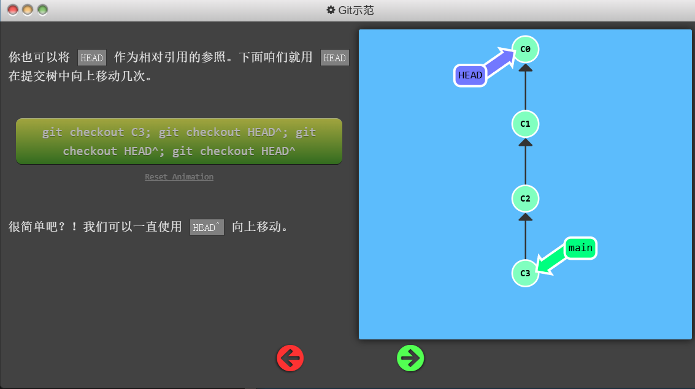
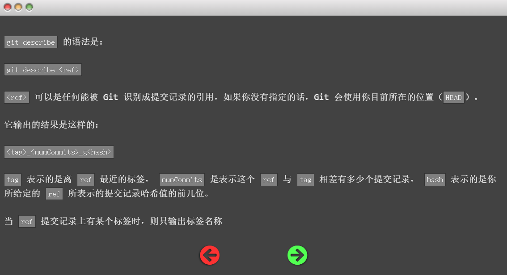
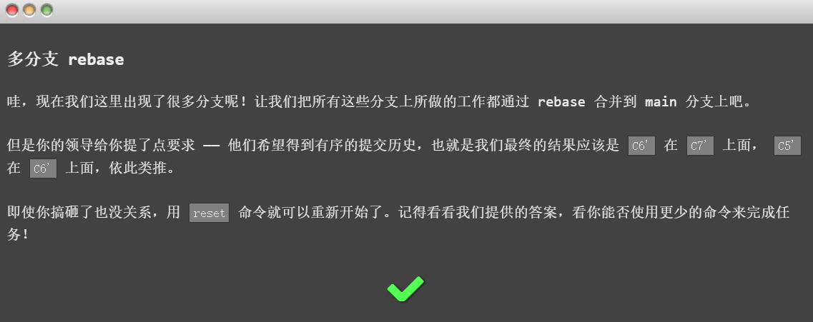
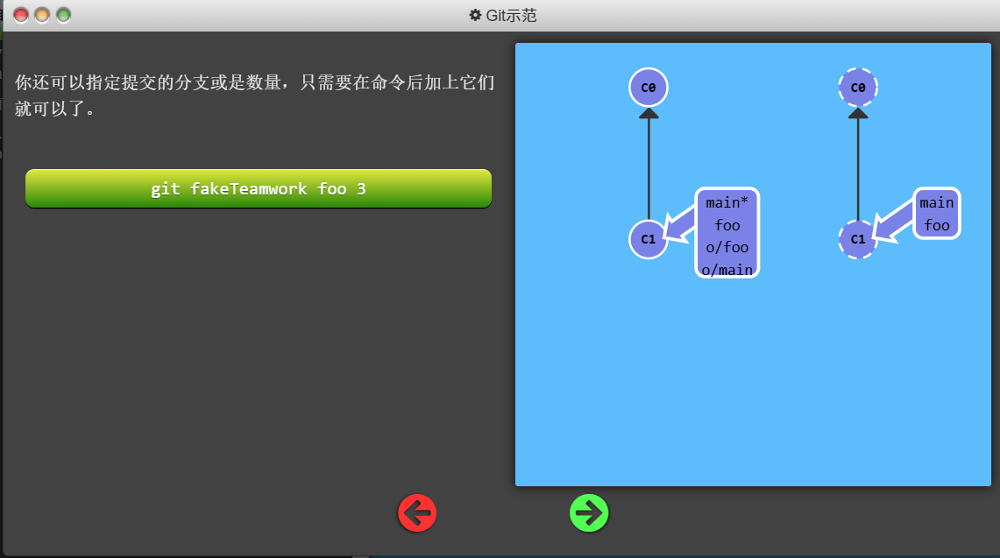
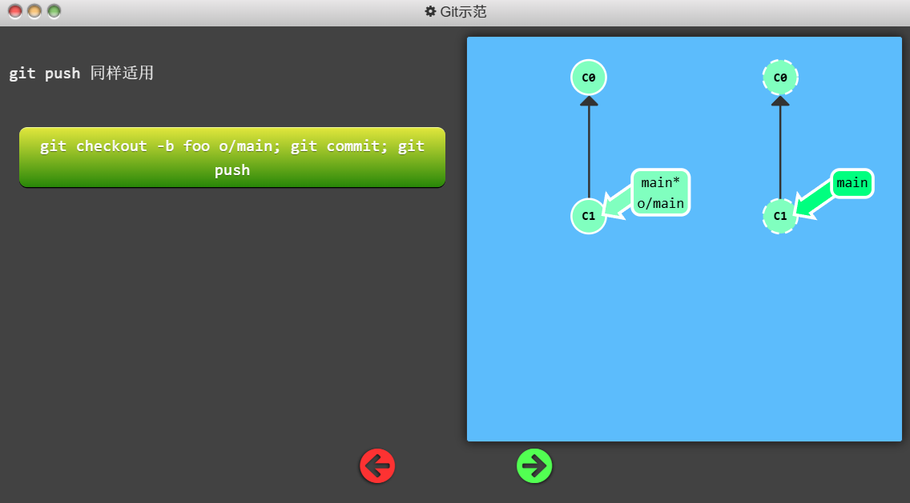
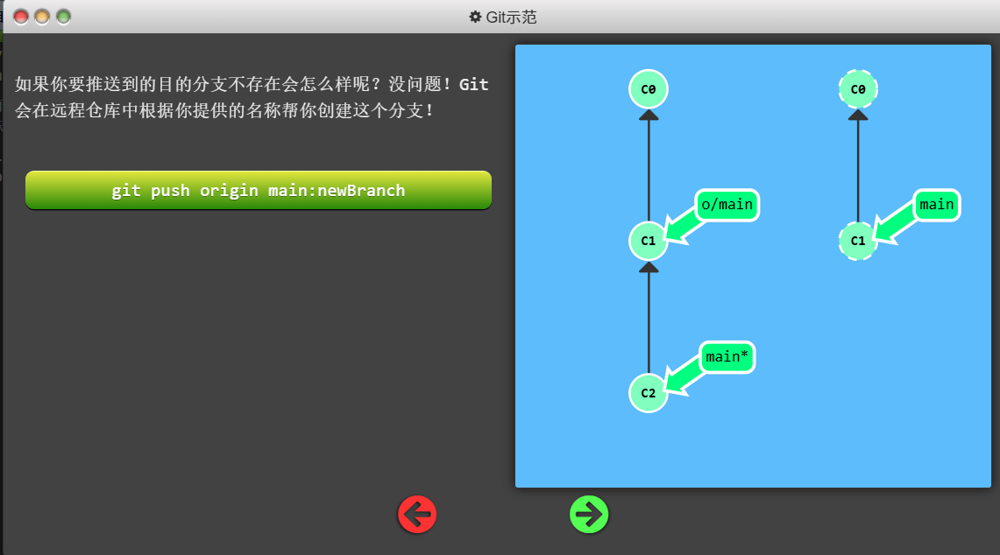

Git Note

Author: YoYiL

reference: [Learn Git Branching](https://learngitbranching.js.org/?locale=zh_CN&NODEMO=)


- [git基础篇](#git基础篇)
  - [git commit](#git-commit)
  - [git branch](#git-branch)
  - [\*\*git switch \*\*](#git-switch-)
    - [📋 **基本命令对比**](#-基本命令对比)
      - [**git switch**](#git-switch)
      - [**git switch -c**](#git-switch--c)
    - [🆚 **与传统命令的详细对比**](#-与传统命令的详细对比)
      - [**1. Switch vs Checkout**](#1-switch-vs-checkout)
      - [**2. Switch -c vs Branch + Switch**](#2-switch--c-vs-branch--switch)
    - [🎯 **Switch 命令的完整选项**](#-switch-命令的完整选项)
      - [**基础切换**](#基础切换)
      - [**创建分支**](#创建分支)
      - [**特殊操作**](#特殊操作)
    - [🔍 **实际使用场景对比**](#-实际使用场景对比)
      - [**场景1：日常分支切换**](#场景1日常分支切换)
      - [**场景2：创建新功能分支**](#场景2创建新功能分支)
      - [**场景3：文件恢复**](#场景3文件恢复)
    - [📊 **命令职责分离**](#-命令职责分离)
    - [🚀 **最佳实践建议**](#-最佳实践建议)
      - [**推荐使用新命令**](#推荐使用新命令)
      - [**团队协作示例**](#团队协作示例)
    - [💡 **为什么要使用 Switch？**](#-为什么要使用-switch)
      - [**1. 语义更清晰**](#1-语义更清晰)
      - [**2. 更安全**](#2-更安全)
      - [**3. 更好的错误提示**](#3-更好的错误提示)
    - [🎯 **总结**](#-总结)
  - [git merge](#git-merge)
  - [git rebase](#git-rebase)
    - [Git Rebase 全面解析](#git-rebase-全面解析)
      - [1. 场景与初始结构](#1-场景与初始结构)
      - [2. Rebase 的核心机制（更精确的描述）](#2-rebase-的核心机制更精确的描述)
      - [3. “C2 + diff(C1, C3)” 是概念，不是逐行机械套用](#3-c2--diffc1-c3-是概念不是逐行机械套用)
      - [4. 无冲突示例（原例演化）](#4-无冲突示例原例演化)
      - [5. 冲突示例（同一行修改 · 详解加强版）](#5-冲突示例同一行修改--详解加强版)
        - [5.1 基础版本（共同祖先 C1）](#51-基础版本共同祖先-c1)
        - [5.2 两条分支分别在同一行做出不同修改](#52-两条分支分别在同一行做出不同修改)
        - [5.3 Rebase 时 Git 试图做的事](#53-rebase-时-git-试图做的事)
        - [5.4 冲突文件内容（抽象行版本）](#54-冲突文件内容抽象行版本)
        - [5.5 冲突文件内容（函数版本）](#55-冲突文件内容函数版本)
        - [5.6 底层补丁为何失败（示意 diff）](#56-底层补丁为何失败示意-diff)
        - [5.7 解决策略示例](#57-解决策略示例)
        - [5.8 提交解决结果](#58-提交解决结果)
        - [5.9 常见疑问补充](#59-常见疑问补充)
        - [5.10 对比：无冲突 vs 冲突](#510-对比无冲突-vs-冲突)
      - [6. 多提交场景](#6-多提交场景)
      - [7. Rebase 与 Merge 的区别（精简对照）](#7-rebase-与-merge-的区别精简对照)
      - [8. 常见误解澄清](#8-常见误解澄清)
      - [9. 高阶用法速览](#9-高阶用法速览)
      - [10. 风险与防护](#10-风险与防护)
      - [11. 可验证实验（建议亲手跑）](#11-可验证实验建议亲手跑)
      - [12. 速记总表（Cheat Sheet）](#12-速记总表cheat-sheet)
      - [13. 总结（一句话）](#13-总结一句话)
- [git高级篇](#git高级篇)
  - [分离HEAD](#分离head)
  - [相对引用(^)](#相对引用)
  - [相对引用(~)](#相对引用-1)
  - [撤销变更reset/revert](#撤销变更resetrevert)
- [git移动提交记录](#git移动提交记录)
  - [git  cherry-pick](#git--cherry-pick)
  - [交互式rebase](#交互式rebase)
- [git杂项](#git杂项)
  - [只取一个提交记录](#只取一个提交记录)
  - [提交的技巧#1](#提交的技巧1)
  - [提交的技巧#2](#提交的技巧2)
  - [git tag](#git-tag)
  - [git describe](#git-describe)
- [git高级话题](#git高级话题)
  - [多分支rebase](#多分支rebase)
  - [两个parent节点](#两个parent节点)
  - [纠缠不清的分支](#纠缠不清的分支)
- [git远程仓库](#git远程仓库)
  - [git clone](#git-clone)
    - [git clone 多分支仓库](#git-clone-多分支仓库)
    - [如何查看所有分支](#如何查看所有分支)
    - [切换 / 创建本地分支以跟踪远程分支](#切换--创建本地分支以跟踪远程分支)
        - [最佳实践](#最佳实践)
    - [远程新增分支后如何获取](#远程新增分支后如何获取)
    - [默认分支为何是 main（或 master）](#默认分支为何是-main或-master)
    - [什么时候 clone 真的“只拿一个分支”](#什么时候-clone-真的只拿一个分支)
    - [常用命令清单（可收藏）](#常用命令清单可收藏)
  - [远程分支](#远程分支)
  - [git fetch](#git-fetch)
  - [git pull](#git-pull)
  - [模拟团队合作](#模拟团队合作)
  - [git push](#git-push)
  - [偏离的提交历史](#偏离的提交历史)
  - [锁定的Main(Locked Main)](#锁定的mainlocked-main)
- [git远程仓库高级操作](#git远程仓库高级操作)
  - [推送主分支/合并特性分支](#推送主分支合并特性分支)
  - [合并远程仓库](#合并远程仓库)
  - [远程追踪](#远程追踪)
  - [git push的参数#1](#git-push的参数1)
  - [git push的参数#2](#git-push的参数2)
  - [git fetch的参数](#git-fetch的参数)
  - [没有source的source](#没有source的source)
  - [git pull的参数](#git-pull的参数)


# git基础篇

## git commit


## git branch


##  **git switch **

Git Switch 是 Git 2.23+ 引入的新命令，专门用于分支切换，让操作更清晰明确。

### 📋 **基本命令对比**

#### **git switch**
```bash
# 切换到已存在的分支
git switch main
git switch feature-branch

# 等价于旧命令
git checkout main
```

#### **git switch -c**
```bash
# 创建并切换到新分支
git switch -c new-feature
git switch -c hotfix/bug-123

# 等价于旧命令
git checkout -b new-feature
```

### 🆚 **与传统命令的详细对比**

#### **1. Switch vs Checkout**

| 功能           | git switch                       | git checkout              | 说明                |
| -------------- | -------------------------------- | ------------------------- | ------------------- |
| **切换分支**   | ✅ `git switch main`              | ✅ `git checkout main`     | 功能相同            |
| **创建+切换**  | ✅ `git switch -c new`            | ✅ `git checkout -b new`   | 功能相同            |
| **恢复文件**   | ❌ 不支持                         | ✅ `git checkout file.txt` | Switch 专注分支     |
| **切换到提交** | ⚠️ `git switch --detach <commit>` | ✅ `git checkout <commit>` | Switch 需要明确指定 |

#### **2. Switch -c vs Branch + Switch**

```bash
# 方式1：使用 switch -c（一步到位）
git switch -c feature-auth

# 方式2：使用传统 branch + switch（两步）
git branch feature-auth
git switch feature-auth

# 方式3：使用传统 branch + checkout（两步）
git branch feature-auth  
git checkout feature-auth
```

### 🎯 **Switch 命令的完整选项**

#### **基础切换**
```bash
# 切换到已存在分支
git switch main
git switch develop

# 强制切换（丢弃工作区修改）
git switch --force main
git switch -f main
```

#### **创建分支**
```bash
# 创建并切换到新分支
git switch -c feature-login

# 基于指定提交创建分支
git switch -c hotfix HEAD~2
git switch -c release-v2.0 v1.9.0

# 基于远程分支创建本地分支
git switch -c local-feature origin/remote-feature
```

#### **特殊操作**
```bash
# 分离头指针模式（detached HEAD）
git switch --detach HEAD~3
git switch --detach abc1234

# 切换到上一个分支
git switch -

# 恢复到指定分支（如果有未提交更改会失败）
git switch --discard-changes main
```

### 🔍 **实际使用场景对比**

#### **场景1：日常分支切换**
```bash
# ✅ 新方式（推荐）- 语义更清晰
git switch main
git switch feature-branch

# ⚪ 旧方式（仍可用）
git checkout main  
git checkout feature-branch
```

#### **场景2：创建新功能分支**
```bash
# ✅ 新方式（推荐）
git switch -c feature/user-profile

# ⚪ 旧方式
git checkout -b feature/user-profile
# 或者
git branch feature/user-profile
git checkout feature/user-profile
```

#### **场景3：文件恢复**
```bash
# ❌ Switch 不支持文件操作
git switch file.txt  # 错误！

# ✅ 必须使用其他命令
git restore file.txt        # 新命令（推荐）
git checkout -- file.txt    # 旧命令
```

### 📊 **命令职责分离**

Git 2.23+ 将 checkout 的功能拆分为专门的命令：

```bash
# 旧的 checkout（功能混杂）
git checkout main           # 切换分支
git checkout -b new         # 创建分支  
git checkout file.txt       # 恢复文件
git checkout HEAD~2         # 切换到提交

# 新的专门命令（职责清晰）
git switch main             # 专门切换分支
git switch -c new           # 专门创建分支
git restore file.txt        # 专门恢复文件
git switch --detach HEAD~2  # 明确指定分离模式
```

### 🚀 **最佳实践建议**

#### **推荐使用新命令**
```bash
# ✅ 分支操作用 switch
git switch main
git switch -c feature-auth
git switch -

# ✅ 文件恢复用 restore  
git restore file.txt
git restore --staged file.txt

# ✅ 只在必要时用 checkout
git checkout HEAD~2         # 查看历史提交
git checkout v1.0.0         # 查看标签
```

#### **团队协作示例**
```bash
# 开始新功能开发
git switch main
git pull origin main
git switch -c feature/payment-system

# 开发完成后
git switch main
git merge feature/payment-system

# 紧急修复
git switch main  
git switch -c hotfix/critical-bug
# ... 修复代码 ...
git switch main
git merge hotfix/critical-bug
```

### 💡 **为什么要使用 Switch？**

#### **1. 语义更清晰**
- `git switch` 明确表示"切换分支"
- `git checkout` 功能太多，容易混淆

#### **2. 更安全**
- Switch 不会意外覆盖文件
- 需要明确指定 `--detach` 才能进入分离模式

#### **3. 更好的错误提示**
```bash
# Switch 会给出更清晰的错误信息
$ git switch non-existent-branch
fatal: invalid reference: non-existent-branch
hint: If you want to create a new branch from 'non-existent-branch', use:
hint:   git switch -c non-existent-branch
```

### 🎯 **总结**

| 需求           | 推荐命令                 | 说明                            |
| -------------- | ------------------------ | ------------------------------- |
| 切换已存在分支 | `git switch <branch>`    | 替代 `git checkout <branch>`    |
| 创建并切换分支 | `git switch -c <branch>` | 替代 `git checkout -b <branch>` |
| 恢复文件       | `git restore <file>`     | 替代 `git checkout -- <file>`   |
| 查看历史提交   | `git checkout <commit>`  | 暂时保留使用 checkout           |

**Switch 让分支操作更专业、更安全、更清晰！** 🎉


## git merge


## git rebase


### Git Rebase 全面解析

#### 1. 场景与初始结构

分支初始拓扑：

```
C0 ← C1 ← C2   (main)
      ↖
        C3     (bugFix)
```

- `C2` 基于 `C1`，对文件 A 做了一组修改
- `C3` 也基于 `C1`，对文件 A 做了另一组修改
- 现在在 `bugFix` 分支执行：`git rebase main`

---

#### 2. Rebase 的核心机制（更精确的描述）

Rebase 的本质：  
针对当前分支上“相对于目标 base 分叉点”之后的每个提交，按顺序将其“父 → 子”的 diff 重新应用（replay）到新的 base（即目标分支最新提交）之上，生成全新的提交对象（哈希变化），并移动分支指针。

步骤抽象：

1. 找共同祖先（这里是 `C1`）
2. 收集要重放的提交序列：`[C3]`
3. 将分支指针临时挪到新的 base：`C2`
4. 对 `C3` 计算补丁：`patch = diff(C1, C3)`
5. 尝试把补丁应用到 `C2` → 成功则生成新提交 `C3'`
6. 结束后形成线性历史：

```
C0 ← C1 ← C2 ← C3'  (bugFix)
```

原 `C3` 仍存在对象库中（可通过 `reflog` 找回），只是分支不再指向它。

---

#### 3. “C2 + diff(C1, C3)” 是概念，不是逐行机械套用

- 实际应用使用带上下文的 patch 匹配（模糊定位，而非死板行号）
- 如果上下文（附近几行）被 `C2` 改动过，Git 尝试智能适配
- 无法安全匹配或同一文本区域产生冲突 → 停止并要求人工解决

---

#### 4. 无冲突示例（原例演化）

`C1` 时文件 A：

```
line 1: original content
line 2: original content
line 3: original content
```

`C2` 修改行 1：

```
line 1: modified by C2
line 2: original content
line 3: original content
```

`C3`（仍基于 C1）修改行 2：

```
line 1: original content
line 2: modified by C3
line 3: original content
```

Rebase 后得到 `C3'`：

```
line 1: modified by C2
line 2: modified by C3
line 3: original content
```

原因：修改集中在不同区域，补丁可直接套入。

#### 5. 冲突示例（同一行修改 · 详解加强版）

当且仅当“要重放的提交（例如 C3）所修改的内容，与新的 base（这里是 C2）在同一位置发生不兼容差异”时才会产生冲突。我们用两个并行视角说明：  
- 抽象行版本（line 风格）  
- 真实函数示例（function greet）

##### 5.1 基础版本（共同祖先 C1）

抽象文件（C1）：

```
line 1: original content
line 2: original content
line 3: original content
```

函数版本（C1）：

```
function greet() {
    console.log("Hello");
    console.log("World");
}
```

##### 5.2 两条分支分别在同一行做出不同修改

`C2`（在 main 上，对同一行做了修改）：

抽象：

```
line 1: original content
line 2: modified by C2
line 3: original content
```

函数：

```
function greet() {
    console.log("Hello, Alice");
    console.log("World");
}
```

`C3`（在 bugFix 上，对同一行做了另一种修改。注意它仍基于 C1，而不知道 C2 的存在）：

抽象：

```
line 1: original content
line 2: modified by C3
line 3: original content
```

函数：

```
function greet() {
    console.log("Hello, Bob");
    console.log("World");
}
```

##### 5.3 Rebase 时 Git 试图做的事

在 `bugFix` 分支执行 `git rebase main`：

1. 找祖先：`merge-base(C2, C3) = C1`
2. 计算补丁（patch = diff(C1, C3)）。抽象 diff 逻辑相当于：  
   将 C1 中  
   `line 2: original content`  
   替换为  
   `line 2: modified by C3`
3. 试图把这份补丁套到当前工作基（已切到 C2 的内容）上  
4. 发现 C2 中对应位置已经不是 `original content`，而是 `modified by C2`  
5. 无法自动判断“谁对谁错” → 产生冲突

##### 5.4 冲突文件内容（抽象行版本）

Git 写入冲突标记后文件变为：

```
line 1: original content
<<<<<<< HEAD
line 2: modified by C2
=======
line 2: modified by C3
>>>>>>> C3
line 3: original content
```

解释：
- `<<<<<<< HEAD` 部分：当前索引/工作区基于的新 base（C2）的版本
- `=======`：分隔符
- `>>>>>>> C3`：正在重放的那个提交（补丁来源），标签可能显示为提交哈希（这里示意为 C3）

##### 5.5 冲突文件内容（函数版本）

```
function greet() {
<<<<<<< HEAD
    console.log("Hello, Alice");
=======
    console.log("Hello, Bob");
>>>>>>> C3
    console.log("World");
}
```

##### 5.6 底层补丁为何失败（示意 diff）

`diff(C1, C3)` 类似：

```
--- a/file (C1)
+++ b/file (C3)
@@
-line 2: original content
+line 2: modified by C3
```

（或函数版本）

```
--- a/greet.js (C1)
+++ b/greet.js (C3)
@@
-    console.log("Hello");
+    console.log("Hello, Bob");
```

应用条件：旧上下文必须还能匹配到（含周围若干行）。但当前基底（C2）显示为：

```
line 2: modified by C2
```

已与“预期旧文本”不符 → 触发冲突。

##### 5.7 解决策略示例

你需要手动编辑冲突区域，保留或融合为最终版本，例如：

1. 选择 C2 版本：

```
line 1: original content
line 2: modified by C2
line 3: original content
```

2. 选择 C3 版本：

```
line 1: original content
line 2: modified by C3
line 3: original content
```

3. 融合（自定义）：

```
line 1: original content
line 2: modified by C2 & C3   ← 人工合并语义
line 3: original content
```

函数对应融合：

```
function greet() {
    console.log("Hello, Alice & Bob");
    console.log("World");
}
```

##### 5.8 提交解决结果

编辑后删除冲突标记，保存，然后：

```
git add file
git rebase --continue
```

如果你决定忽略这个提交（跳过 C3 的变更）：

```
git rebase --skip
```

如果觉得这一切太麻烦，放弃本次 rebase：

```
git rebase --abort
```

##### 5.9 常见疑问补充

| 疑问                            | 说明                                                         |
| ------------------------------- | ------------------------------------------------------------ |
| 为什么标签是 HEAD？             | 在 rebase 重放某提交时，工作副本代表“当前基”即 `C2` 的内容，Git 把它标作 HEAD |
| `>>>>>>> C3` 一定显示分支名吗？ | 现实中多为提交哈希（例如 `>>>>>>> a1b2c3d`），这里用 C3 代称 |
| 可以自动解决吗？                | 如果两边都只是格式化，可尝试 `git rerere` 或借助合并工具；语义差异仍需人工裁决 |
| 冲突多次出现怎么办？            | 每个提交单独重放，可能在后续 C4'、C5' 再次发生；逐次解决即可 |
| 是否可改用 merge 避免多次冲突？ | 是。merge 会一次性解决总差异；取舍取决于你是否需要线性历史   |

##### 5.10 对比：无冲突 vs 冲突

| 条件                      | 结果                             |
| ------------------------- | -------------------------------- |
| C2 与 C3 改不同位置       | 自动合并 → C3' 包含两者          |
| C2 与 C3 改同一行不同内容 | 产生冲突 → 需人工修改后继续      |
| C2 删除了 C3 修改的行     | 也会冲突（补丁找不到上下文）     |
| C2 大范围重排             | 可能冲突或错误匹配，需要人工审查 |

---

如果需要，我可以再为这节画一张 ASCII 时间线或展示 `git range-diff` 对比输出。需要的话继续告诉我。

---

#### 6. 多提交场景

如果 `bugFix` 实际是：

```
C0 ← C1 ← C2 (main)
      ↖
        C3 ← C4 ← C5 (bugFix)
```

Rebase 后：

```
C0 ← C1 ← C2 ← C3' ← C4' ← C5'
```

冲突可能出现在链条中任意一个；每解决一次需继续执行 `--continue` 直至全部重放完成。  
需要清理历史/合并零碎提交 → 用交互式：`git rebase -i main`

---

#### 7. Rebase 与 Merge 的区别（精简对照）

| 维度             | Rebase                    | Merge                                |
| ---------------- | ------------------------- | ------------------------------------ |
| 历史形态         | 线性；重写提交            | 保留分叉；新增合并提交               |
| 是否生成新哈希   | 是（重放产生新提交）      | 仅生成一个合并提交（及现有提交不变） |
| 冲突处理次数     | 可能多次（逐提交）        | 一次（在 merge 操作）                |
| 适用             | 清理私有历史、准备提交 PR | 保留真实演化、公共协作               |
| 触碰公共历史风险 | 高                        | 低                                   |
| 语义             | “像是一直跟进最新”        | “在此刻合并两条发展线”               |

---

#### 8. 常见误解澄清

| 误解                               | 纠正                                                  |
| ---------------------------------- | ----------------------------------------------------- |
| Rebase 会“移动”旧提交              | 不是移动，是“复制 + 指针重定向”                       |
| Rebase 会丢代码                    | 正常不会；丢失多来自人为 `--skip`/错误解决/强制 reset |
| Rebase 比 merge 更先进/更安全      | 只是策略不同；不当使用会更危险                        |
| 冲突只出现一次                     | 可能在多个补丁阶段重复出现                            |
| 补丁只是简单 diff                  | 使用三方合并 + 上下文匹配                             |
| 解决冲突后马上 `--continue` 就结束 | 需测试验证每一步的逻辑正确性                          |

---

#### 9. 高阶用法速览

- 交互式整理：`git rebase -i base`
  - `pick / reword / squash / fixup / drop`
- 自动 squash/fixup：在后续提交 message 前缀加 `squash! xxx` → `git rebase -i --autosquash`
- 改换基底（非直接父链）：`git rebase --onto newBase oldBase feature`
  - 例：`git rebase --onto C9 C4 featureX` → 把 featureX 上 “C4 之后的提交” 搬到 C9 后
- 复用历史冲突解决：`git config rerere.enabled true`
- 恢复意外丢失：`git reflog`
- 只重放部分：交互式编辑把不要的改为 `drop`

---

#### 10. 风险与防护

| 风险                         | 防护策略                                                    |
| ---------------------------- | ----------------------------------------------------------- |
| 重写已推送历史导致他人失败   | 约定：共享分支禁 rebase；必要时先通知协作者                 |
| 冲突解决引入逻辑 bug         | 每次 `--continue` 前跑测试 / lint / 构建                    |
| 丢失原提交引用               | 及时：`git reflog > backup.txt`                             |
| 不必要的复杂 rebase          | 改用 merge；或保持小步提交                                  |
| 误 squash 合理语义           | 使用 `fixup!` 而非粗暴 squash 全部                          |
| 重放后的重复提交（语义重复） | 用 `git log --patch` 或 `git range-diff base...branch` 检查 |

---

#### 11. 可验证实验（建议亲手跑）

```
git init demo && cd demo
echo "A" > file.txt
git add file.txt
git commit -m "C1"

echo -e "A\nB" > file.txt
git commit -am "C2"

git checkout -b bugFix HEAD~1   # 回到 C1 建分支
echo -e "A\nC" > file.txt
git commit -am "C3"

git checkout main   # 在 C2
git checkout bugFix
git rebase main
```

检查：

```
git log --oneline --graph --decorate
git show HEAD
git reflog
```

---

#### 12. 速记总表（Cheat Sheet）

| 要点           | 精简记忆                     |
| -------------- | ---------------------------- |
| 定义           | Rebase = 逐提交重放到新 base |
| 变更实体       | 每提交的 parent→child diff   |
| 结果           | 新提交（哈希变），线性历史   |
| 冲突           | 可能多次，逐补丁处理         |
| 公共分支       | 不要随意 rebase              |
| 整理历史       | 用 `rebase -i`               |
| 防丢           | `reflog`                     |
| 复杂基底迁移   | `--onto`                     |
| 自动合并 fixup | `--autosquash`               |
| 重用冲突解决   | `rerere`                     |

---

#### 13. 总结（一句话）

Rebase 不是“把旧提交挪到新位置”，而是“以旧提交的差异为蓝本，在新基上重新构建一串全新提交”，从而形成一条线性、干净但经过重写的历史；`C3'` 既保留 `main` 最新进展（C2）也重现原 `C3` 的语义变更。


# git高级篇

## 分离HEAD


## 相对引用(^)




## 相对引用(~)


*强制修改分支位置 git branch -f*


## 撤销变更reset/revert


# git移动提交记录

## git  cherry-pick


## 交互式rebase


# git杂项

## 只取一个提交记录


## 提交的技巧#1


## 提交的技巧#2


## git tag


## git describe





# git高级话题


## 多分支rebase



## 两个parent节点


这里的HEAD^是C1(更旧), HEAD^2是C2(在C1之后)，有点像C3线性化的继承顺序。按照C3线性化，C3 is C1, C2, 可算出C3的继承序列应该是[C3,C1,C2,C0]


## 纠缠不清的分支


# git远程仓库

## git clone


### git clone 多分支仓库

默认情况下 `git clone` 并不只获取 `main`（或 `master`）那一个分支的内容；它会：

1. 复制（下载）远程仓库的大部分对象（所有分支的提交、标签等——除非你用了限制参数）  
2. 在本地仅创建一个“当前检出”的本地分支（通常是远程的默认分支：`main` 或 `master`）  
3. 其它分支的提交虽然已在对象库里，但没有对应的本地分支，只是以“远程跟踪分支”存在（`refs/remotes/origin/xxx`）

所以：clone 后你看到只有 `main`，是因为只有它有本地分支，不代表其它分支没被 fetch。

### 如何查看所有分支

只看当前本地分支：  
```
git branch
```

查看本地 + 远程跟踪分支：  
```
git branch -a
```

只看远程跟踪分支：  
```
git branch -r
```


更详细显示（含默认远程 HEAD 指向）：  

```
git remote show origin
```

*以“远程 origin”为中心：展示远程的整体配置与你本地对它的跟踪情况，包括：*

- *远程的 Fetch URL / Push URL*
- *远程默认分支（HEAD branch）*
- *远程有哪些分支（Remote branches）*
- *哪些远程分支被本地跟踪、哪些是“new”（你还没有对应本地分支）、哪些是“stale”（远程已删而本地引用仍在）*
- *本地哪些分支被配置为 pull / push 到哪些远程分支（含 up to date / fast-forwardable / local out of date 等文字提示）*


```
git branch -vv
```

*以“本地分支”为中心：列出所有本地分支，并显示：*

- *每个本地分支当前提交（短哈希 + 提交标题）*
- *该分支的 upstream（跟踪的远程分支）*
- *与 upstream 的 ahead / behind 状态（如果有）*
- *没有 upstream 的分支直接显示而不加方括号*


查看所有远程引用（含标签）：  

```
git ls-remote origin
```

列出远程分支名（纯名字）：  
```
git for-each-ref --format='%(refname:short)' refs/remotes/origin
```

### 切换 / 创建本地分支以跟踪远程分支

方式 1（Git 2.23+ 推荐）：  
```
git switch feature-x
```
（若本地不存在且存在 `origin/feature-x`，会自动创建跟踪。若失败，可显式：）  
```
git switch -c feature-x origin/feature-x
```

老写法：  
```
git checkout -b feature-x origin/feature-x
```

仅临时查看（不建分支，用游离 HEAD）：  
```
git checkout origin/feature-x
```
（不建议长期停留，容易产生悬挂提交）

##### 最佳实践


Git 2.23+（推荐 switch）：  
```
git switch audit-data
git switch onboarded
```
如果本地还不存在同名分支，且远程有 `origin/audit-data`，Git 会自动创建一个本地 `audit-data` 分支并设置 `upstream=origin/audit-data`。

若自动失败（某些版本/配置）可显式指定：  
```
git switch -c audit-data origin/audit-data
git switch -c onboarded origin/onboarded
```

老写法（兼容旧版）：  
```
git checkout -b audit-data origin/audit-data
git checkout -b onboarded origin/onboarded
```

更底层写法（等价）：  
```
git branch --track audit-data origin/audit-data
git switch audit-data
```

### 远程新增分支后如何获取

远程有人后来推了新分支：  
```
git fetch origin
```
然后：  
```
git branch -r
```
或直接：  
```
git switch 新分支名
```
（若提示不存在，再用 `-c` 语法）

清理已删除的远程分支引用：  
```
git remote prune origin
```

### 默认分支为何是 main（或 master）

远程仓库有一个符号引用：  
```
HEAD → refs/heads/main
```
（或其它，如 `develop`）

`git clone` 会：  
- 创建远程跟踪分支 `origin/main`  
- 创建本地分支 `main`（跟踪 `origin/main`）  
- 检出 `main`  

你可查看：  
```
git symbolic-ref refs/remotes/origin/HEAD
```
或：  
```
git remote show origin   # 会显示 "HEAD branch: main"
```

### 什么时候 clone 真的“只拿一个分支”

只有在你显式限制时，例如：

单分支克隆：  
```
git clone --single-branch --branch develop <url>
```
只抓 `develop` 的历史（以及相关的必要对象），其它分支不抓。

浅克隆（减少历史深度）：  
```
git clone --depth 1 <url>
```
抓所有分支的最近层（仍可配合 `--single-branch`），默认仍会 fetch 全部分支的浅端引用。

组合：  
```
git clone --depth 1 --single-branch --branch main <url>
```

稀疏 / 部分克隆（按需取大文件）：  
```
git clone --filter=blob:none <url>
```
仍是所有分支引用，只是延迟拉取大对象。

稀疏检出（限制目录，而不是限制分支）：  
```
git sparse-checkout init
git sparse-checkout set <path...>
```
（与分支数量无关）

| 误解                                    | 事实                                                     |
| --------------------------------------- | -------------------------------------------------------- |
| clone 只下载默认分支                    | 默认会 fetch 所有分支引用（除非 --single-branch 等参数） |
| 看不到分支说明没下载                    | 只是没创建本地分支；远程跟踪分支里有                     |
| 切换远程分支要先 fetch                  | 第一次 clone 后通常不需要；除非分支是后来新建            |
| ours/theirs 在 rebase 与 merge 含义一致 | 不一致（你之前的问题中已解释）                           |
| 浅克隆无法再补齐                        | 可以用 `git fetch --unshallow`                           |

### 常用命令清单（可收藏）

查看所有本地 + 远程分支：  
```
git branch -a
```

查看远程分支：  
```
git branch -r
```

查看远程详细：  
```
git remote show origin
```

创建本地 tracking 分支（与远程同名）：  
```
git switch audit-data
git switch onboarded
```

创建本地分支跟踪远程：  
```
git switch -c feature-x origin/feature-x
```

快速切换（自动跟踪）：  
```
git switch feature-x
```

列出远程引用（含标签）：  
```
git ls-remote origin
```

扩展单分支 fetch 回全部：  
```
git config remote.origin.fetch "+refs/heads/*:refs/remotes/origin/*"
git fetch
```

清理已删除远程分支：  
```
git remote prune origin
```


## 远程分支


## git fetch


## git pull


## 模拟团队合作





## git push


## 偏离的提交历史


## 锁定的Main(Locked Main)


# git远程仓库高级操作

## 推送主分支/合并特性分支


## 合并远程仓库


## 远程追踪





## git push的参数#1


## git push的参数#2





## git fetch的参数


## 没有source的source


## git pull的参数


