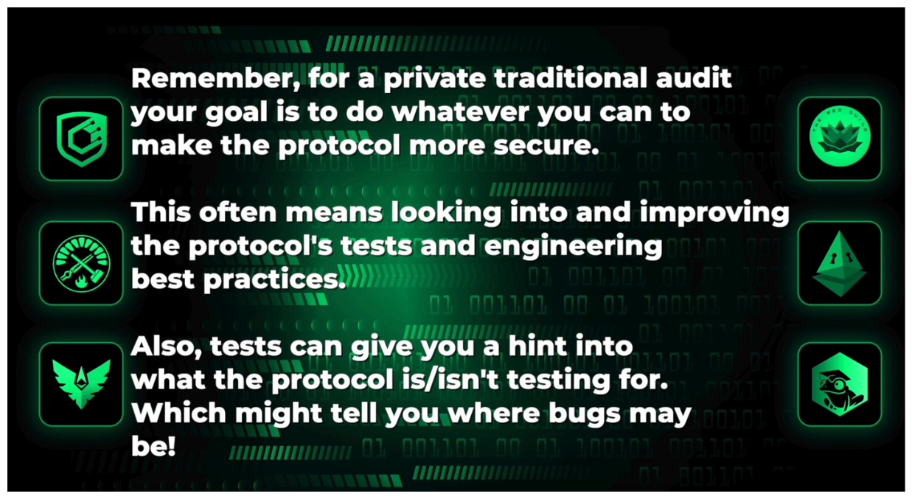

> **
>
> **注意 / NOTE**: 这是一个用来记录我在智能合约安全中学习和 debug 经验的笔记，仅供参考。  
> This is a note used to record my learning and debugging experience in smart contract security, for reference only.
>
> 📋 **目录导航 / Table of Contents**: 点击右上角的目录图标 (📋) 查看完整目录  
> Click the table of contents icon (📋) in the upper right corner to view the complete directory
>
> Author: YoYiL


- [Dangerous Functions](#dangerous-functions)
  - [selfdestruct()](#selfdestruct)
    - [The Unique Characteristic of Selfdestruct](#the-unique-characteristic-of-selfdestruct)
    - [重大变化：EIP-6780 的影响](#重大变化eip-6780-的影响)
    - [EIP-6780 的核心规则](#eip-6780-的核心规则)
      - [情况1：同一交易中创建和销毁（完全有效）](#情况1同一交易中创建和销毁完全有效)
      - [情况2：不同交易中销毁（功能受限）](#情况2不同交易中销毁功能受限)
    - [当前状态和弃用](#当前状态和弃用)
    - [当前可能的攻击向量](#当前可能的攻击向量)
      - [1. 强制发送以太币攻击](#1-强制发送以太币攻击)
      - [2. 同交易创建-销毁攻击](#2-同交易创建-销毁攻击)
      - [3. 状态不一致攻击](#3-状态不一致攻击)
    - [防护措施](#防护措施)
      - [1. 避免依赖合约销毁](#1-避免依赖合约销毁)
      - [2. 余额检查保护](#2-余额检查保护)
      - [3. 状态管理](#3-状态管理)
      - [4. 访问控制强化](#4-访问控制强化)
- [Attack Vectors](#attack-vectors)
- [Security Review](#security-review)
  - [What is a Smart Contract Audit?](#what-is-a-smart-contract-audit)
    - [The Three Phases of a Security Review](#the-three-phases-of-a-security-review)
    - [Reach Out for a Review](#reach-out-for-a-review)
    - [Initial Report](#initial-report)
    - [Mitigation Phase](#mitigation-phase)
    - [Final Report](#final-report)
    - [Ensuring a Successful Audit](#ensuring-a-successful-audit)
    - [Post Audit](#post-audit)
    - [What an audit *isn't*](#what-an-audit-isnt)
  - [Embedding Security Audits in Development Lifecycle](#embedding-security-audits-in-development-lifecycle)
  - [Rekt Test](#rekt-test)
    - [Audit Readiness](#audit-readiness)
    - [The Rekt Test](#the-rekt-test)
    - [Nascent Audit Readiness Checklist](#nascent-audit-readiness-checklist)
  - [Tools for Security Reviews](#tools-for-security-reviews)
    - [Static Analysis: Debugging Without Execution](#static-analysis-debugging-without-execution)
    - [Fuzz Testing: Randomness Meets Tests](#fuzz-testing-randomness-meets-tests)
    - [Formal Verification: Mathematical Proofs](#formal-verification-mathematical-proofs)
    - [AI Tools: Not Quite There Yet](#ai-tools-not-quite-there-yet)
  - [What If Your Security Audit Fails?](#what-if-your-security-audit-fails)
    - [Redefining the Role of Auditors](#redefining-the-role-of-auditors)
    - [Who Owns the Blame?](#who-owns-the-blame)
    - [The Auditor’s Role in the Wake of a Breach](#the-auditors-role-in-the-wake-of-a-breach)
- [PasswordStore](#passwordstore)
  - [Scoping](#scoping)
    - [Scoping：Etherscan](#scopingetherscan)
    - [Scoping: Audit Details](#scoping-audit-details)
        - [Preparing for the Audit: Onboarding Questions](#preparing-for-the-audit-onboarding-questions)
        - [Scope](#scope)
    - [Scoping: CLOC(*Count Lines of Code*)](#scoping-cloccount-lines-of-code)
      - [The Importance of Knowing Your Codebase Size](#the-importance-of-knowing-your-codebase-size)
  - [The Tincho Auditing Method](#the-tincho-auditing-method)
    - [First Step](#first-step)
    - [Tools and Frameworks](#tools-and-frameworks)
    - [Audit, Review, Audit, Repeat](#audit-review-audit-repeat)
    - [Communication](#communication)
    - [Wrapping it Up](#wrapping-it-up)
    - [The Audit Report and Follow Up](#the-audit-report-and-follow-up)
    - [Aftermath of a Missed Vulnerability](#aftermath-of-a-missed-vulnerability)
  - [Reconnaissance](#reconnaissance)
    - [Recon: Context](#recon-context)
    - [Recon: Understanding the Code](#recon-understanding-the-code)
  - [Exploit](#exploit)
    - [Exploit: Accsess Control](#exploit-accsess-control)
    - [Exploit: Public Data](#exploit-public-data)
- [Puppy Raffle](#puppy-raffle)
- [TSwap](#tswap)
- [Thunder Loan](#thunder-loan)
- [Boss Bridge](#boss-bridge)
- [MEV \& Governance](#mev--governance)


# Dangerous Functions

## selfdestruct()

### The Unique Characteristic of Selfdestruct

Why `selfdestruct` stands out lies in its exceptional behavior once a contract gets destroyed. Any Ethereum (or ETH) residing within the deleted contract gets automatically ‘pushed’ or ‘forced’ into any address that you specify.

Under normal circumstances a contract that doesn't contain a receive or fallback function (or some other payable function capable of receiving funds) cannot have ETH sent to it.

Only through the use of `selfdestruct` can you be permitted to push any Ethereum into such a contract.

So if ever you’re hunting for an exploit, or you have identified an attack where you need to force ETH into a contract, `selfdestruct` will be your instrument of choice.

### 重大变化：EIP-6780 的影响

**从 Cancun 硬分叉开始，底层操作码不再删除代码和数据** 。EIP-6780 显著削减了 SELFDESTRUCT 操作码的功能 。

**Ethereum Dencun 升级引入的 EIP-6780 更新了 selfdestruct 操作码，停用了合约的销毁功能** 。这意味着：

- 合约代码不再被实际删除
- 合约存储不再被清除
- 只有余额转移功能保留

### EIP-6780 的核心规则

**EIP-6780 建议的改变是 SELFDESTRUCT 只能在创建合约的同一交易中被调用** 。这意味着：

#### 情况1：同一交易中创建和销毁（完全有效）

**当 SELFDESTRUCT 在部署合约的同一交易中执行时，这个特定的 EIP 保留了操作码的完整功能** 。

**具体例子：**

```
// 在一个交易中：
// 1. 部署合约A
// 2. 立即调用合约A的selfdestruct()
// 结果：合约完全被销毁，代码和状态都被移除
```

#### 情况2：不同交易中销毁（功能受限）

**Ethereum Dencun 升级引入了 EIP-6780，更新了 selfdestruct 操作码，停用了合约的销毁功能** 。

**具体例子：**

```
// 交易1：部署合约A
// 交易2：调用合约A的selfdestruct()
// 结果：只转移余额，但合约代码和状态保留（变成"僵尸合约"）
```

### 当前状态和弃用

**SELFDESTRUCT 已经被弃用了一段时间** 。在 Solidity 0.8.24 版本中，编译器会对使用 `selfdestruct` 发出弃用警告 。

**"selfdestruct" 已被弃用。注意，从 Cancun 硬分叉开始，底层操作码不再删除代码和数据** 。

### 当前可能的攻击向量

#### 1. 强制发送以太币攻击

**操作码仍然转移以太币** ，这意味着攻击者仍然可以：

- 强制向目标合约发送以太币
- 破坏依赖精确余额计算的合约逻辑
- 绕过某些访问控制机制

#### 2. 同交易创建-销毁攻击

由于 **EIP 在合约创建的同一交易中执行 SELFDESTRUCT 时保留了操作码功能** ，攻击者可以：

- 在同一交易中部署恶意合约并立即销毁
- 利用这种模式进行复杂的攻击
- 规避某些检测机制

#### 3. 状态不一致攻击

**以太坊已在 Cancun 升级中纳入了 EIP-6780，修改了 SELFDESTRUCT 操作码的行为** ，但由于余额转移功能保留，可能导致：

- 合约状态与实际余额不匹配
- 依赖合约"死亡"状态的逻辑被破坏

### 防护措施

#### 1. 避免依赖合约销毁

- 不要假设合约会被完全移除
- 设计时考虑合约可能"僵尸化"

#### 2. 余额检查保护

- 实现robust的余额验证逻辑
- 不依赖精确的余额计算

#### 3. 状态管理

- 使用明确的状态标记而非依赖合约存在性
- 实现暂停/停用机制

#### 4. 访问控制强化

- 不依赖合约不存在作为安全保证
- 实现多层访问控制


# Attack Vectors


# Security Review


## What is a Smart Contract Audit?

Let's start off by stating that the term "smart contract audit" is a bit of a misnomer. As a more appropriate alternative, I am a stout advocate of "security review." I even have a T-shirt to prove my allegiance!

You might be wondering why this change of terms is required. Well, it’s because the term 'audit' might wrongly insinuate some kind of guarantee or even encompass legal implications. A security review, being free of these misconceptions, exudes the essence of what we are actually doing: looking for as many bugs as possible to ensure maximum code security.

> Note: Despite this, many protocols still insist on requesting a "smart contract audit," so it's eminent to know that the terms are interchangeable. When you hear "security review", think "smart contract audit" and vice versa. Protocols are often unaware of these nuances, but you, as a trained security researcher, know better!

### The Three Phases of a Security Review

- [High Level Overview](https://www.youtube.com/watch?v=aOqhQvWhUG0)
- People say "audit" -> security review
- There is no silver bullet to auditing, and they have limitations
- 3 phases of a security review
  - Initial Review
    - 1. Scoping
    - 1. Reconnaissance（侦察）
    - 1. Vulnerability identification
    - 1. Reporting
  - Protocol fixes
    - 1. Fixes issues
    - 1. Retests and adds tests
  - Mitigation Review
    - 1. Reconnaissance
    - 1. Vulnerability identification
    - 1. Reporting

Often a single audit won't be enough, protocols are really entering into a security journey which may include:

- Formal Verification
- Competitive Audits
- Mitigation Reviews
- Bug Bounty Programs

### Reach Out for a Review

The review process begins when a protocol reaches out, be it before or after their code is complete. After they make contact, it's important to determine the cost of a review based on things like:

- Code Complexity/nSLOC
- Scope
- Duration
- Timeline

Lines of Code: Duration

- 100 : 2.5days
- 500 : 1 Week
- 1000 : 1-2 Weeks
- 2500 : 2-3 Weeks
- 5000 : 3-5 Weeks
- 5000+: 5+ weeks

Take this with a lot of salt though, as these timelines vary largely based on circumstance.

With the submission of a `commit hash` and `down payment` by the protocol and start date can be set!

> Note: The `commit hash` is the unique ID of the codebase an auditor will be working with.

### Initial Report

Once the review period is over, the auditors compile an initial report. This report includes all findings, categorized according to severity

- High
- Medium
- Low
- Information/Non-critical
- Gas Efficiencies

High, medium and low findings have their severity determined by the impact and likelihood of an exploit.

Informational/Non-Critical and Gas are findings focused on improving the efficiency of your code, code structure and best practices. These aren't vulnerabilities, but ways to improve your code.

### Mitigation Phase

The protocol's team then has a fixed period to address the vulnerabilities found in the initial audit report. More often than not, they can simply implement the recommendations provided by the auditors.

### Final Report

Upon completion of the mitigation phase, the audit team compiles a final audit report focusing exclusively on the fixes made to address the initial report's issues. Hopefully, this cements a strong relationship between the protocol and the audit team, fostering future collaborations to keep Web3 secure.

### Ensuring a Successful Audit

For an audit to be as successful as possible, you should ensure that there's:

- Good documentation
- A solid test suite
- Clear and readable code
- Modern best practices are followed
- Clear communication channels
- An initial video walkthrough of the code

By considering auditors as an extension of your team, maintaining an open channel of communication, and providing them with the necessary documentation and context, you ensure the audit process is smoother and more accurate, providing auditors valuable context of the codebase.

### Post Audit

Lastly, remember that a smart contract audit is an integral part of a security journey rather than an endpoint. Even after an audit, any subsequent code changes need to be reviewed as the new code is unaudited, regardless of the size of the change.

> Remember: One audit might not be enough. Getting more eyes on your code is only going to increase the chances of catching vulnerabilities before it's too late

### What an audit *isn't*

Going through a security review does not mean that your code is bug free. Security is a continuous process tha tis always evolving.

> "There is no silver bullet in smart contract auditing. But understanding the process, methods, and importance of regular security reviews can significantly enhance your protocol's robustness."


## Embedding Security Audits in Development Lifecycle

The process of developing a smart contract follows a lifecycle too. According to the [OWASP](https://www.owasp.org/index.php/Main_Page) (The Open Web Application Security Project) guide, security isn't just a one-off step but a part of your ongoing smart contract journey. It is about fostering the mindset that security is continuous. The smart contract developer lifecycle entails the following stages:

1. **Plan and Design**
2. **Develop and Test**
3. **Get an Audit**
4. **Deploy**
5. **Monitor and Maintain**

OWASP strongly emphasizes that embedding security considerations into all stages of your Development Lifecycle is what it takes to build a secure decentralized application, not just conducting a one time smart contract “check.” Before deploying your contract, think hard about the security measures in place and ensure to maintain and monitor your code post-deployment.

While a smart contract security audit is an absolute necessity, also ensure to plan for any contingencies post-deployment. The key takeaway here is this: Smart contract security is a crucial part of the smart contract development lifecycle and should be treated with as much care as the development of the smart contract itself.

## Rekt Test

*'Rekt' 在这里是拼写变体，源自英语俚语 'wrecked'（毁灭）*

### Audit Readiness

The concept that once you've had an audit done, you're ready to ship - is wrong. There are two tests that I tell everyone to look at prior to getting a security review one is the [**nacentxyz simple-security-toolkit**](https://github.com/nascentxyz/simple-security-toolkit) and the other is [**The Rekt Test**](https://blog.trailofbits.com/2023/08/14/can-you-pass-the-rekt-test/), by Trail of Bits.

### The Rekt Test

The Rekt Test is highly important as it poses a set of questions to gauge your protocol's preparedness for an audit. This tool forces you to think about security measures from a more proactive angle. Should your protocols fail to answer these questions, the chances are that they're not audit-ready.

The questions touch on several aspects like documentation, security roles, security tools, and protective measures, among others. Here's a curated list:

1. **Do you have all actors roles and privileges documented?**
2. **Do you keep documentation of external services contracts and oracles?**
3. **Do you have a written and tested incident response plan?**
4. **Do you document the best ways to attack your system?**
5. **Do you perform identity verification and background checks on all employees?**
6. **Do you have a team member with security defined in the role?**
7. **Do you require hardware security keys for production systems?**
8. **Does your key management system require multiple humans and physical steps?**
9. **Do you define key invariants for your system and test them on every commit?**
10. **Do you use the best automated tools to discover security issues in your code?**
11. **Do you undergo external audits and maintain a vulnerability disclosure or bug bounty program?**
12. **Have you considered and mitigated avenues for abusing users of your system?**

As developers, you must be able to answer all these queries before you proceed with an audit. If you're dealing with a protocol that fails to answer these questions, it's best to tell them the protocol isn't ready to ship, or arguably audit, until they can.

> "Delegate responsibility to someone on your team for security - Give your project a sense of ownership and a point person to handle any security breaches."

### Nascent Audit Readiness Checklist

[**This**](https://github.com/nascentxyz/simple-security-toolkit) checklist is another effective method to assess if you're ready for an audit. Though it offers different perspectives, it's another tool that helps you determine if your protocols are prepared for audits.

## Tools for Security Reviews

### Static Analysis: Debugging Without Execution

Static analysis represents the next level of defense. This method automatically checks for issues without executing your code, hence the debugging process remains `static`. Slither, 4nalyzer, Mythril, and Aderyn are some prominent tools in the static analysis category.

Throughout this course, we'll work heavily with Slither and Aderyn, you'll become experts at these static analysis options.

### Fuzz Testing: Randomness Meets Tests

Next we have Fuzz testing, which really comes in two flavours, `fuzz testing` and `stateful fuzz testing`.


A few other types of testing we *won't* be covering are `differential test` and `chaos tests`, but in an effort to further you security journey, you always want to be looking for new looks and expanding your knowledge, so you may want to check them out.

### Formal Verification: Mathematical Proofs

Formal verification is a broad term for deploying formal methods to affirm the correctness of hardware or software. Often, these methods involve converting the codebase into mathematical expressions and deploying mathematical proofs to authenticate that the code does or doesn't do something specific.

A popular formal verification approach is symbolic execution. This method converts your Solidity function into math or a set of boolean expressions. Manticore, Certora, Z3 stand tall in this domain.

We will delve deeper into formal verification in later sections.

### AI Tools: Not Quite There Yet

Lastly but importantly, AI tools offer another dimension to imagine code auditing functionalities. However, despite their potential, they have some distance to cover before they provide substantial value for securing a codebase. At present, using AI tools could serve as a sanity check or aid in looking for something quickly, but if a project suggests it has been audited by an AI tool like `ChatGPT`, it is best to be skeptical and question if the project takes security seriously.

There's a great GitHub repo by ZhangZhuoSJTU that illustrates examples of bugs that are detectable by machines and those that aren't. Check it out [**here**](https://github.com/ZhangZhuoSJTU/Web3Bugs).

## What If Your Security Audit Fails?

### Redefining the Role of Auditors

In the eyes of many, the fundamental purpose of a security audit is to identify and rectify the most critical vulnerabilities in a system. However, Tincho encourages us to look beyond this simplistic view.

> Auditors should provide value, regardless of whether or not they spot critical issues.

In other words, an auditor's value doesn't solely rest upon their ability to find vulnerabilities. Instead, their advice should strengthen the overall security protocol and offer pragmatic solutions for future scenarios.

Of course, it goes without saying that the fewer critical vulnerabilities that are overlooked, the better - the safer Ethereum will be. It's naive however to believe that an auditor is solely responsible for when things go wrong.

### Who Owns the Blame?

The notion of finding a scapegoat when a system is exploited is a regressive one.

> A whole chain of events leads to the successful exploitation of a vulnerability.

Attributing the failure of a system to an auditor's incompetency is simplistic and misguided. If a vulnerability was missed, it means it slipped past numerous stages of checks and balances, of which an audit is just one. When a flaw goes unnoticed for as long as four months, there are perhaps lapses in system monitoring and in many other security parameters.

### The Auditor’s Role in the Wake of a Breach

So, what should an auditor do if a protocol they've reviewed ends up compromised? The answer is that a responsible security partner should not abandon their client in the midst of a crisis.

As an auditor, you may be able to help mitigate the damage, restrict the scope of the attack, and possibly identify the hackers. A quality auditor must be there, lending their expertise, during the inevitable chaos that ensues after a breach.

> "If you are to be the trusted security partner of your clients, probably, when they are hacked, you want to be there. You want to be there supporting them." - Tincho


# PasswordStore

## Scoping

### Scoping：Etherscan

As security researchers, you're looking for more than bugs. You're looking for code maturity. If all you have is a codebase on etherscan, if there's no test suite, if there's no deployment suite you should be asking: `how mature is this code?`

> **Remember: Secure protocols not only safeguard the code but also our reputation as researchers. They will likely blame us for a security breach if we've audited a compromised codebase.**

If all they provide is an etherscan link, can you assure the protocol's safety? In these cases, the answer is a resounding **NO**.


If all they've provided you is an Etherscan link - the answer is poorly.

> **If you're offered monetary reward to audit an Etherscan-only codebase, that's a red flag. Say NO. Doing otherwise contradicts our mission to promote secure protocols.**

Do not take clients who have not shown the same commitment to security in their codebase as you would. If you work with clients like those described above, it should be to educate them on how to write good tests and how to prepare their code for a review.


### Scoping: Audit Details

##### Preparing for the Audit: Onboarding Questions

For your convenience, we've compiled a reference of [**Minimal Onboarding Questions**](https://github.com/Cyfrin/security-and-auditing-full-course-s23/blob/main/minimal-onboarding-questions.md). This document will help you extract the minimum information necessary for a successful audit or security review.

We've also included a more [**Extensive Onboarding Questions**](https://github.com/Cyfrin/security-and-auditing-full-course-s23/blob/main/extensive-onboarding-questions.md) document which is more derivative of what we at Cyfrin use for private audits - we'll go over this in more detail later.

Let's go through these questions and understand why each one is important in preparing for our security review.

1. **About the Project:** Knowledge about the project and its business logic is crucial. You need to be aware of what the project is intended to do so as to spot areas where code implementation does not align with the project's purpose. Remember 80% of vulnerabilities are a product of business logic implementation!
2. **Stats:** Information about the size of the codebase, how many lines of code are in scope, and its complexity are incredibly vital. This data will help to estimate the timeline and workload for the audit.
3. **Setup:** We need to ask the protocol how to build and test the project, which frameworks they've used etc.
4. **Review Scope:** Know the **exact commit hash** that the client plans to deploy and the **specific elements of the codebase** it covers. You do not want to spend time auditing code that the client has already modified or doesn't plan to use. The protocol should include the appropriate GitHub URL and explicitly detail which contracts are in scope.
5. **Compatibilities:** Information about the solidity version the client is using, the chains they plan on working with, and the tokens they will be integrating is important, we'll go into why later.
6. **Roles:** This entails understanding the different roles and powers within the system and detailing what the different actors should and shouldn't be able to do.
7. **Known Issues:** Understanding existing vulnerabilities and bugs which are already being considered/fixed. This will allow you to focus on the hidden issues.

##### Scope

For this particular example, the client has provided scope:

```
./src/

└── PasswordStore.sol
```

In this case, a single contract - depending on the maturity of the protocol, you may want to request to include their deployment process, or to provide feedback on their tests - but this is largely a private audit consideration. ==**In competitive audits, the outlined scope is the only code that will be valid.**==

### Scoping: CLOC(*Count Lines of Code*)

**Stats** *Use something like solidity metrics or cloc to get these.*

- nSLOC: XX
- Complexity Score: XX
- Security Review Timeline: Date -> Date

One of the components of the `Stats` section is `nSLOC` or `number of source lines of code`. A very simple tool exists to help us derive this count.

[**CLOC**](https://github.com/AlDanial/cloc) - cloc counts blank lines, comment lines, and physical lines of source code in many programming languages. It's compatible with Solidity, Python, Rust and many more.


#### The Importance of Knowing Your Codebase Size

As you perform more audits and delve further into security research, you'll start to gauge the pace at which you can audit a code base. Understanding that pace enables you to estimate more accurately the time required for future coding or auditing tasks based on the size of the code base.

This is incredibly useful, as with time, you can use your past audit experience and tell the protocol you're working with how long it will take to audit their codebase. Notably, this pace tends to speed up as you do more security reviews. Nevertheless, it's a good starting point.

> *"When auditing 1000 lines of code for the first time, you now have an estimated timeline for subsequent audits or security reviews of 1000 lines codebases."*

Often, competitive audits might have a quicker timeline depending on the auditing platform. Upon having a good grasp of your auditing speed, it may assist in selecting competitive audits that align with your capabilities, or even ones that push you to accelerate your pace.

## The Tincho Auditing Method

To illustrate the Tincho auditing method, we're going to refer to a video where Tincho performs a live auditing of the Ethereum Name Service (ENS).

> "I don't have a super formal auditing process. I will just show you briefly some things that I do..." - Tincho

### First Step

First thing's first - download the code, and **read the documentation**. You need to familiarize yourself with the content and context of the codebase, learn the jargon you can expect to see in the code and become comfortable with what the protocol is expected to do.

**READ THE DOCUMENTATION**

### Tools and Frameworks

Tincho describes a number of tools he uses while performing security reviews, bring the tools you're most familiar and best with.

- **VS Codeium**: a text editor with a privacy focus. It's based on VS Code but removes a lot of the user tracking telemetry
- **Foundry**: As a framework for reviewing codebases Foundry is incredibly fast and allows for quick testing with it's robust test suite
- **CLOC**: A simple command-line utility that helps count lines of code which can give a sense of the complexity of different parts of the codebase.
- **Solidity Metric**: Another tool developed by Consensys that provides useful metrics about your Solidity codebase.

By leveraging `CLOC` and `Solidity Metrics`, a security researcher can organize the codebase by complexity and systemically go through the contracts - marking them each complete as appropriate. This pragmatic approach ensures no stone is left unturned.

It's recommended to start with the smaller and more manageable contracts and build upon them as you go.

There's a point in an audit where your frame of mind should switch to an adversarial one. You should be thinking *"How can I break this..."*


Given even simple functions like above, we should be asking ourselves

- **"Will this work for every type of token?"**
- **"Have they implemented access control modifiers properly?"**

> *USDT is a 'weird ERC20' in that it doesn't return a boolean on transferFrom calls*

### Audit, Review, Audit, Repeat

Keeping a record of your work is crucial in this process.

> Tincho recommends taking notes directly in the code *and* maintaining a separate file for raw notes/ideas.

Remember, there is always a risk of diving too deep into just one part of the code and losing the big picture. So, remember to pop back up and keep an eye on the over-all review of the code base.

Not everything you'll be doing is a manual review. Applying your knowledge of writing tests to verify suspicions is incredibly valuable. Tincho applies a `fuzz test` to his assessment of functions within the ENS codebase.

### Communication

Tincho describes keeping an open line of communication with the client/protocol as `fundamental`. The protocol is going to possess far more contextual understanding of what constitutes intended behavior than you will. Use them as collaborators. **`Trust but validate.`**

> "I would advise to keep the clients at hand. Ask questions, but also be detached enough." - Tincho

### Wrapping it Up

Sometimes it can feel like there's no end to the approaches you can make to a codebase, no end to the lines of code you can check and verify.

Tincho advocates for time-bounding yourself. Set limits and be as thorough as possible within them.

> "The thing is...I always get the feeling that you can be looking at a system forever." - Tincho

### The Audit Report and Follow Up

The last stage of this whole process is to present an audit report to the client. It should be clear and concise in the detailing of discovered vulnerabilities and provide recommendations on mitigation.

It's our responsibility as security researchers to review the implementation of any mitigations the client employs and to assure that *new bugs* aren't introduced.

### Aftermath of a Missed Vulnerability

There will always be the fear of missing out on some vulnerabilities and instead of worrying about things that slip through the net, aim to bring value beyond just identifying vulnerabilities. Be that collaborative security partner/educator the protocol needs to employ best practices and be prepared holistically.

As an auditor it's important to remember that you do not shoulder the whole blame when exploits happen. You share this responsibility with the client.

> This doesn't give you free reign to suck at your job. People will notice.

A last takeaway from Tincho:

> "Knowing that you’re doing your best in that, knowing that you’re putting your best effort every day, growing your skills, learning grows an intuition and experience in you."

## Reconnaissance

### Recon: Context 

#### First Step: Understanding The Codebase

If we're following `The Tincho` method, our first step is going to be reading the docs and familiarizing ourselves with the codebase. In VS Code, you can click on the `README.MD` file in your workspace and use the command `CTRL + SHIFT + V` to open the preview mode of this document.

> You can also open the preview pane by opening your command pallet and typing `markdown open preview`.

*Quick tip: Check if an extension must be installed for VS Code if it's not working for you.*

Already, we should be thinking about potential attack vectors with the information we've gleaned.

*Is there any way for an unauthorized user to access a stored password?*

Once you've finished reading through the documentation, we can proceed to...

#### Scoping Out The Files（Solidity Metrics）


Applying Tincho's methodology to this process, we can:

1. Scroll down to the section containing the various files and their lengths.
2. Copy this info and paste it onto any platform that allows for easy viewing and comparison— like Google Sheets or Notion.

> Please note that if your codebase contains a solitary file like ours, this step won't be necessary.

Some aspects I'll draw your attention to in this metrics report are the `Inheritance Graph`, `The Call Graph`, and `The Contracts Summary`. It's not super obvious with such a simple protocol, but these are going to provide valuable insight down the line. Familiarize yourself with them now (way at the bottom).


### Recon: Understanding the Code

#### How Tincho Cracked the Code

Tincho, was very pragmatic in his approach, literally going through the code line by line. This method might seem like he was looking for bugs/vulnerabilities in the code. But actually, he was just trying to understand the codebase better. In essence, understanding the functionalities and architecture of the code forms the first and most important part of code inspection.

So let's take it from the top, just like Tincho did…

#### Understanding What the Codebase Is Supposed to Do

Our client's documentation has let us know what the intended functionality of the protocol are. Namely: A user should be able to store and retrieve their password, no one else should be able to see it.

#### Scanning the Code from the Top

After gaining a fundamental understanding, you can start going through the code. You can jump directly to the main functionality. However, to keep things simple, let's just start right from the top and start working our way down.

The open source license seems fine. A compiler version of `0.8.18` may not be an immediate concern, but we do know that this isn't the most recent compiler version. It may be worthwhile to make note of this to come back to.

```
// SPDX-License-Identifier: MIT

pragma solidity 0.8.18; // Q: Is this the correct compiler version?
```

Formatting our in-line comments in a reliable way will allow us to easily come back to these areas later by leveraging search.


#### Taking Notes

As Tincho had advised, creating a separate file to dump thoughts into and compile notes can be a valuable organizational tool. I like to open a file called `.notes.md` and outline things like potential `attack vectors`

> **Pro Tip**: Some security researchers, like 0Kage from the Cyfrin team, even print the source code and use different colour highlighters to visualize the codebase better.

#### Moving Further

Next we see some `NatSpec` comments like this can be considered **extended documentation** and will tell us more about what the protocol is expected to do.


**Hypothetically**, were the naming conventions poor, we might want to make an informational note.

```solidity
contract PasswordStore {

   // I - naming convention could be more clear ie 'error PasswordStore__NotOwner();'
   error NotOwner();

}
```

In the example above we use `// I` for `informational` findings, but use what feels right for you.

> **Pro Tip** - I like to use a package called [**headers**](https://github.com/transmissions11/headers) by `transmissions11`. It allows me to clearly label areas of a repo I'm reviewing.

#### Looking at Functions

Were things less clear, it may be appropriate to leave a note to ask the client.

```
// Q What's this function do?
```

It can't be stressed enough, clarity in our understanding of the codebase and the intended functionalities are a *necessary* part of performing a security review.

## Exploit

### Exploit: Accsess Control

#### The First Vulnerability

The function's `NatSpec` gives us a clear `invariant` - "..only the owner..". This should serve as a clue for what to look for and we should as ourselves...

> *Can anyone **other** than the **owner** call this function?*

At first glance, there doesn't seem to be anything preventing this. I think we've found something! Let's be sure to make notes of our findings as we go.

```solidity
    /*
     * @notice This function allows only the owner to set a new password.
     * @param newPassword The new password to set.
     */
    // @Audit - High - any user can set a password.
    function setPassword(string memory newPassword) external {
        s_password = newPassword;
        emit SetNetPassword();
    }
```

#### The Bug Explained

What we've found is a fairly common vulnerability that protocols overlook. `Access Control` effectively describes a situation where inadequate or inappropriate limitations have been places on a user's ability to perform certain actions.

In our simple example - only the owner of the protocol should be able to call `setPassword()`, but in its current implementation, this function can be called by anyone.

I'll stress again the value of **taking notes throughout this process**. In-line comments, formatted properly are going to make returning to these vulnerabilities later for reassessment much easier and will keep you organized as you go.

```
// @Audit - Any user can set a password - Access Control
```

**Clear and concise notes are key.**

### Exploit: Public Data

Starting, starting as always with the `NatSpec` documentation, we see a couple things to note:

- Only the owner should be able to retrieve the password (*your `access control` bells should be ringing*)
- The function should take the parameter `newPassword`.

We see a problem on the very next line. This function *doesn't take* a parameter. Certainly informational, but let's make a note of it.

```solidity
/*
* @notice This allows only the owner to retrieve the password.
* @param newPassword The new password to set.
*/
function getPassword() external view returns (string memory) {
    if (msg.sender != s_owner) {
    revert PasswordStore__NotOwner();
    }
    return s_password;
}
```


We've uncovered a major flaw in the business logic of this protocol. It's best we make a note of this.

```solidity
address private s_owner;
// @Audit - s_password variable is not actually private! Everything on the blockchain is public, this is not a safe place to store your password.
string private s_password;
```


## Protocol Tests



As security researchers our job is to ultimately do what's necessary to make a protocol more secure. While we've thoroughly examined everything within scope of `PasswordStore` there can be some value in expanding our recon.

Test suites should be an expectation of any protocol serious about security, assuring adequate test coverage will be valuable in a `private audit`.


Wow! Our coverage looks great...right? It's important to note that coverage may be a vanity metric and not truly representative of what's being tested for. If we look closely at the tests included, we can see the a major vulnerability we found (`Access Control`) wasn't tested for at all.

In addition to the above, tests aren't going to catch problems with documentation, or erroneous business logic. ==It's important not to assume things are fine because our framework tells us so.==

## Writing an Amazing Finding(Finding #1)

### Phase #4: Reporting

After the identification phase, we are tasked with communicating our findings to the protocol. This phase is crucial on several levels:

1. We need to convince the protocol that the identified vulnerabilities are valid.
2. We must illustrate how severe/impactful the issue is
3. We should also help the protocol with mitigation strategies.

By effectively communicating this information, we position ourselves as educators, helping the protocol understand **why** these vulnerabilities are issues, **why** they were overlooked, and **how** to fix them to avoid running into the same issues in the future.

**Writing Your First Finding**

Now comes an incredibly exciting part - doing a minimalistic write up of the vulnerabilities you've found.

We've prepared a finding template for you, accessible in the course's [**GitHub Repo**](https://github.com/Cyfrin/security-and-auditing-full-course-s23/blob/main/finding_layout.md).

Open a new file in your project titled `audit-data`, download and copy `finding_layout.md` into this folder.

It should look like this when previewed (`CTRL + SHIFT + V`):

```markdown
#### [S-#] TITLE (Root Cause + Impact)

**Description:**

**Impact:**

**Proof of Concept:**

**Recommended Mitigation:**
```

You can customize this however you like, but this minimalistic template is a great starting point.

> Remember our goals in this report:
>
> - illustrate that the issue is valid
> - make clear the issue's severity and impact
> - offer recommendation for mitigation

### Writing an Amazing Finding: Title

The report so far:


The first thing we need to fill out is our report's title. We want to be concise while still communicating important details of the vulnerability. A good rule of thumb is that your title should include:

> Root Cause + Impact

So, we ask ourselves *what is the root cause of this finding, and what impact does it have?*

For this finding the root cause would be something asking to:

- **Storage variables on-chain are publicly visible**

and the impact would be:

- **anyone can view the stored password**

Let's work this into an appropriate title for our finding (don't worry about `[S-#]`, we'll explain this more later).

```
### [S-#] Storing the password on-chain makes it visible to anyone and no longer private
​
**Description:**
​
**Impact:**
​
**Proof of Concept:**
​
**Recommended Mitigation:**
```

### Writing an Amazing Finding: Description

Our goal here is to describe the vulnerability concisely while clearly illustrating the problem.


```markdown
### [S-#] Storing the password on-chain makes it visible to anyone and no longer private
​
**Description:** All data stored on chain is public and visible to anyone. The `PasswordStore::s_password` variable is intended to be hidden and only accessible by the owner through the `PasswordStore::getPassword` function.
​
I show one such method of reading any data off chain below.
​
**Impact:** Anyone is able to read the private password, severely breaking the functionality of the protocol.
​
**Proof of Concept:**
​
**Recommended Mitigation:**
```

### Writing an Amazing Finding: Proof of Code

Foundry allows us to check the storage of a deployed contract with a very simple `cast` command. For this we'll need to recall to which storage slot the `s_password` variable is assigned.


~~~markdown
### [S-#] Storing the password on-chain makes it visible to anyone and no longer private 

**Description:** All data stored on chain is public and visible to anyone. The `PasswordStore::s_password` variable is intended to be hidden and only accessible by the owner through the `PasswordStore::getPassword` function.

I show one such method of reading any data off chain below.

**Impact:** Anyone is able to read the private password, severely breaking the functionality of the protocol.

**Proof of Concept:** The below test case shows how anyone could read the password directly from the blockchain. 

We use foundry's cast tool to read directly from the storage of the contract, without being the owner.

1.Create a locally running chain

```
make anvil
```

2.Deploy the contract to the chain

```
make deploy
```

3.Run the storage tool

We use `1` because that's the storage slot of `s_password` in the contract.

```
cast storage <ADDRESS_HERE> 1 --rpc-url http://127.0.0.1:8545
```

You'll get an output that looks like this:

```
0x6d7950617373776f726400000000000000000000000000000000000000000014
```

You can then parse that hex to a string with:


```
cast parse-bytes32-string 0x6d7950617373776f726400000000000000000000000000000000000000000014
```

And get an output of:

```
myPassword
```

Recommended Mitigation:
~~~

### Writing an Amazing Finding: Recommended Mitigation

~~~markdown
### [S-#] Storing the password on-chain makes it visible to anyone and no longer private 

**Description:** All data stored on chain is public and visible to anyone. The `PasswordStore::s_password` variable is intended to be hidden and only accessible by the owner through the `PasswordStore::getPassword` function.

I show one such method of reading any data off chain below.

**Impact:** Anyone is able to read the private password, severely breaking the functionality of the protocol.

**Proof of Concept:** The below test case shows how anyone could read the password directly from the blockchain. 

We use foundry's cast tool to read directly from the storage of the contract, without being the owner.

1.Create a locally running chain

```
make anvil
```

2.Deploy the contract to the chain

```
make deploy
```

3.Run the storage tool

We use `1` because that's the storage slot of `s_password` in the contract.

```
cast storage <ADDRESS_HERE> 1 --rpc-url http://127.0.0.1:8545
```

You'll get an output that looks like this:

```
0x6d7950617373776f726400000000000000000000000000000000000000000014
```

You can then parse that hex to a string with:


```
cast parse-bytes32-string 0x6d7950617373776f726400000000000000000000000000000000000000000014
```

And get an output of:

```
myPassword
```

**Recommended Mitigation:** Due to this, the overall architecture of the contract should be rethought. One could encrypt the password off-chain, and then store the encrypted password on-chain. This would require the user to remember another password off-chain to decrypt the stored password. However, you're also likely want to remove the view function as you wouldn't want the user to accidentally send a transaction with this decryption key.
~~~


## Access Control(Finding #2)

### Access Control Writeup

```markdown
### [S-#] `PasswordStore::setPassword` has no access controls, meaning a non-owner could change the password
​
**Description:** The `PasswordStore::setPassword` function is set to be an `external` function, however the purpose of the smart contract and function's natspec indicate that `This function allows only the owner to set a new password.`
​
'''
function setPassword(string memory newPassword) external {
    // @Audit - There are no Access Controls.
    s_password = newPassword;
    emit SetNewPassword();
}
'''
​
**Impact:** Anyone can set/change the stored password, severely breaking the contract's intended functionality
​
**Proof of Concept:**
​
**Recommended Mitigation:**
```

### Missing Access Controls Proof of Code

~~~markdown
### [S-#] `PasswordStore::setPassword` has no access controls, meaning a non-owner could change the password
​
**Description:** The `PasswordStore::setPassword` function is set to be an `external` function, however the purpose of the smart contract and function's natspec indicate that `This function allows only the owner to set a new password.`
​
```
function setPassword(string memory newPassword) external {
    // @Audit - There are no Access Controls.
    s_password = newPassword;
    emit SetNewPassword();
}
```
​
**Impact:** Anyone can set/change the stored password, severely breaking the contract's intended functionality
​
**Proof of Concept:** Add the following to the PasswordStore.t.sol test file:
​

```
function test_anyone_can_set_password(address randomAddress) public {
       vm.assume(randomAddress != owner);
       vm.startPrank(randomAddress);
       string memory expectedPassword = "myNewPassword";
       passwordStore.setPassword(expectedPassword);
​
       vm.startPrank(owner);
       string memory actualPassword = passwordStore.>getPassword();
       assertEq(actualPassword, expectedPassword);
   }
```

​
**Recommended Mitigation:** Add an access control conditional to `PasswordStore::setPassword`.
​
```
if(msg.sender != s_owner){
    revert PasswordStore__NotOwner();
}
```

~~~

## Finding Writeup Docs(Finding #3)

~~~markdown
### [S-#] The `PasswordStore::getPassword` natspec indicates a parameter that doesn't exist, causing the natspec to be incorrect.
​
**Description:**

```
/*
   * @notice This allows only the owner to retrieve the password.
@> * @param newPassword The new password to set.
*/
function getPassword() external view returns (string memory) {}
```
    
The `PasswordStore::getPassword` function signature is `getPassword()` while the natspec says it should be `getPassword(string)`.


**Impact:** The natspec is incorrect
​
**Recommended Mitigation:** Remove the incorrect natspec line.
​
```diff
    /*
+     * @notice This allows only the owner to retrieve the password.
-     * @param newPassword The new password to set.
     */
```
~~~

## Severity Rating

reference: https://docs.codehawks.com/hawks-auditors/how-to-evaluate-a-finding-severity

#### How to evaluate a finding severity

The severity of a finding can be categorized as **High**, **Medium**, or **Low** and is determined based on several factors:

1. **Impact on the protocol:** How severe would the potential damage be if the vulnerability were exploited
2. **Likelihood of exploitation:** How probable would an attacker exploit this vulnerability?
3. **Degree of judge/protocol subjectivity**

**Severity Matrix**

|                |            | **Impact** |            |         |
| -------------- | ---------- | ---------- | ---------- | ------- |
|                |            | **High**   | **Medium** | **Low** |
|                | **High**   | H          | H/M        | M       |
| **Likelihood** | **Medium** | H/M        | M          | M/L     |
|                | **Low**    | M          | M/L        | L       |

⚠️ **Subjectivity in Classification**

While the Impact vs Likelihood matrix provides a structured approach, there remains a degree of subjectivity in classifying findings. The judge's discretion is pivotal in determining a finding's category.

If the protocol under audit stipulates particular criteria, then those guidelines should be the benchmark for classifying findings.

---

#### How to evaluate the impact of a finding

Impact refers to the potential harm or consequence to the users or the protocol due to the vulnerability.

• **High Impact:**
  ○ Funds are directly or nearly directly at risk.
  ○ There's a severe disruption of protocol functionality or availability.

• **Medium Impact:**
  ○ Funds are indirectly at risk.
  ○ There's some level of disruption to the protocol's functionality or availability.

• **Low Impact:**
  ○ Funds are not at risk.
  ○ However, a function might be incorrect, the state might not be handled appropriately, etc.

---

#### How to evaluate the likelihood of exploitation of a finding

Likelihood represents the probability of the impact occurring due to the vulnerability.

▽ **High likelihood**

It's highly probable to happen. For instance, a hacker can call a function directly and extract money.

▽ **Medium likelihood**

It might occur under specific conditions. For example, a peculiar ERC20 token is used on the platform.

▽ **Low likelihood**

It is unlikely to occur. An example might be if a hard-to-change variable is set to a unique value on a specific block.

**Note** There are instances where the likelihood is deemed "computationally infeasible". For example, "An attacker could guess the user's private key". 

The author must demonstrate that their finding is computationally feasible in such scenarios.


#### Informational/Non-Crits/Gas Severity

Anything that isn't a bug, but maybe should be considered anyway to make the code more readable etc - `Informational Severity` (sometimes called 'non-crits') There are also `Gas` severity findings, pertaining to gas optimizations, but we'll go over some of those a little later on.


## Generate a PDF audit report

1. Add all your findings to a markdown file like `report-example.md`
   1. Add the metadata you see at the top of that file
2. Install [pandoc](https://pandoc.org/installing.html) & [LaTeX](https://www.latex-project.org/get/)
   1. You might also have to install [one more package](https://github.com/Wandmalfarbe/pandoc-latex-template/issues/141) if you get `File 'footnotebackref.sty' not found.`
3. Download `eisvogel.latex` and add to your templates directory (should be `~/.pandoc/templates/`)
4. Add your logo to the directory as a pdf named `logo.pdf`
5. Run this command:

```
pandoc report-example.md -o report.pdf --from markdown --template=eisvogel --listings
```

## Isolated Dev Environments

According to Chain Analysis, in 2024 the most popular type of attack was a private key leak. In this lesson we want to introduce to how to mitigate the risks of running malicious code on our host machine. This is important for any level of developer or security researcher.

We will take a look at ways to protect our host machine against different attack vectors which all have one thing in common, running unvetted code on our host machine and giving it access to everything.

The tool we are going to use to isolate the unvetted code is Docker containers or Dev containers, specifically Dev containers built directly into VS Code. The Red Guild has written an awesome blog on it which is linked in the description.


# Puppy Raffle


# TSwap


# Thunder Loan


# Boss Bridge


# MEV & Governance